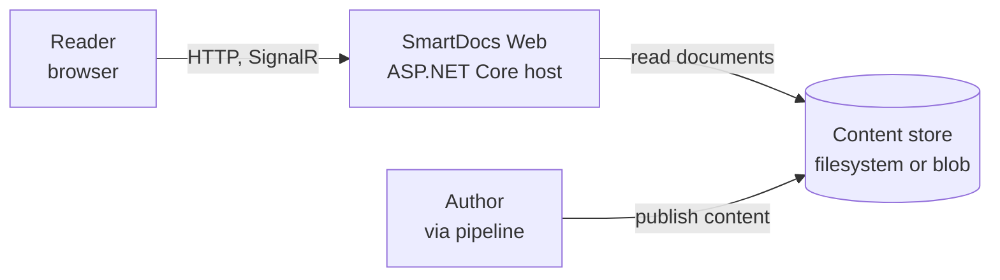
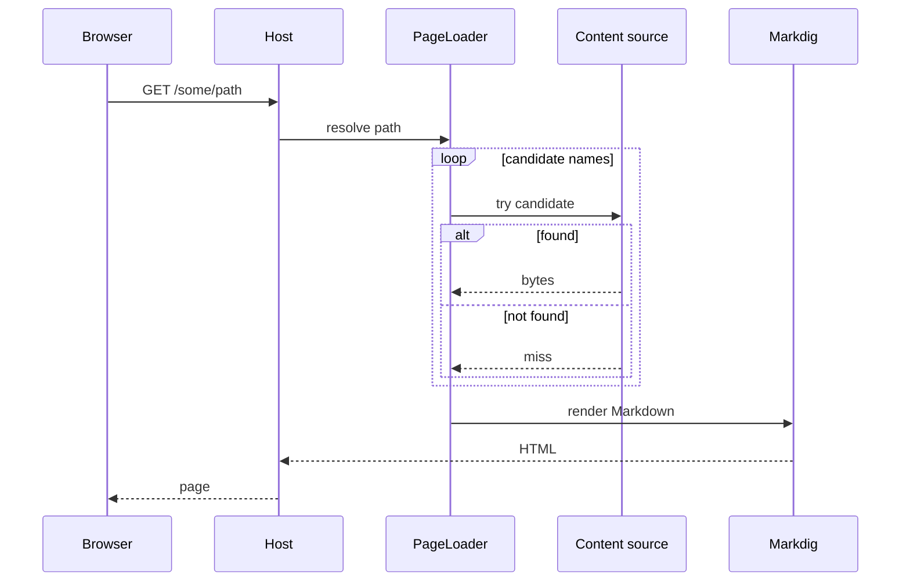
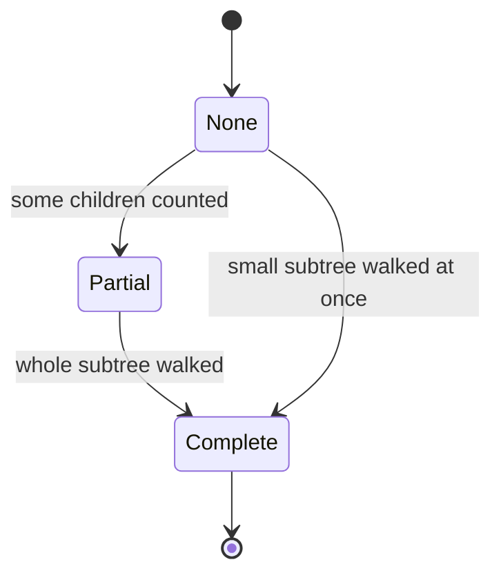

<!--
verification_stamp:
  generated: "2026-08-18"
  verified: "2026-08-18"
  gate_outcome: "pass-with-gaps"
  evidence:
    - dossier: "_evidence/smartdocs-web/code.md"
      observed: "2026-08-18"
    - dossier: "_evidence/smartdocs-web/configuration.md"
      observed: "2026-08-18"
    - dossier: "_evidence/smartdocs-web/data.md"
      observed: "2026-08-18"
    - dossier: "_evidence/smartdocs-web/environment.md"
      observed: "2026-08-18"
    - dossier: "_evidence/smartdocs-web-client/code.md"
      observed: "2026-08-18"
    - dossier: "_evidence/smartdocs-web-shared/code.md"
      observed: "2026-08-18"
  open_gaps: 2
-->

# System architecture

## 📚 Table of contents

- [🎯 Purpose and context](#-purpose-and-context)
- [🧱 Structure](#-structure)
- [🔀 Key flows](#-key-flows)
- [🔗 Dependencies](#-dependencies)
- [🧭 Design decisions](#-design-decisions)
- [🏗️ Physical placement](#-physical-placement)
- [🕳️ Open questions](#-open-questions)
- [🔗 Related](#-related)

## 🎯 Purpose and context

Diginsight SmartDocs serves a documentation site whose content is Markdown and whose structure is the shape of the content itself. The central design commitment is that **nothing is pre-computed**: a document is rendered when it is requested, and the navigation tree is discovered when it is browsed. Everything else in the architecture follows from paying that cost at request time and then working hard not to pay it twice.

## 🧱 Structure

| Part | Responsibility | Established by |
|---|---|---|
| `Diginsight.SmartDocs.Web` | Hosts everything: composes services, exposes the HTTP and SignalR surfaces, renders server-side | composition root and hub mapping ^[smartdocs-web/code-01,smartdocs-web/code-05,smartdocs-web/code-18] |
| `Diginsight.SmartDocs.Web.Client` | Runs the interactive shell in the browser under WebAssembly | client project kind ^[smartdocs-web-client/code-01] |
| `Diginsight.SmartDocs.Web.Shared` | Holds every type both sides use — abstractions, the navigation model, the rendering model, the site model | project references from both other projects ^[smartdocs-web-shared/code-01,smartdocs-web-shared/code-03] |
| Content store | Supplies document bytes; filesystem locally, Azure Blob Storage when deployed | per-space source factory ^[smartdocs-web/code-08] and space configuration ^[configuration-07] |

The shared library is the load-bearing part of this arrangement. `IContentSource`, `IMarkdownRenderer`, `INavProvider` and `PageLoader` are all declared there. ^[smartdocs-web-shared/code-04,smartdocs-web-shared/code-06,smartdocs-web-shared/code-07,smartdocs-web-shared/code-21] Both sides register that same interface set against different implementations. ^[smartdocs-web-shared/code-03] That is what makes the same component render identically in two very different execution contexts.

## 🔀 Key flows

### Serving a page

The candidate list is fixed and ordered: at the root it tries `index.md`, `readme.md`, `README.md`; elsewhere it tries the path with `.md` appended, then `index.md`, `overview.md` and a readme beneath it. A path already ending in `.md` is used as given. ^[smartdocs-web/code-20]

### Building the sidebar

The navigation tree is never materialised whole. `DynamicNavBuilder` builds **one level** at a time: list the children of a prefix, score each of them concurrently, drop the ones the rules exclude, classify the survivors, sort, and return. ^[smartdocs-web/code-23,smartdocs-web/code-24]

Scoring is where the cost sits, because each folder means reading a `metadata.yml` and each file means reading front matter. ^[smartdocs-web/code-26] Those reads are independent, so they run concurrently at the medium concurrency tier, and the final order comes from an explicit sort rather than from completion order. ^[smartdocs-web/code-23,configuration-12]

Classification decides what a child *is*. A folder becomes a section when it holds subfolders or more than one article; a folder holding exactly one article — or only an index and a readme — collapses into a leaf pointing straight at that article; anything else disappears. ^[smartdocs-web/code-25] That is why a folder that exists to hold a single page does not force a reader through an extra click.

### Keeping counts honest

Article counts beneath a folder cannot be known without walking it, and walking it is exactly what the lazy build avoids. The system resolves this by admitting it does not know yet.

A count is rendered as `…` while nothing is known, `≥ N` while a floor is known, and `N` once the subtree has been fully walked. Partial supersedes none, complete supersedes both, and an unknown count is never rendered as zero. ^[smartdocs-web/code-32] When better knowledge arrives the server pushes it over the navigation hub ^[smartdocs-web/code-18], and the browser folds the new counts into its cached level without issuing a request ^[smartdocs-web-client/code-07].

## 🔗 Dependencies

| Depends on | For | Nature |
|---|---|---|
| Markdig | Markdown to HTML, with advanced extensions, auto identifiers, YAML front matter and Mermaid | rendering ^[smartdocs-web-shared/code-17] |
| Diginsight.Core | activity-based observability and the parallel service | cross-cutting ^[smartdocs-web/code-02,smartdocs-web/code-04,configuration-13] |
| Diginsight.SmartCache | the caching layer wrapping every content source | cross-cutting ^[smartdocs-web/code-09,configuration-18] |
| OpenTelemetry | trace and metric export | cross-cutting ^[configuration-14] |
| Azure Blob Storage | content storage in deployed environments | external ^[configuration-07] |
| Azure Service Bus | optional cache-invalidation companion | external, opt-in ^[configuration-19] |
| Redis | optional passive cache store | external, opt-in ^[configuration-20] |

## 🧭 Design decisions

**Render at request time rather than building a site.** The consequence is that publishing is just a file copy — no build agent stands between an author and a reader. The cost is per-request work, which is why the caching layer is not optional in the design even though it is switchable in configuration.

**Wrap every content source in a cache, and key it by space.** Each configured space gets its own `CachedContentSource` over a physical source ^[smartdocs-web/code-09], and the cache key is a value type combining space and path rather than a path string ^[data-12]. Two spaces can hold `index.md` without colliding — a class of bug that a bare string key would have made possible and hard to see.

**Make the external caching companions opt-in by configuration presence.** Service Bus is wired only when both a connection string and a topic name are present; Redis only when a configuration string is present. ^[configuration-19,configuration-20] The application runs identically without either, which is what makes a local run possible with no cloud resources at all.

**Give the Service Bus subscription a per-process identity.** The subscription name is a fresh `Guid` generated at startup. ^[configuration-19] Each instance therefore sees every invalidation message, which is the correct semantic for cache invalidation and the wrong one for work distribution.

**Fail fast on missing configuration.** The `Site` section is bound and then eagerly resolved, throwing `InvalidOperationException` when absent. ^[smartdocs-web/code-06] A misconfigured deployment refuses to start rather than serving an empty site.

**Keep resource identity out of the repository.** The space declares `Source: Blob` but leaves `AccountUri` and `ContainerName` empty ^[configuration-07], and the SmartCache Service Bus section names a topic but declares no connection string ^[configuration-11]. Both arrive from an overlay at deploy time. ^[configuration-26]

## 🏗️ Physical placement

One ASP.NET Core application, deployed to an Azure App Service ^[environment-03] as a self-contained Windows build ^[environment-05,environment-06], reading its content from an Azure Blob Storage container ^[environment-08] over a managed identity ^[environment-10]. Two such deployments exist. ^[environment-01] Details are in the [Infrastructure](../05.00-infrastructure/index.md) chapter.

## 🕳️ Open questions

> **Not established**: no infrastructure definition exists in this repository. Searches for Bicep, ARM, Terraform, Pulumi, Dockerfile and `azure.yaml` all returned zero results, so the topology above is reconstructed from what the pipelines configure at deploy time rather than from a declared model. ^[gap]

> **Not established**: the Razor markup files were not read during this investigation, so what the layout components render — as distinct from what they hold — is not described here. ^[gap]

## 🔗 Related

- [The host](02-host-application.md), [the browser client](03-browser-client.md) and [the shared library](04-shared-library.md) each have their own page in this chapter
- [Caching and invalidation](05-caching-and-invalidation.md) — how the per-request cost above is avoided a second time
- [Reference](../06.00-reference/index.md) — the endpoint, schema and settings surfaces named above
- [Infrastructure](../05.00-infrastructure/index.md) — where this runs
