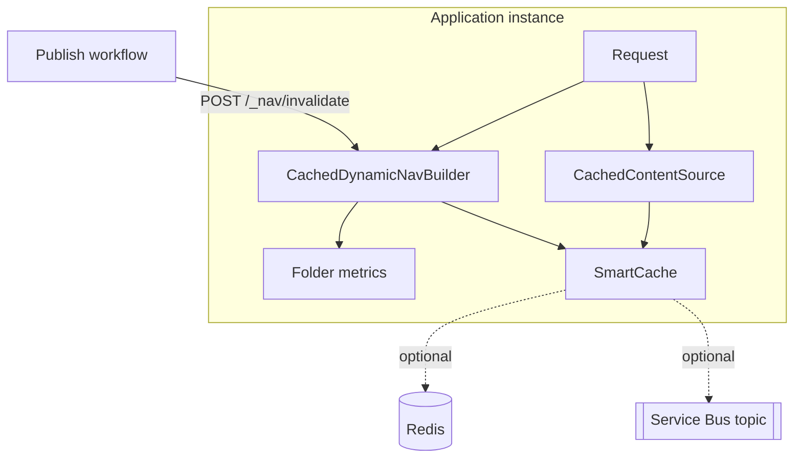

<!--
verification_stamp:
  generated: "2026-08-18"
  verified: "2026-08-18"
  gate_outcome: "pass-with-gaps"
  evidence:
    - dossier: "_evidence/smartdocs-web/code.md"
      observed: "2026-08-18"
    - dossier: "_evidence/smartdocs-web/configuration.md"
      observed: "2026-08-18"
    - dossier: "_evidence/smartdocs-web/data.md"
      observed: "2026-08-18"
    - dossier: "_evidence/smartdocs-web/devops.md"
      observed: "2026-08-18"
    - dossier: "_evidence/smartdocs-web/environment.md"
      observed: "2026-08-18"
    - dossier: "_evidence/smartdocs-web/security.md"
      observed: "2026-08-18"
  open_gaps: 3
-->

# Caching and invalidation

## 📚 Table of contents

- [🎯 Purpose and context](#-purpose-and-context)
- [🧱 Structure](#-structure)
- [🔀 Key flows](#-key-flows)
- [🔗 Dependencies](#-dependencies)
- [🧭 Design decisions](#-design-decisions)
- [🕳️ Open questions](#-open-questions)
- [🔗 Related](#-related)

## 🎯 Purpose and context

Rendering at request time is the design commitment. Caching is what makes that commitment affordable, and invalidation is what keeps it honest. This page describes both, and the several independent layers they are spread across.

## 🧱 Structure

| Layer | What it holds | Established by |
|---|---|---|
| `CachedContentSource` | Document bytes, per space and path | ^[code-09,data-11] |
| `CachedDynamicNavBuilder` | Built navigation levels, in an in-process memory cache | ^[code-34,data-14] |
| Folder metrics | Article counts and latest dates per folder, seeded at startup from a JSON snapshot | ^[code-36,data-09,data-10] |
| Redis (optional) | A passive store behind SmartCache | ^[configuration-10,configuration-20] |
| Service Bus (optional) | Cross-instance invalidation messages | ^[configuration-11,configuration-19] |

## 🔀 Key flows

### The cache key

`ContentPathCacheKey` is a value type over the space and the path. ^[data-12] Because the key carries the space, two spaces holding a file at the same path cannot collide — the failure a plain path string would have permitted.

### The two optional companions

Neither is required, and both are wired only when their configuration is present.

**Service Bus** is added when *both* a connection string and a topic name resolve. ^[configuration-19] The public settings file declares the topic name but no connection string, with a comment stating the connection string comes from a key vault. ^[configuration-11] The subscription name is a fresh `Guid` per process, so every running instance receives every message — the correct semantic for invalidation, since each instance holds its own in-memory copy. ^[configuration-19]

**Redis** is added when a configuration string resolves. ^[configuration-20] The public settings file declares an empty configuration and a key prefix of `smartdocs-content:`. ^[configuration-10] With the configuration empty, Redis is not wired.

### Learning that content changed

Two mechanisms exist, for two different situations.

**Locally**, the `Development` overlay declares `WatchForChanges: true` on the filesystem space. ^[environment-11]

**When deployed**, content arrives in a blob container that the application does not watch. The publish workflow therefore tells the site explicitly: after uploading content and removing the blobs that no longer have a local counterpart ^[devops-25], it issues `POST /_nav/invalidate` against the site, carrying `X-Invalidate-Key` when a key is configured ^[devops-26]. That call is best-effort — it is given a sixty-second timeout, and its failure does not fail the workflow run. ^[devops-26]

The endpoint compares the supplied key against `Site:InvalidateApiKey` with `CryptographicOperations.FixedTimeEquals` and returns `401` on mismatch. ^[code-15,security-05]

### Propagating counts

`NavChangePublisher` is wired after the application is built and before the host begins serving ^[code-35], and updates reach connected browsers over the navigation hub ^[code-18]. A published entry carries a prefix, an article count, a latest date, an author and a coverage value — and those values are **absolute**, not increments, despite the type being named a delta. A single change publishes one entry for the changed folder and one for each ancestor up to the root. ^[code-33]

## 🔗 Dependencies

Diginsight.SmartCache provides the caching primitives; `AddSmartCache(...).AddHttp()` is the base registration ^[configuration-18], and the Service Bus and Redis registrations are conditional additions on top ^[configuration-19,configuration-20].

## 🧭 Design decisions

**SmartCache is declared disabled in the public settings.** `Diginsight:SmartCache:Enabled` is `false`, alongside an absolute expiration of 31 days, a maximum age of 7 days and a sliding expiration of 7 days. ^[configuration-09,data-13] Whether either deployed environment turns it on is decided by the private overlay.

**Persist the metrics snapshot outside the application folder.** The snapshot path comes from `Site:MetricsSnapshotPath` when that is non-empty, and otherwise sits beside the application binaries. ^[code-37] The pipeline sets that value as an App Service application setting on both deployments. ^[devops-18]

**Warm ahead of the reader.** Requesting a navigation level also starts a fire-and-forget warm of two levels deeper. ^[code-11]

## 🕳️ Open questions

> **Not established**: `Diginsight:SmartCache:Enabled` is `false` in the public settings, and the overlay that would change it per environment lives outside this repository. Whether caching is active in either deployed environment was not observable. ^[gap]

> **Not established**: how long after a publish a reader sees new content. The three mechanisms above — the invalidation call, the metrics drain and the hub push — are each established separately, but no record joins them into one latency figure. The navigation-metrics drain is debounced by 400 ms (`FolderMetricsIndex.cs`, line 30); that is a lower bound on scheduling delay, not a user-visible latency. No rationale for the value is recorded, no test pins it, and no end-to-end latency was measured. ^[gap]

> **Not established**: no retention or lifecycle policy for the content container was found. The publish workflow removes blobs no longer present in the source, but that is a mirror operation rather than a retention policy. ^[gap]

## 🔗 Related

- [System architecture](01-system-architecture.md) — where caching sits in the request path
- [The host](02-host-application.md) — the composition that wires these layers
- [Reference](../06.00-reference/index.md) — the SmartCache settings and the invalidation endpoint
- [DevOps](../10.00-devops/index.md) — the publish workflow that triggers invalidation
