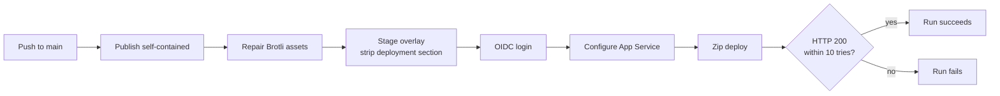

<!--
verification_stamp:
  generated: "2026-08-18"
  verified: "2026-08-18"
  gate_outcome: "pass-with-gaps"
  evidence:
    - dossier: "_evidence/smartdocs-web/devops.md"
      observed: "2026-08-18"
    - dossier: "_evidence/smartdocs-web/environment.md"
      observed: "2026-08-18"
  open_gaps: 2
-->

# Deploying the application

## 📚 Table of contents

- [🎯 Goal](#-goal)
- [✅ Preconditions](#-preconditions)
- [🔬 Flow](#-flow)
- [🔀 Alternate and failure paths](#-alternate-and-failure-paths)
- [🧪 What proves it](#-what-proves-it)
- [🕳️ Open questions](#-open-questions)
- [🔗 Related](#-related)

## 🎯 Goal

- **Actor**: a developer, via a merge to `main`
- **Outcome**: the running application in a target environment is replaced with the current build
- **Component**: `smartdocs-web`, `smartdocs-web-client`, `smartdocs-web-shared`

## ✅ Preconditions

- The change touches one of the three project folders, the shared build files, `nuget.config`, or the workflows themselves. ^[devops-07]
- The self-hosted runner has a pre-installed .NET SDK matching `10.*`; the workflow fails otherwise. ^[devops-09]
- The private configuration overlay is reachable with the configured read token. ^[devops-13]
- The overlay declares both `Site.Spaces` and a deployment target; the workflow refuses otherwise. ^[devops-16]

## 🔬 Flow

1. A push to `main` triggers one of the two thin deployment workflows ^[devops-07], each serialised on its own concurrency group with in-progress runs **not** cancelled ^[devops-08].
2. That workflow calls the reusable build-and-deploy workflow with an environment name, a runtime identifier, an overlay path and a GitHub deployment environment. ^[devops-02,devops-05,devops-06]
3. The runner checks out this repository, then sparse-checks-out the configuration overlay from the private peer. ^[devops-13]
4. It verifies that the runner's SDK matches `10.*`. ^[devops-09]
5. It publishes self-contained for the requested runtime identifier in `Release`, then asserts the executable exists. ^[devops-10]
6. It repairs the published output: zero-byte Brotli assets under the framework folder are pruned and the static-asset endpoint manifest is rewritten to match. ^[devops-11]
7. It stages the overlay and validates it ^[devops-16], masks the deployment target and exports it, then **removes the deployment section** before the settings file is staged into the published output ^[devops-15].
8. It authenticates to Azure with an OIDC federated credential; no client secret is stored. ^[devops-14]
9. It configures the App Service: the resource group is resolved with `az webapp list` rather than declared, the 32-bit worker flag is set only for a 32-bit runtime identifier, and the .NET Framework version marker is set. ^[devops-17] It then writes the application settings — the settings environment name, `ASPNETCORE_ENVIRONMENT=Production`, the metrics snapshot path, and the invalidation key when its optional secret is present. ^[devops-18]
10. It zips the published output and pushes it with `az webapp deploy --type zip`. ^[devops-12]
11. It smoke-checks the site: up to ten attempts, fifteen seconds apart, each with a thirty-second timeout, expecting HTTP 200. ^[devops-19]

## 🔀 Alternate and failure paths

| Situation | What happens |
|---|---|
| The SDK is not `10.*` | The run fails at verification, before publishing. ^[devops-09] |
| The overlay is missing a required section | The run fails at staging, before touching Azure. ^[devops-16] |
| The published executable is absent | The publish step asserts its presence and fails. ^[devops-10] |
| The site does not return 200 | The smoke check exhausts its retries and the run fails. ^[devops-19] |
| A second push arrives during a deployment | The concurrency group does not cancel in progress. ^[devops-08] |
| The invalidation secret is absent | That application setting is simply not written. ^[devops-18] |

## 🧪 What proves it

Four in-pipeline assertions: the SDK check, the published-executable check, the overlay validation and the smoke check. ^[devops-09,devops-10,devops-16,devops-19] The smoke check is the only one that observes the running application, and it observes exactly one thing — that the site answers 200.

One run is captured. A recorded deploy run against the `testmc` environment on 2026-08-17 lists the eleven step names the job executed, in order. ^[devops-28] ^[environment-14]

## 🕳️ Open questions

> **Not established**: no build validation runs on a pull request. Every trigger block in `.github/workflows/` was read; all four trigger on a push to `main` or on manual dispatch, and none triggers on `pull_request`. ^[gap]

> **Not established**: whether the GitHub deployment environments carry protection rules such as required reviewers, wait timers or branch restrictions. The workflows name the environments, but the rules are repository settings rather than workflow content. ^[gap]

## 🔗 Related

- [Build and deploy pipeline](../10.00-devops/01-build-and-deploy-pipeline.md) — the reusable workflow in full
- [Learn hub deployment](../10.00-devops/02-learn-hub-deployment.md) and [docs site deployment](../10.00-devops/03-docs-site-deployment.md) — the two thin callers
- [Infrastructure](../05.00-infrastructure/index.md) — the environments this deploys to
- [Deployment smoke check](../08.00-validation/01-deployment-smoke-check.md) — the one automated observation
