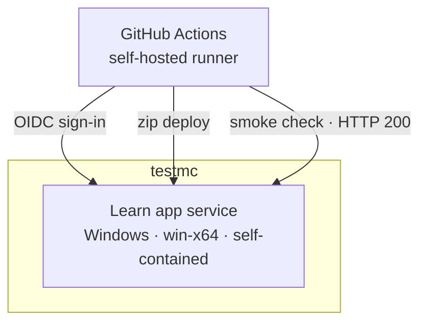

<!--
verification_stamp:
  generated: "2026-08-18"
  verified: "2026-08-18"
  gate_outcome: "pass-with-gaps"
  evidence:
    - dossier: "_evidence/smartdocs-web/environment.md"
      observed: "2026-08-18"
    - dossier: "_evidence/smartdocs-web/devops.md"
      observed: "2026-08-18"
    - dossier: "_evidence/smartdocs-web/configuration.md"
      observed: "2026-08-18"
    - dossier: "_evidence/smartdocs-web/data.md"
      observed: "2026-08-18"
    - dossier: "_evidence/smartdocs-web/security.md"
      observed: "2026-08-18"
  open_gaps: 4
-->

# testmc environment

## 📚 Table of contents

- [🎯 Purpose](#-purpose)
- [🧱 Provisioned resources](#-provisioned-resources)
- [🗺️ Topology](#-topology)
- [⚙️ Configuration surface](#-configuration-surface)
- [🔗 Connections](#-connections)
- [🧾 Provenance](#-provenance)
- [🕳️ Open questions](#-open-questions)
- [🔗 Related](#-related)

## 🎯 Purpose

`testmc` is one of the two GitHub deployment environments the workflows name. ^[environment-01] It hosts the **learn app service** — the Learning Hub deployment of Diginsight SmartDocs — and is targeted by the *01 · Deploy Learning Hub* workflow, which calls the reusable build-and-deploy workflow with the `testmc` deployment environment. ^[devops-05]

## 🧱 Provisioned resources

| Role | Kind | Established by |
|---|---|---|
| Learn app service | Azure App Service, Windows, `win-x64` | one instance of the host runs on an App Service resolved from the overlay at deploy time ^[environment-03]; the runtime identifier, framework version and worker bitness are set by the deploy step ^[environment-05] |
| Application resource group | Resource group | resolved with `az webapp list` at deploy time rather than declared ^[devops-17] |
| Deployment app registration | Entra application with a federated credential | OIDC sign-in, no stored client secret ^[devops-14] ^[security-09] |

The application is deployed self-contained, so the runner's .NET SDK produces the build and the platform's own runtime is not relied on. ^[environment-06]

## 🗺️ Topology

## ⚙️ Configuration surface

The deployment workflow writes these application settings. ^[devops-18]

| Setting | Value | Note |
|---|---|---|
| `AppsettingsEnvironmentName` | `Testmc` | the environment name the caller passes ^[devops-05]; it selects the out-of-tree overlay the host layers on top of its in-tree settings ^[configuration-04] |
| `ASPNETCORE_ENVIRONMENT` | `Production` | fixed by the workflow ^[devops-18] |
| `Site__MetricsSnapshotPath` | a path under the App Service data directory | the navigation metrics snapshot is written there ^[environment-12]; folder metrics are persisted between process lifetimes as that JSON snapshot ^[data-10] |
| `Site__InvalidateApiKey` | written only when the optional secret is present | otherwise not written at all ^[devops-18] |

The platform settings the workflow applies are the `--net-framework-version v4.0` marker and the 32-bit worker flag — the latter set only when the runtime identifier is `win-x86`, which this environment does not use. ^[devops-17] ^[environment-05]

Everything else arrives from the overlay, which the workflow selects by name for this environment. ^[environment-02] The overlay's deployment section is masked and then **removed** before the settings file is staged into the published output, so the running application never sees the values used to place it. ^[devops-15]

## 🔗 Connections

| From | To | Mechanism |
|---|---|---|
| GitHub Actions | Learn app service | OIDC federated credential, then `az webapp deploy --type zip` ^[devops-14] ^[devops-12] |
| GitHub Actions | Learn app service | a closing smoke check, up to ten attempts fifteen seconds apart, expecting HTTP 200 ^[devops-19] |
| GitHub Actions | private peer repository | sparse clone for the settings overlay, authenticated with a read token ^[devops-13] |

Where a space in this environment declares `Source: Blob`, the host reaches that store with `DefaultAzureCredential` — in Azure, the App Service's managed identity — so no storage credential is deployed with the application. ^[environment-10] ^[security-08]

## 🧾 Provenance

- **Observed from**: repository source — workflow definitions, settings files and launch profiles
- **Environment**: `testmc`
- **Observed**: 2026-08-18

One live observation contributes: a deploy run against this environment on 2026-08-17, recorded at the repository root, which reached the publish step ^[environment-14] and whose captured log lists the eleven step names the build-and-deploy job executed ^[devops-28].

## 🕳️ Open questions

> **Not established**: no infrastructure definition exists in this repository. Glob searches across the whole tree for Bicep, ARM, `azuredeploy*`, Terraform, Pulumi, Dockerfile and `azure.yaml` files all returned zero results, so the resources above are what the pipeline configures and are not read from a declared model. ^[gap]

> **Not established**: what content store this environment reads from. The settings overlay that names it is held in the private peer repository, and no record in this repository establishes a content source for this environment. ^[gap]

> **Not established**: the live behaviour of this deployment. Its hostname is not declared in this repository — it resolves from the overlay at deploy time and is masked in workflow logs — so no request was made against it during this investigation, and response headers, TLS configuration and cache behaviour were not observed. ^[gap]

> **Not established**: the scaling, availability and networking posture. Instance count, autoscale rules, availability zones, VNet integration and private-endpoint usage were all sought and none is declared here. ^[gap]

## 🔗 Related

- [Learn hub deployment](../10.00-devops/02-learn-hub-deployment.md) — the workflow that targets this environment
- [Deploying the application](../04.00-use-cases/04-deploying-the-application.md) — the flow that reaches it
- [testmcdocs environment](02-testmcdocs-environment.md) — the other environment
