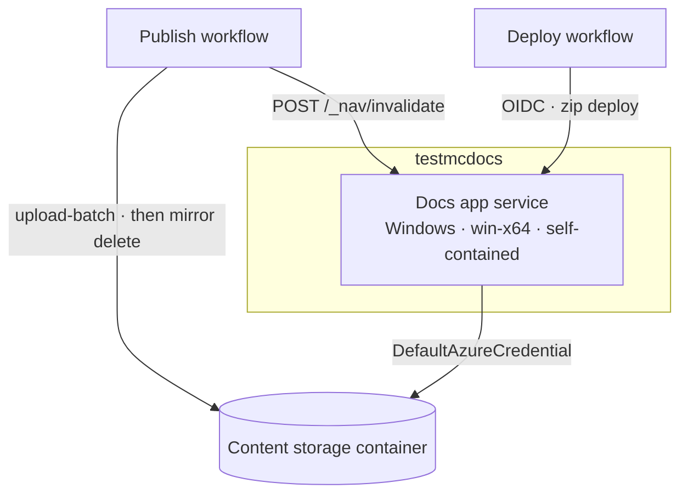

<!--
verification_stamp:
  generated: "2026-08-18"
  verified: "2026-08-18"
  gate_outcome: "pass-with-gaps"
  evidence:
    - dossier: "_evidence/smartdocs-web/environment.md"
      observed: "2026-08-18"
    - dossier: "_evidence/smartdocs-web/devops.md"
      observed: "2026-08-18"
    - dossier: "_evidence/smartdocs-web/configuration.md"
      observed: "2026-08-18"
    - dossier: "_evidence/smartdocs-web/data.md"
      observed: "2026-08-18"
    - dossier: "_evidence/smartdocs-web/security.md"
      observed: "2026-08-18"
    - dossier: "_evidence/smartdocs-content/data.md"
      observed: "2026-08-18"
  open_gaps: 4
-->

# testmcdocs environment

## 📚 Table of contents

- [🎯 Purpose](#-purpose)
- [🧱 Provisioned resources](#-provisioned-resources)
- [🗺️ Topology](#-topology)
- [⚙️ Configuration surface](#-configuration-surface)
- [🔗 Connections](#-connections)
- [🧾 Provenance](#-provenance)
- [🕳️ Open questions](#-open-questions)
- [🔗 Related](#-related)

## 🎯 Purpose

`testmcdocs` is one of the two GitHub deployment environments the workflows name. ^[environment-01] It hosts the **docs app service** — the deployment serving the `diginsight.smartdocs` content space. It is targeted by the *02 · Deploy docs site* workflow ^[devops-06], and it is also the fixed environment of the *03 · Publish docs content* workflow ^[devops-21].

That second point is the meaningful difference between the two environments: this one receives content, not just code.

## 🧱 Provisioned resources

| Role | Kind | Established by |
|---|---|---|
| Docs app service | Azure App Service, Windows, `win-x64` | one instance of the host runs on an App Service resolved from the overlay at deploy time ^[environment-03]; runtime identifier, framework version and worker bitness are set by the deploy step ^[environment-05] |
| Content storage container | Azure Storage blob container | content for this environment is stored in a blob container, created by the publish workflow when absent ^[environment-08]; the destination is resolved from the overlay and masked before use ^[devops-22] |
| Application resource group | Resource group | resolved with `az webapp list` at deploy time rather than declared ^[devops-17] |
| Deployment app registration | Entra application with a federated credential | OIDC sign-in, no stored client secret ^[devops-14] ^[security-09] |

The application is deployed self-contained. ^[environment-06]

## 🗺️ Topology

## ⚙️ Configuration surface

| Setting | Value | Note |
|---|---|---|
| `AppsettingsEnvironmentName` | `TestmcDocs` | the environment name the caller passes ^[devops-06]; it selects the out-of-tree overlay ^[configuration-04] |
| `ASPNETCORE_ENVIRONMENT` | `Production` | fixed by the workflow ^[devops-18] |
| `Site__MetricsSnapshotPath` | a path under the App Service data directory | the navigation metrics snapshot is written there ^[environment-12]; folder metrics persist between process lifetimes as that JSON snapshot ^[smartdocs-web/data-10] |
| `Site__InvalidateApiKey` | written only when the optional secret is present | the publish workflow sends the matching `X-Invalidate-Key` header ^[devops-18] ^[devops-26] |

The space this environment serves is declared in the public settings with `Id` `diginsight.smartdocs`, `RouteBase` `/`, title `SmartDocs`, `Source` `Blob` and a repository URL pointing at the public repository — with `Blob.AccountUri` and `Blob.ContainerName` deliberately empty. ^[configuration-07] Those two values arrive from the overlay, which the settings file states is where environment-specific storage identity comes from. ^[configuration-26]

## 🔗 Connections

| From | To | Mechanism |
|---|---|---|
| Docs app service | Content storage container | `DefaultAzureCredential` — in Azure, the App Service's managed identity; no storage credential is deployed with the application ^[environment-10] ^[security-08] |
| Publish workflow | Content storage container | `az storage blob upload-batch --overwrite true --auth-mode login` ^[devops-24], then a mirror delete of blobs with no local counterpart ^[devops-25] ^[smartdocs-content/data-14] |
| Publish workflow | Docs app service | best-effort `POST /_nav/invalidate` with `X-Invalidate-Key` and a sixty-second timeout; its failure does not fail the run ^[devops-26] |
| Deploy workflow | Docs app service | OIDC federated credential ^[devops-14], then `az webapp deploy --type zip` ^[devops-12], closed by a smoke check expecting HTTP 200 ^[devops-19] |

## 🧾 Provenance

- **Observed from**: repository source — workflow definitions and settings files
- **Environment**: `testmcdocs`
- **Observed**: 2026-08-18

## 🕳️ Open questions

> **Not established**: no infrastructure definition exists in this repository. Glob searches across the whole tree for Bicep, ARM, `azuredeploy*`, Terraform, Pulumi, Dockerfile and `azure.yaml` files all returned zero results, so the resources above are what the pipelines configure and are not read from a declared model. ^[gap]

> **Not established**: the live behaviour of this deployment. Its hostname is not declared here — it resolves from the overlay at deploy time and is masked in workflow logs — so no request was made against it during this investigation. ^[gap]

> **Not established**: no retention or lifecycle policy for the content container was found. The container is created with `az storage container create` and no policy arguments, and the storage account's own settings are not declared in this repository, so whether versioning or soft delete is in force was not established. The publish workflow mirrors the source, which is not the same thing as a retention policy. ^[gap]

> **Not established**: the scaling, availability and networking posture of this environment. Instance count, autoscale rules, availability zones, VNet integration and private-endpoint usage were all sought and none is declared here. ^[gap]

## 🔗 Related

- [Docs site deployment](../10.00-devops/03-docs-site-deployment.md) — the workflow that deploys here
- [Publish content pipeline](../10.00-devops/04-publish-content-pipeline.md) — the workflow that publishes content here
- [Publishing content](../04.00-use-cases/03-publishing-content.md) — the flow from a merge to a live page
- [testmc environment](01-testmc-environment.md) — the other environment
