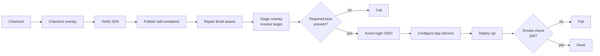

<!--
verification_stamp:
  generated: "2026-08-18"
  verified: "2026-08-18"
  gate_outcome: "pass-with-gaps"
  evidence:
    - dossier: "_evidence/smartdocs-web/devops.md"
      observed: "2026-08-18"
  open_gaps: 3
-->

# Build and deploy pipeline

## 📚 Table of contents

- [🎯 What it does](#-what-it-does)
- [⚡ Triggers](#-triggers)
- [🔀 Stages](#-stages)
- [🚦 Gates](#-gates)
- [📦 Artifacts](#-artifacts)
- [🪜 Environment progression](#-environment-progression)
- [🕳️ Open questions](#-open-questions)
- [🔗 Related](#-related)

## 🎯 What it does

Builds the application as a self-contained executable, merges in a private configuration overlay, configures the target App Service, deploys a zip, and checks that the site answers.

- **Defined in**: `.github/workflows/00.BuildSmartDocsWeb.yml` ^[devops-02]
- **Components**: `smartdocs-web`, `smartdocs-web-client`, `smartdocs-web-shared`

It is a **reusable workflow** — it is invoked by `workflow_call` and has no trigger of its own. ^[devops-02] Two caller workflows supply the environment. ^[devops-05,devops-06]

## ⚡ Triggers

Called by another workflow. Its inputs are what make one deployment differ from another.

| Input | Default | Purpose |
|---|---|---|
| `environment-name` | *(required)* | The GitHub environment ^[devops-02] |
| `runtime-identifier` | `win-x64` | The publish target ^[devops-02] |
| `internal-config-path` | `src/Diginsight.SmartDocs.Web/appsettings.Testmc.json` | Which overlay file to stage ^[devops-02] |
| `deployment-environment` | `testmc` | Which deployment block to read ^[devops-02] |

| Secret | Required |
|---|---|
| `SMARTDOCS_INTERNAL_READ_TOKEN` | yes ^[devops-03] |
| `AZURE_CLIENT_ID` | yes ^[devops-03] |
| `AZURE_TENANT_ID` | yes ^[devops-03] |
| `SMARTDOCS_INVALIDATE_KEY` | optional ^[devops-03] |

## 🔀 Stages

The step sequence below is the one a captured run of the deploy job actually executed. ^[devops-28]

| Step | What it does |
|---|---|
| Checkout repository | This repository ^[devops-28] |
| Checkout configuration overlay | A sparse clone of a private peer repository, authenticated with a repository read token; the step fails when that secret is absent ^[devops-13] |
| Verify .NET SDK | Asserts the runner's pre-installed SDK matches `10.*` ^[devops-09] |
| Publish | `dotnet publish -c Release -r $RID --self-contained true`, then asserts the executable exists ^[devops-10] |
| Repair zero-byte Brotli assets | Removes empty `.br` files under the WASM framework folder, prunes the matching entries from the static-asset endpoint manifest, then asserts none remains ^[devops-11] |
| Stage configuration overlay | Copies the overlay in, reads `Deployment.WebAppName`, masks it, exports it as `WEBAPP_NAME`, then **removes the `Deployment` section** ^[devops-15]; fails when `Site.Spaces` or `Deployment.WebAppName` is missing ^[devops-16] |
| Azure login | Requests an OIDC token and signs in with `az login --service-principal --federated-token`; no client secret is stored ^[devops-14] |
| Configure App Service | Resolves the resource group with `az webapp list`, sets the worker to 32-bit only for `win-x86`, sets `--net-framework-version v4.0` ^[devops-17], and writes four application settings ^[devops-18] |
| Deploy to App Service | `Compress-Archive` of the publish folder, pushed with `az webapp deploy --type zip` ^[devops-12] |
| Smoke check | Resolves the hostname with `az webapp show`, then up to 10 attempts, 15 seconds apart, 30-second timeout, expecting 200 ^[devops-19] |

Every job runs on a **self-hosted** runner and declares `permissions: id-token: write, contents: read`. ^[devops-04]

## 🚦 Gates

| Gate | Effect on failure |
|---|---|
| The read token for the overlay is present | Stops before building ^[devops-13] |
| SDK version is `10.*` | Stops before building ^[devops-09] |
| Published executable exists | Stops before packaging ^[devops-10] |
| No empty framework asset remains after repair | Stops before packaging ^[devops-11] |
| `Site.Spaces` present in the overlay | Stops before deploying ^[devops-16] |
| `Deployment.WebAppName` present for the chosen environment | Stops before deploying ^[devops-16] |
| Smoke check returns 200 | Marks the run failed — **after** the deployment is live ^[devops-19] |

No workflow declares a manual approval or review gate inside its job definition. ^[devops-27]

## 📦 Artifacts

A self-contained publish folder, compressed to `smartdocs-deploy.zip` and deployed directly with `az webapp deploy --type zip`. ^[devops-12]

Four application settings are written to the target: `AppsettingsEnvironmentName` (the `environment-name` input), `ASPNETCORE_ENVIRONMENT=Production`, `Site__MetricsSnapshotPath` pointing at the App Service data folder, and `Site__InvalidateApiKey` — the last only when the optional secret is present. ^[devops-18]

## 🪜 Environment progression

None. Each caller deploys straight to its own environment ^[devops-05,devops-06], and promotion happens on a push or a manual dispatch rather than through a declared gate ^[devops-27].

## 🕳️ Open questions

> **Not established**: whether the two GitHub environments carry protection rules such as required reviewers, wait timers or branch restrictions. The workflows reference the environments by name; protection rules are repository settings rather than workflow content. ^[gap]

> **Not established**: why zero-byte Brotli assets occur at all. The repair step and its post-condition are declared ^[devops-11]; nothing in the workflow or the repository states the cause. ^[gap]

> **Not established**: whether a failed deployment can be rolled back. No rollback step, previous-version retention, deployment slot or baseline comparison appears in the workflow, whose executed step sequence ends at the smoke check ^[devops-28]. ^[gap]

## 🔗 Related

- [Learn Hub deployment](02-learn-hub-deployment.md) and [Docs site deployment](03-docs-site-deployment.md) — the two callers
- [Deployment smoke check](../08.00-validation/01-deployment-smoke-check.md) — the final gate, in detail
- [Deploying the application](../04.00-use-cases/04-deploying-the-application.md) — the same flow from an operator's point of view
