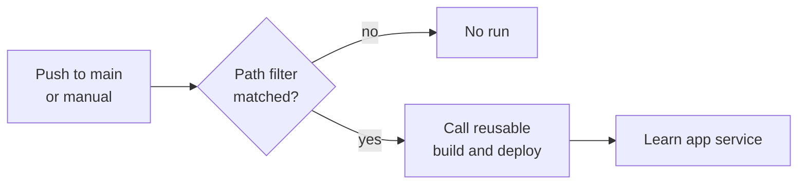

<!--
verification_stamp:
  generated: "2026-08-18"
  verified: "2026-08-18"
  gate_outcome: "pass-with-gaps"
  evidence:
    - dossier: "_evidence/smartdocs-web/devops.md"
      observed: "2026-08-18"
  open_gaps: 1
-->

# Learn Hub deployment

## 🎯 What it does

Deploys the application to the **Learn app service**, by calling the reusable build-and-deploy workflow with the Learn environment's inputs. ^[devops-05]

- **Defined in**: `.github/workflows/01.DeployLearnHub.yml` ^[devops-05]
- **Components**: `smartdocs-web`, `smartdocs-web-client`, `smartdocs-web-shared`

It contains no build logic of its own: it declares a trigger ^[devops-07], a concurrency policy ^[devops-08] and four input values ^[devops-05].

## ⚡ Triggers

| Trigger | Condition |
|---|---|
| `push` to `main` | Any change under the three project folders, `src/Directory.Build.props`, `src/Directory.Build.targets`, `nuget.config`, the reusable workflow, or this file ^[devops-07] |
| `workflow_dispatch` | Manual ^[devops-07] |

The path filter is why editing a document does not redeploy the application: content lives under `src/docs`, which is not in that list ^[devops-07] and is the filter of the content-publishing workflow instead ^[devops-20].

Concurrency group `deploy-learnhub`, which does not cancel in progress. ^[devops-08] A second push queues behind the first rather than cancelling it.

## 🔀 Stages

All stages are the reusable workflow's. See [Build and deploy pipeline](01-build-and-deploy-pipeline.md).

| Input | Value |
|---|---|
| `environment-name` | `Testmc` ^[devops-05] |
| `runtime-identifier` | `win-x64` ^[devops-05] |
| `internal-config-path` | `…/appsettings.Testmc.json` ^[devops-05] |
| `deployment-environment` | `testmc` ^[devops-05] |

## 🚦 Gates

The reusable workflow's gates apply unchanged — see [Build and deploy pipeline](01-build-and-deploy-pipeline.md#-gates). This workflow adds only the path filter ^[devops-07] and the concurrency policy ^[devops-08], neither of which is a quality gate.

## 📦 Artifacts

None of its own. The reusable workflow produces the deployable zip. ^[devops-12]

## 🪜 Environment progression

`main` → the Learn app service, in one step. ^[devops-05] Promotion happens on a push or a manual dispatch ^[devops-07], and no workflow declares an approval or review gate inside its job definition ^[devops-27].

## 🕳️ Open questions

> **Not established**: whether the `testmc` GitHub environment carries protection rules such as required reviewers, wait timers or branch restrictions. The workflow references the environment by name; protection rules are repository settings rather than workflow content. ^[gap]

## 🔗 Related

- [Build and deploy pipeline](01-build-and-deploy-pipeline.md) — everything this workflow delegates to
- [Docs site deployment](03-docs-site-deployment.md) — the sibling caller
- [testmc environment](../05.00-infrastructure/01-testmc-environment.md) — the target
