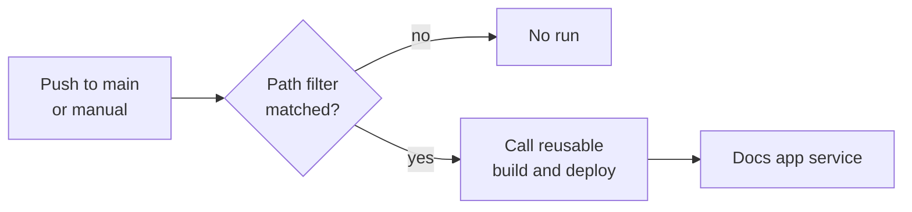

<!--
verification_stamp:
  generated: "2026-08-18"
  verified: "2026-08-18"
  gate_outcome: "pass-with-gaps"
  evidence:
    - dossier: "_evidence/smartdocs-web/devops.md"
      observed: "2026-08-18"
  open_gaps: 1
-->

# Docs site deployment

## 🎯 What it does

Deploys the same application to the **Docs app service**, by calling the reusable build-and-deploy workflow with the docs environment's inputs. ^[devops-06]

- **Defined in**: `.github/workflows/02.DeployDocsSite.yml` ^[devops-06]
- **Components**: `smartdocs-web`, `smartdocs-web-client`, `smartdocs-web-shared`

The same reusable workflow, invoked twice, differing in the overlay file each caller names. ^[devops-05,devops-06]

## ⚡ Triggers

| Trigger | Condition |
|---|---|
| `push` to `main` | The same path filter as the Learn deployment ^[devops-07] |
| `workflow_dispatch` | Manual ^[devops-07] |

Concurrency group `deploy-docssite`, which does not cancel in progress. ^[devops-08] The group differs from the Learn deployment's ^[devops-08], so the two are not serialised against each other.

## 🔀 Stages

| Input | Value |
|---|---|
| `environment-name` | `TestmcDocs` ^[devops-06] |
| `internal-config-path` | `…/appsettings.TestmcDocs.json` ^[devops-06] |
| `deployment-environment` | `testmcdocs` ^[devops-06] |

This caller declares no `runtime-identifier`, so the reusable workflow's default of `win-x64` applies. ^[devops-02,devops-06]

## 🚦 Gates

The reusable workflow's gates apply unchanged — see [Build and deploy pipeline](01-build-and-deploy-pipeline.md#-gates).

## 📦 Artifacts

None of its own. The reusable workflow produces the deployable zip. ^[devops-12]

## 🪜 Environment progression

`main` → the Docs app service, in one step. ^[devops-06] Neither deployment is a stage of the other: each caller names its own environment ^[devops-05,devops-06], and no workflow declares an approval or review gate inside its job definition ^[devops-27].

## 🕳️ Open questions

> **Not established**: whether the `testmcdocs` GitHub environment carries protection rules such as required reviewers, wait timers or branch restrictions. The workflow references the environment by name; protection rules are repository settings rather than workflow content. ^[gap]

## 🔗 Related

- [Build and deploy pipeline](01-build-and-deploy-pipeline.md) — everything this workflow delegates to
- [Publish content pipeline](04-publish-content-pipeline.md) — the workflow that fills this site with content
- [testmcdocs environment](../05.00-infrastructure/02-testmcdocs-environment.md) — the target
