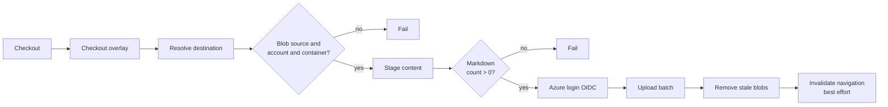

<!--
verification_stamp:
  generated: "2026-08-18"
  verified: "2026-08-18"
  gate_outcome: "pass-with-gaps"
  evidence:
    - dossier: "_evidence/smartdocs-web/devops.md"
      observed: "2026-08-18"
  open_gaps: 2
-->

# Publish content pipeline

## 📚 Table of contents

- [🎯 What it does](#-what-it-does)
- [⚡ Triggers](#-triggers)
- [🔀 Stages](#-stages)
- [🚦 Gates](#-gates)
- [📦 Artifacts](#-artifacts)
- [🪜 Environment progression](#-environment-progression)
- [🕳️ Open questions](#-open-questions)
- [🔗 Related](#-related)

## 🎯 What it does

Uploads the repository's documentation content to the content storage container ^[devops-24], removes blobs that are no longer present ^[devops-25], and asks the running site to drop its navigation cache ^[devops-26].

- **Defined in**: `.github/workflows/03.PublishDocsContent.yml` ^[devops-20]
- **Components**: `smartdocs-content`

This is the workflow that separates content from code: it filters on `src/docs/**` ^[devops-20], where the deployment workflows filter on the project folders ^[devops-07].

## ⚡ Triggers

| Trigger | Condition |
|---|---|
| `push` to `main` | Any change under `src/docs/**`, or to this workflow file ^[devops-20] |
| `workflow_dispatch` | Manual, with three inputs ^[devops-20] |

| Manual input | Default |
|---|---|
| `space-id` | `diginsight.smartdocs` ^[devops-20] |
| `source-path` | `src/docs` ^[devops-20] |
| `internal-config-path` | `…/appsettings.TestmcDocs.json` ^[devops-20] |

The job is fixed to the GitHub environment `testmcdocs` and that is not an input. ^[devops-21] Changing the overlay input therefore changes which destination is read, but not which GitHub environment's credentials are used.

Concurrency group `publish-docs-content`, which does not cancel in progress. ^[devops-08]

## 🔀 Stages

| Step | What it does |
|---|---|
| Checkout configuration overlay | A sparse clone of a private peer repository, authenticated with a repository read token; the step fails when that secret is absent ^[devops-13] |
| Resolve publish destination | Looks the `space-id` up in the overlay's `Site.Spaces`, requires `Source: Blob` plus `Blob.AccountUri` and `Blob.ContainerName`, and masks the storage account name, container name and web-app name ^[devops-22] |
| Stage content | Copies into a temporary directory, removes `bin`, `obj` and `node_modules`, and counts Markdown (`.md`, `.qmd`) and image files ^[devops-23] |
| Azure login | Requests an OIDC token and signs in with `az login --service-principal --federated-token` ^[devops-14] |
| Upload to blob | `az storage container create --auth-mode login`, then `az storage blob upload-batch --overwrite true --auth-mode login`; no storage key or connection string is used ^[devops-24] |
| Remove stale blobs | Lists remote blobs, computes the case-insensitive set difference against the local file set, and deletes the remainder one at a time ^[devops-25] |
| Invalidate navigation cache | `POST /_nav/invalidate` with the optional `X-Invalidate-Key` header and a sixty-second timeout ^[devops-26] |

Every job runs on a self-hosted runner and declares `permissions: id-token: write, contents: read`. ^[devops-04]

## 🚦 Gates

| Gate | Effect on failure |
|---|---|
| The read token for the overlay is present | Stops before resolving the destination ^[devops-13] |
| The space declares `Source: Blob` | Stops before touching storage ^[devops-22] |
| `Blob.AccountUri` and `Blob.ContainerName` present | Stops before touching storage ^[devops-22] |
| At least one Markdown file staged | Stops before uploading ^[devops-23] |
| Upload succeeded | The removal step runs only after a successful upload ^[devops-25] |

The invalidation call is explicitly **not** a gate: it is best-effort and its failure does not fail the run. ^[devops-26]

## 📦 Artifacts

Blobs in the content container, uploaded with overwrite. ^[devops-24]

## 🪜 Environment progression

`main` → the `testmcdocs` environment's content container, in one step. ^[devops-21] No workflow declares an approval or review gate inside its job definition. ^[devops-27]

## 🕳️ Open questions

> **Not established**: whether content is reviewed before it is published. The trigger is a push to `main` or a manual dispatch ^[devops-20], the workflow validates content only by counting staged files ^[devops-23], and no workflow declares a manual approval or review gate ^[devops-27]. Whether a review happens outside the repository could not be determined from it. ^[gap]

> **Not established**: whether the invalidation call succeeds in practice. It is best-effort and its result does not affect the run ^[devops-26]; no record of its outcome is retained in the repository. ^[gap]

## 🔗 Related

- [Content publish checks](../08.00-validation/02-content-publish-checks.md) — the gates above, in detail
- [Publishing content](../04.00-use-cases/03-publishing-content.md) — the same flow from an author's point of view
- [Caching and invalidation](../03.00-architecture/05-caching-and-invalidation.md) — what the final step is talking to
