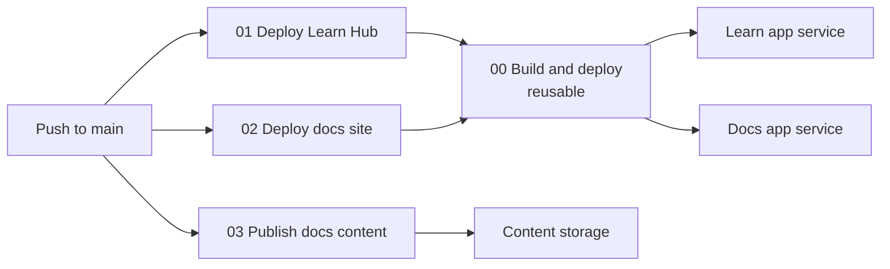

<!--
verification_stamp:
  generated: "2026-08-18"
  verified: "2026-08-18"
  gate_outcome: "pass-with-gaps"
  evidence:
    - dossier: "_evidence/smartdocs-web/devops.md"
      observed: "2026-08-18"
  open_gaps: 3
-->

# DevOps

## 📚 Table of contents

- [🎯 Introduction](#-introduction)
- [🗺️ Pages in this section](#-pages-in-this-section)
- [🧭 How the four workflows relate](#-how-the-four-workflows-relate)
- [🔑 Key points](#-key-points)
- [🕳️ Open questions](#-open-questions)
- [🔗 Related](#-related)

## 🎯 Introduction

What runs when something is pushed, what it checks, and where it lands.

Four GitHub Actions workflow definitions exist, numbered `00` to `03`. ^[devops-01]

## 🗺️ Pages in this section

| Page | Covers |
|---|---|
| [Build and deploy pipeline](01-build-and-deploy-pipeline.md) | The reusable workflow that does all the work |
| [Learn Hub deployment](02-learn-hub-deployment.md) | The caller targeting the Learn environment |
| [Docs site deployment](03-docs-site-deployment.md) | The caller targeting the docs environment |
| [Publish content pipeline](04-publish-content-pipeline.md) | The workflow that uploads content and invalidates navigation |

## 🧭 How the four workflows relate

Code changes fan out to two deployments of the same binary. Content changes take an entirely separate path that never rebuilds anything. The path filters are what keep the two apart: workflows 01 and 02 filter on the three project folders, the shared build files, `nuget.config`, the reusable workflow and their own file ^[devops-07], while workflow 03 filters on `src/docs/**` and its own file ^[devops-20].

## 🔑 Key points

- **One build workflow, two callers.** All build, configuration and deployment logic lives in the reusable workflow, which declares four inputs. ^[devops-02] The Learn caller supplies all four ^[devops-05]; the docs caller supplies three and takes the default runtime identifier ^[devops-06].
- **The build never sees its own configuration.** Real settings live in a private overlay fetched by a sparse clone at deploy time ^[devops-13], and the overlay's `Deployment` section is stripped from the settings file before it is staged into the published output ^[devops-15].
- **No stored Azure secret.** Both workflows that sign in to Azure request an OIDC token and use `az login --service-principal --federated-token`; no client secret is stored. ^[devops-14]
- **All jobs run on self-hosted runners** and declare `permissions: id-token: write, contents: read`. ^[devops-04]
- **Content publishing is decoupled.** Upload with `--overwrite true` ^[devops-24], then delete every remote blob with no local counterpart ^[devops-25], then a best-effort cache invalidation whose failure does not fail the run ^[devops-26].
- **Nothing gates a change before it reaches an environment.** Workflows 01 and 02 trigger on a push to `main` or a manual dispatch ^[devops-07], workflow 03 likewise ^[devops-20], and no workflow declares a manual approval or review gate inside its job definition ^[devops-27].

## 🕳️ Open questions

> **Not established**: whether a change is built or checked before it is merged. Every trigger block in `.github/workflows/` was read; all four workflows trigger on `push` to `main` or `workflow_dispatch` only, and no `pull_request`-triggered workflow was found under the searched root. ^[gap]

> **Not established**: whether either GitHub environment carries protection rules such as required reviewers, wait timers or branch restrictions. The workflows reference the environments by name; protection rules are repository settings rather than workflow content. ^[gap]

> **Not established**: whether dependency updates are automated. A dependency-scanning workflow, a lock-file audit step and a declared advisory policy were sought; a `packages.lock.json` exists for each project, but no workflow consumes it for auditing and no Dependabot configuration was found under `.github/`. ^[gap]

## 🔗 Related

- [Validation](../08.00-validation/index.md) — the two automated checks these pipelines contain
- [Infrastructure](../05.00-infrastructure/index.md) — the environments they target
- [Security posture](../09.00-security/01-security-posture.md) — the pipeline's identity and secret handling
