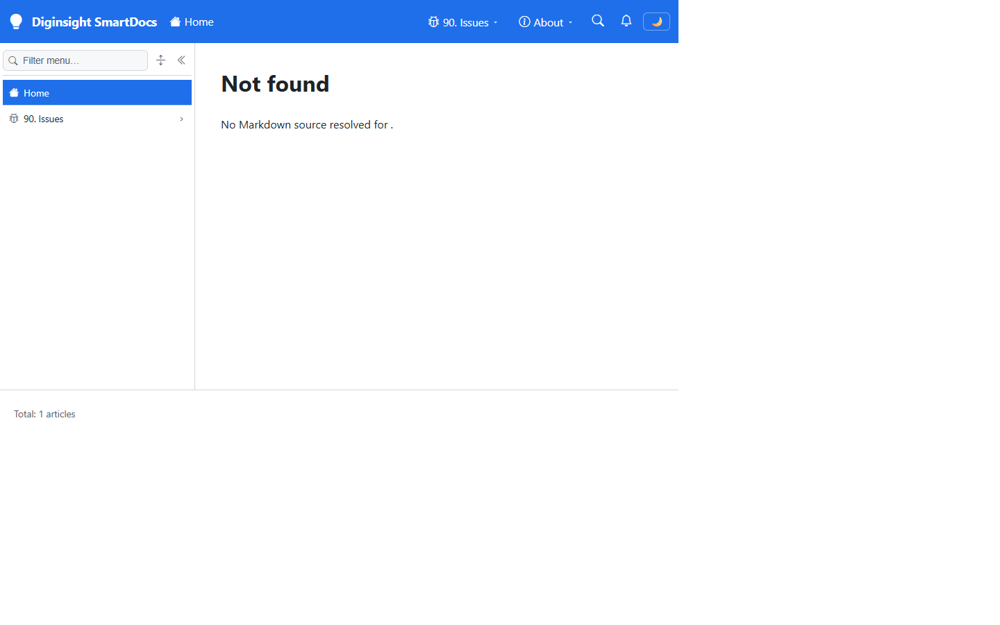
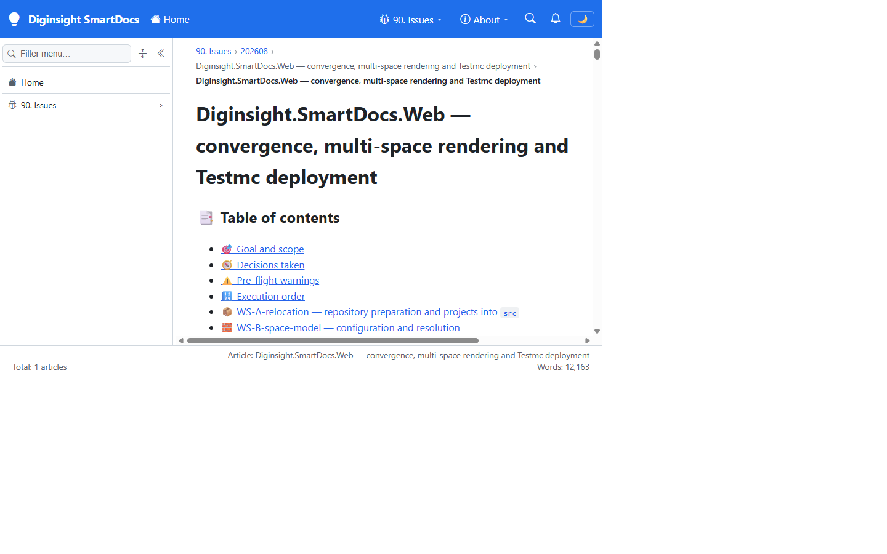

# 🧪 Validation sequence — SmartDocs.Web port, space model and branding

The application formerly known as `Learn.Web` now builds and runs as `Diginsight.SmartDocs.Web`, reads its content configuration from a `Site` section that declares a list of spaces instead of a single flat content block, and refuses to start when that declaration would produce an ambiguous URL space. This run confirms the ported application still renders Markdown, still builds its navigation live from the content hierarchy, now presents SmartDocs branding, and now fails closed on a misconfigured site.

## 🧭 Environment

| Item | Value |
|---|---|
| URL | `http://localhost:5280/` |
| Build | `dotnet build Diginsight.SmartDocs.slnx -c Debug` → **Build succeeded. 0 Warning(s) 0 Error(s)** |
| Run | `dotnet run --launch-profile http` in a visible foreground PowerShell console |
| Content source | `FileSystem`, root `src/docs` (space `diginsight.smartdocs`, `RouteBase: "/"`) |
| Browser | Visible headed browser window, viewport 1440×900 |
| Date | 2026-08-17 |

## ✅ Sequence and results

| # | Precondition | Action | Expected | Observed | Result |
|---|---|---|---|---|---|
| 1 | Solution restored, no prior build output | `dotnet build Diginsight.SmartDocs.slnx -c Debug` | Build succeeds with no warnings | `Build succeeded. 0 Warning(s) 0 Error(s)` | PASS |
| 2 | Server not running | `dotnet run --launch-profile http` in a visible console | Host starts and binds `http://localhost:5280` | Host started; `GET /` returned HTTP 200 (7 472 bytes) on the third poll | PASS |
| 3 | Server running | Open `http://localhost:5280/` in a visible browser | Shell renders with SmartDocs branding, not "Learning Hub" | Brand reads **Diginsight SmartDocs**; document title is `Diginsight SmartDocs` | PASS |
| 4 | Home page loaded | Read the sidebar tree | Navigation built at runtime from `src/docs`, showing its folders | Tree shows `Home` and `90. Issues`, built from the live hierarchy | PASS |
| 5 | Home page loaded | Read the main pane | `src/docs` has no root index, so the not-found page is expected | `Not found — No Markdown source resolved for .` | PASS |
| 6 | Server running | Navigate to `/90. Issues/202608/20260815.01-smartdocs-firstimpl/02-smartdocs-web-convergence.plan` | Markdown renders with breadcrumb, heading, table of contents and footer metrics | Article rendered; breadcrumb `90. Issues › 202608 › …`; H1, emoji headings and ToC present | PASS |
| 7 | Article displayed | Read the footer status bar from the live DOM | Footer reports the article and its word count | `Total: 1 articles · Article: Diginsight.SmartDocs.Web — convergence, multi-space rendering and Testmc deployment · Words: 12,163` | PASS |
| 8 | Article displayed | Read `document.title` from the live DOM | Title comes from the article's first heading, not the fallback | `Diginsight.SmartDocs.Web — convergence, multi-space rendering and Testmc deployment` | PASS |
| 9 | Server stopped | Start the host with a second space also declaring `RouteBase: "/"` | Host refuses to start and names both offending spaces | `InvalidOperationException: More than one space claims the site root: diginsight.smartdocs, second-root. At most one space may have RouteBase '/'.` | PASS |

## 📸 Evidence

| Step | Screenshot |
|---|---|
| **Steps 3–5** — the ported shell on first load. The top bar reads "Diginsight SmartDocs", the sidebar tree has been built at runtime from `src/docs`, and the main pane shows the expected not-found page because that folder has no root index. |  |
| **Steps 6–8** — an article rendered from Markdown through the ported pipeline: breadcrumb, H1, emoji-prefixed section headings, generated table of contents, and the footer reporting the article title and a 12 163-word count. |  |

**Step 9** produced console rather than screen evidence — the host exits before it can serve a page, which is the point of the check:

```text
Unhandled exception. System.InvalidOperationException: More than one space claims the site root:
diginsight.smartdocs, second-root. At most one space may have RouteBase '/'.
   at Diginsight.SmartDocs.Web.Shared.Sites.SpaceRegistry.Validate(IReadOnlyList`1 spaces)
   at Diginsight.SmartDocs.Web.Shared.Sites.SpaceRegistry..ctor(IEnumerable`1 spaces)
```

## 📝 Notes

- The first two screenshots were taken at a 1440×900 viewport. The initial exploratory snapshot was captured in the automation browser's default narrow window, which renders the sidebar as an icon rail; that is responsive behaviour, not a defect.
- `Total: 1 articles` is correct for this content root — `src/docs` currently holds a single Markdown article. The metrics warm-up folds the tree one root branch at a time, so the count is a labelled lower bound that settles rather than a value that jumps.
- Step 9 was run against a temporary second space injected through `Site__Spaces__1__*` environment variables; the variables were removed afterwards and no configuration file was changed.
- Not covered by this run, because the delivered configuration mounts a single space at the root: non-root `RouteBase` routing, the generated space index at `/`, per-space `/_content-raw` and `/_nav` addressing, and space-prefixed URL rewriting in `MarkdigMarkdownRenderer`. These are tracked in the plan as `WS-C`, `WS-D` and `Step E3`.
- The `X-Invalidate-Key` guard on `/_nav/invalidate` is inactive locally by design: it engages only when `Site:InvalidateApiKey` is non-empty, which is the case in the deployed configuration and not in a local run.
