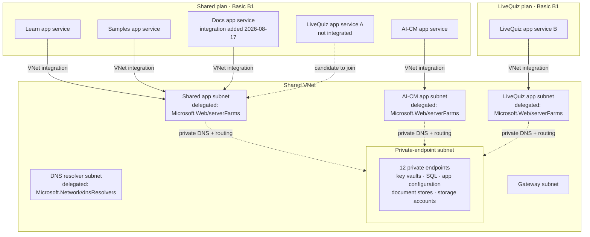

# Environment reference: testmc network topology

## 📚 Table of contents

- [🎯 Introduction](#-introduction)
- [🗺️ Topology diagram](#-topology-diagram)
- [🔌 App Service to subnet mapping](#-app-service-to-subnet-mapping)
- [🔒 Private endpoint inventory](#-private-endpoint-inventory)
- [📏 Plan-level integration limit](#-plan-level-integration-limit)
- [🧱 Infrastructure-as-code coverage](#-infrastructure-as-code-coverage)
- [🎓 What this means for a new deployment](#-what-this-means-for-a-new-deployment)
- [🏁 Conclusion](#-conclusion)
- [📚 References](#-references)

## 🎯 Introduction

This page describes how the `testmc` environment is wired: which App Services reach the shared virtual network, through which subnets, and which backing services are reachable only through private endpoints. It was assembled while diagnosing [incident B](03-incident-b-docs-site-500.md), but it is written as a standing reference rather than as part of that narrative.

**Naming convention.** Resources are named by **role**, not by resource name — "the docs app service", "the shared app subnet". Resource names, address ranges and subscription identifiers are deliberately absent because this repository is public. Readers with access to the paired private repository can resolve every alias through its `testmc` alias registry.

**Confidence.** The App Service integrations, the private endpoint inventory and the plan limit were observed directly. Every private endpoint's target resource was **enumerated live on 2026-08-18**, so the inventory below is verified rather than inferred from naming.

**Internal companion.** The as-built diagrams with real resource names, the subnet address spaces and the private endpoint target mapping are in the private peer repository: `src/docs/90.00-issues/202608/20260817.01-deployfail/04-environment-reference.internal.md`.

## 🗺️ Topology diagram

## 🔌 App Service to subnet mapping

| App Service | Plan | Integration subnet | Notes |
|---|---|---|---|
| AI-CM app service | Shared plan | AI-CM app subnet | Pre-existing |
| Learn app service | Shared plan | Shared app subnet | Pre-existing |
| Samples app service | Shared plan | Shared app subnet | Pre-existing |
| Docs app service | Shared plan | Shared app subnet | **Added 2026-08-17** to resolve incident B — reused the existing subnet because the plan was already at its limit |
| LiveQuiz app service A | Shared plan | none | Can join the shared app subnet without consuming a new plan slot, since that subnet is already counted against the plan. Not yet applied |
| LiveQuiz app service B | LiveQuiz plan | LiveQuiz app subnet | Separate plan with its own allowance; already reaches the same shared VNet |

## 🔒 Private endpoint inventory

Twelve private endpoints share the private-endpoint subnet:

| Endpoint role | Group ID | Backing service |
|---|---|---|
| Content store, blob | `blob` | Content storage account — serves the SmartDocs docs space |
| Content store, table | `table` | Content storage account |
| Samples store, blob | `blob` | Samples storage account |
| Samples store, table | `table` | Samples storage account |
| Shared key vault | `vault` | Key vault |
| AI-CM key vault | `vault` | Key vault |
| AI-CM SQL | `sqlServer` | SQL server |
| App configuration ×2 | `configurationStores` | App configuration stores |
| Document store ×2 | `Sql` | Document databases |
| LiveQuiz document store | `Sql` | Document database |

### Private DNS zone links

- The blob and document-store private DNS zones are **confirmed** linked to the shared VNet, with registration disabled.
- Key vault, SQL, app configuration and table zones were **not individually re-verified**. They are assumed to follow the same pattern, because every private endpoint above sits in the same subnet and VNet.

## 📏 Plan-level integration limit

An App Service plan on the Basic tier accepted at most **two distinct regional VNet integration subnets** in this environment. The shared plan was already using both before incident B, so an attempt to give the docs app a third, dedicated subnet was rejected outright by the platform with an HTTP 409 conflict.

The consequence is counter-intuitive and worth stating plainly:

> Adding an app to an **existing** integration subnet costs **no** plan slot. Adding a **new** subnet costs one, and there are only two.

This makes subnet reuse the default choice on a shared plan, and makes "one subnet per app" an option that must be budgeted for at design time — or paid for with a separate plan.

## 🧱 Infrastructure-as-code coverage

**There is none.** This warrants its own section because it changes how much the rest of this page can be relied upon.

| Signal | Observed |
|---|---|
| `.bicep` / `.bicepparam` / `.tf` files in the repository | 0 |
| References to VNet or subnet configuration in the workflows | 0 |

Every fact on this page describes **live environment state that no repository artifact declares**. In particular, the VNet integration that resolved incident B was applied imperatively against the running environment and exists in no committed file.

The practical consequences:

- **The fix is not reproducible.** Rebuilding or recreating the docs app restores the broken configuration, because the working configuration was never written down anywhere executable.
- **Drift is undetectable.** Nothing can compare intended state against actual state, so a manual change — including an accidental one — leaves no trace and triggers no alarm.
- **This page is the only record.** A prose document is a weak substitute for a template: it cannot be applied, validated, or diffed, and it goes stale silently.

Closing this gap means declaring the App Service plans, the VNet integrations, the subnets and their delegations as code, then reconciling the declaration against what is currently deployed. Until that happens, treat every statement here as an observation with a shelf life rather than as a specification.

## 🎓 What this means for a new deployment

Before adding an App Service that reads from a privately secured backing service in this environment:

1. **Check the plan's remaining integration slots first.** If both are used, plan to reuse an existing subnet rather than requesting a new one.
2. **Confirm the target subnet is delegated** to `Microsoft.Web/serverFarms` and sits in the shared VNet.
3. **Confirm the backing service's private DNS zone is linked** to that VNet, otherwise name resolution still returns the public endpoint.
4. **Add VNet integration as part of provisioning**, not as a remediation step after a failed smoke check.
5. **Record the change as code.** See the section above — nothing else in this environment currently does.

## 🏁 Conclusion

The `testmc` environment routes every App Service to its backing services through a single shared virtual network, with all private endpoints concentrated in one subnet. The binding constraint is the two-subnet-per-plan integration limit, which makes subnet sharing the norm rather than the exception. The binding *risk* is that none of this is declared as code, so the topology described here is observed rather than specified, and any rebuild will not reproduce it.

## 📚 References

- **[Integrate your app with an Azure virtual network](https://learn.microsoft.com/azure/app-service/overview-vnet-integration)** 📘 [Official]  
  Regional VNet integration behaviour and the per-plan subnet limits that shape every mapping on this page.

- **[Use private endpoints for Azure Storage](https://learn.microsoft.com/azure/storage/common/storage-private-endpoints)** 📘 [Official]  
  How a storage account's network rules and private endpoint/DNS configuration decide which callers can reach it.

- **[Azure Private Endpoint DNS configuration](https://learn.microsoft.com/azure/private-link/private-endpoint-dns)** 📘 [Official]  
  Why a linked private DNS zone is required for a private endpoint to be resolvable from an integrated subnet.
