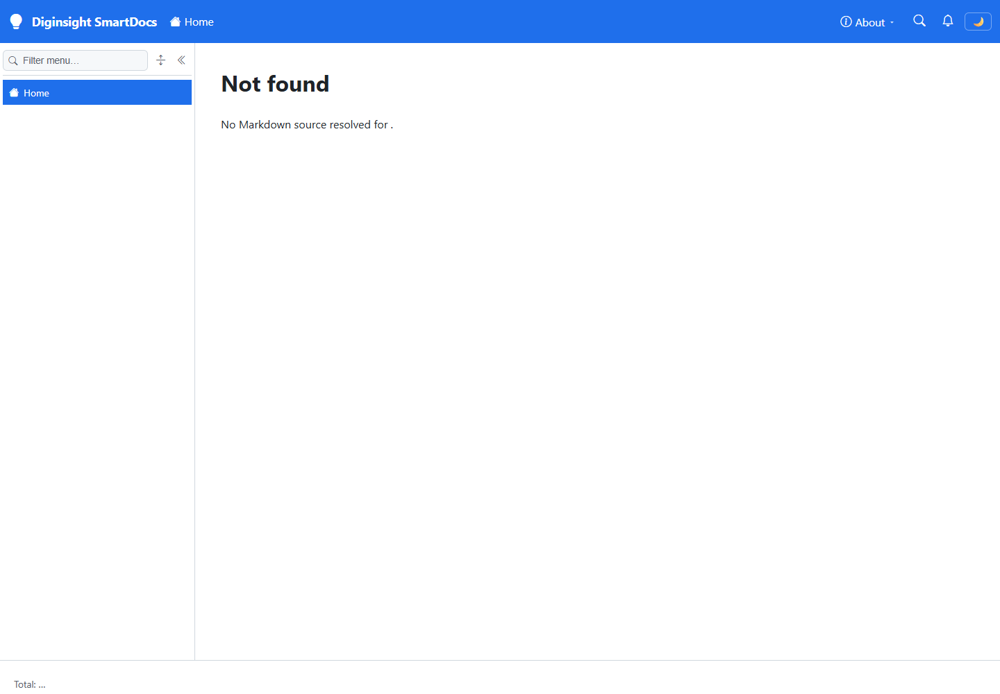
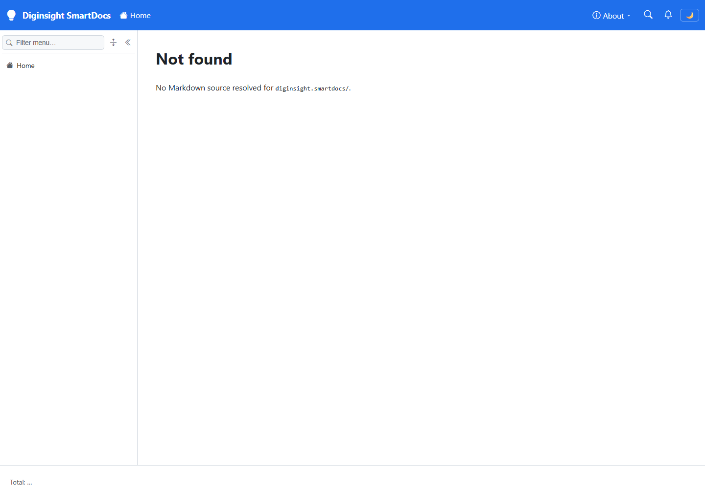

# Validation sequence — docs deployment smoke check

This run validates that the documentation App Service can reach its private Blob Storage endpoint and that the deployment smoke check receives HTTP 200. A passing run proves network connectivity and deployment readiness; it doesn't prove content publication because the configured container is empty.

## 🧪 Environment

| Item | Value |
|---|---|
| URL | Documentation App Service URL resolved from the private `TestmcDocs` overlay (masked) |
| Build | GitHub Actions run `32062547792`, attempt 2 → success |
| Run | `02 · Deploy docs site`, rerun of failed jobs |
| Browser | Visible headed Microsoft Edge window, viewport 1440×1000 |
| Date | August 17, 2026 |

## ✅ Sequence and results

| # | Precondition | Action | Expected | Observed | Result |
|---|---|---|---|---|---|
| 1 | The docs App Service is integrated with the storage private-endpoint VNet. | Open `/` in the visible browser. | The host returns HTTP 200 and renders the application shell instead of an empty HTTP 500 response. | HTTP `200`; page title `Diginsight SmartDocs`; live `h1` value `Not found`. | PASS |
| 2 | The same deployment is running, and the docs space is mounted at `/diginsight.smartdocs`. | Open `/diginsight.smartdocs/` in the visible browser. | The host returns HTTP 200 and renders the application shell instead of an empty HTTP 500 response. | HTTP `200`; page title `Diginsight SmartDocs`; live `h1` value `Not found`. | PASS |
| 3 | GitHub Actions run `32062547792` previously failed during `Smoke check` with ten HTTP 500 responses. | Rerun failed jobs after adding VNet integration. | Deployment and smoke-check steps complete successfully. | Attempt 2: `Deploy to App Service` → `success`; `Smoke check` → `success`; job completed in 3m30s. | PASS |

## 📷 Evidence

| Step | Screenshot |
|---|---|
| **Step 1** — The post-deployment root request renders the SmartDocs shell instead of returning an empty HTTP 500 response. |  |
| **Step 2** — The mounted docs-space request also renders through the repaired host. |  |

The workflow result has no separate rendered application state, so its console-only evidence is the completed attempt summary:

```text
02 · Deploy docs site — run 32062547792, attempt 2
Deploy to App Service: success
Smoke check: success
Job: success (3m30s)
```

## 📝 Notes

- The original application logs showed Blob Storage `AuthorizationFailure`. The managed identity already held container-scoped `Storage Blob Data Reader`, but the storage account had public network access disabled and the App Service had no VNet integration.
- The App Service plan already used its two allowed integration subnets. The repair reused the existing shared App Service subnet in the private-endpoint VNet; no storage firewall or public-access setting was relaxed.
- The `Not found` headings are expected for this validation because the docs container is empty. The host navigation index returned zero entries after connectivity was restored.
- This run didn't cover content publication, article rendering, generated site-index behavior, responsive layouts, or interactive navigation.
