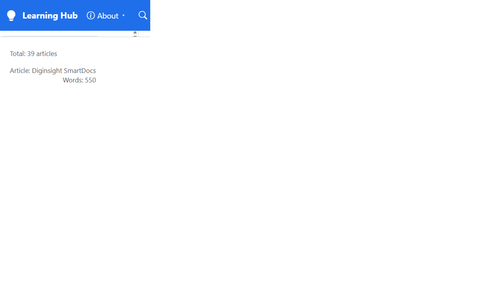

# Validation sequence - configured shell title

This run validates that the shell brand shown in the top navigation comes from runtime configuration. A passing run proves that a deployment whose `Site:Title` is configured as `Learning Hub` no longer renders the hardcoded `Diginsight SmartDocs` label in the navbar.

## 🧪 Environment

| Item | Value |
|---|---|
| URL | `http://localhost:5280/` |
| Build | `dotnet build src\Diginsight.SmartDocs.slnx` -> PASS |
| Run | `dotnet run --launch-profile http` from `src/Diginsight.SmartDocs.Web`, with `Site__Title=Learning Hub` |
| Browser | Visible headed window, viewport 1240x720 |
| Date | 2026-08-19 |

## ✅ Sequence and results

| # | Precondition | Action | Expected | Observed | Result |
|---|---|---|---|---|---|
| 1 | Local server running with `Site__Title=Learning Hub`. | Open `http://localhost:5280/` in a visible browser and read `.brand span` from the live DOM. | The navbar brand text is `Learning Hub`. | `.brand span` = `Learning Hub`; brand icon class = `bi bi-lightbulb-fill`. | PASS |

## 📸 Evidence

| Step | Screenshot |
|---|---|
| **Step 1** - The navbar shows the configured shell title. |  |

## 📝 Notes

- The run used a local environment-variable override instead of the deployed Testmc overlay, so the public artifact does not expose deployment-specific values.
- The browser tab title remained `Diginsight SmartDocs` because the loaded home article itself has `# Diginsight SmartDocs`; this run validates the shell brand, not article frontmatter or rendered article titles.
- The run did not cover the deployed App Service, blob-backed content, or the private Testmc overlay fetch workflow.