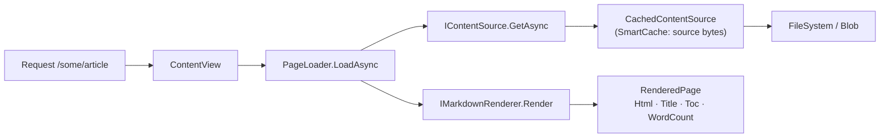
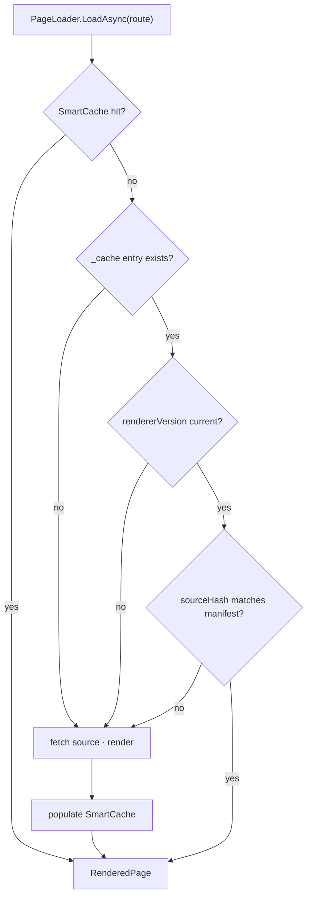

# Prerendered Markdown cache — render once, serve many

> **Status: `draft`.** The design below is complete and the first work stream is executable today. It is **not** promoted to `actionable` because the premise that motivates it — that rendering is expensive — is currently unmeasured, and § WS-0 exists to confirm or refute it. See § Answering the question that was asked for why that matters more than usual here.

## 📚 Table of contents

- [Goal](#-goal)
- [Answering the question that was asked](#-answering-the-question-that-was-asked)
- [How rendering works today](#-how-rendering-works-today)
- [Where the time actually goes](#-where-the-time-actually-goes)
- [The design](#-the-design)
- [Decisions taken](#-decisions-taken)
- [Execution steps](#-execution-steps)
- [Exit criteria](#-exit-criteria)
- [Open decisions](#-open-decisions)
- [Discovery](#-discovery)
- [Park lot](#-park-lot)
- [References](#-references)

## 🎯 Goal

Produce the rendered form of every article at publish time, store it beside the content under `_cache`, stamped so staleness is detectable, and consume it ahead of live rendering — so that rendering happens once per content version rather than once per cold request and once per browser navigation.

## 🧭 Answering the question that was asked

The request asked four things directly. Three are yes. One is no, and it is load-bearing.

**Is the shape of the idea right?** Yes. The proposed lookup order — SmartCache, then `_cache`, then render — is exactly the right ladder, and the instinct to stamp each entry with a hash or timestamp so staleness is detectable is the correct instinct.

**Can it work?** Yes, and § The design specifies how.

**Will it improve *startup* latency?** **No.** Nothing renders at startup. Rendering is lazy and per request: [`ContentView`](src/Diginsight.SmartDocs.Web.Shared/Components/ContentView.razor.cs) calls `PageLoader.LoadAsync` when a page is requested, never at boot. The one thing that *does* run at startup is the **navigation** warm-up, `WarmAllLevelsAsync` in [Program.cs](src/Diginsight.SmartDocs.Web/Program.cs#L271), which walks the content hierarchy and computes folder counts. That is a listing cost, not a rendering cost, and this plan does not touch it. Prerendering articles will leave startup time unchanged. What it improves is **first-view latency per article** and **in-browser navigation latency**.

This matters because if startup is the actual complaint, this plan is the wrong plan and the navigation warm-up is the right target.

**Is the request clear, unambiguous and fully actionable?** Clear and well-motivated — but **not fully actionable as stated**, for four reasons, each resolved below rather than left hanging:

| # | Gap in the request as stated | Where resolved |
|---|---|---|
| 1 | "Rendering is very expensive" is asserted, not measured — and the corpus size argues against it on the server | § WS-0, a gate |
| 2 | Validating a cache entry against the source implies *reading the source*, which is the expensive part in blob storage — so a naive validation defeats the cache | § D2, manifest |
| 3 | A source hash alone cannot detect a cache invalidated by a **renderer** change rather than a content change | § D3, version stamp |
| 4 | "Save the rendering to `_cache`" implies the app writes to the content store, which in production it has no reason to be able to do | § D4, publish-time only |

## 🔍 How rendering works today

Read from source on 2026-09-04.



Three facts about this flow drive the whole design:

- **[`PageLoader`](src/Diginsight.SmartDocs.Web.Shared/Services/PageLoader.cs) lives in the shared project and runs on both sides.** `MarkdigMarkdownRenderer` is registered in [the server](src/Diginsight.SmartDocs.Web/Program.cs#L171) *and* in [the client](src/Diginsight.SmartDocs.Web.Client/Program.cs#L16). So a first page view renders the same Markdown **twice** — once on the server during prerender, once in the browser after hydration — and every subsequent in-app navigation renders once more, in the browser.
- **[`CachedContentSource`](src/Diginsight.SmartDocs.Web/ContentSources/CachedContentSource.cs) caches source bytes, never rendered HTML.** Its own doc comment says so. The rendering result is discarded after every request.
- **Rendering produces four values, not one.** `RenderedPage(Html, Title, Toc, WordCount)`. A cache that stores only HTML would force a re-parse to recover the other three, which would defeat itself.

## ⏱️ Where the time actually goes

The corpus is **85 Markdown files, 715 KB total, 8.4 KB average, 105.7 KB largest**.

Markdig parses and renders in the low tens of MB/s. At 8.4 KB, an average article is plausibly a **fraction of a millisecond** on server .NET, and the largest article a few milliseconds. Against that, a blob round trip is tens of milliseconds.

That comparison produces the uncomfortable observation this plan is built around:

> On the **server**, replacing "fetch `.md`, then render" with "fetch prerendered `.json`" removes the *cheap* part and keeps the *expensive* part. It is still one round trip to storage. The saving is CPU that may be under a millisecond.

The saving is real in two other places, and they are where the value is:

1. **The browser.** WASM .NET runs several times slower than server .NET, so the same render costs materially more after hydration — and it is paid again on every client-side navigation, where there is no server prerender to hide it. Serving a rendered envelope to the client removes that entirely, and opens the door to dropping Markdig from the WASM payload (§ Park lot).
2. **Cold multi-instance starts**, where SmartCache is empty and every first view pays full cost.

There is also a **cheaper competing option** that must be honestly compared before this is built: the content endpoint already computes a strong `ETag` ([`FileSystemContentSource`](src/Diginsight.SmartDocs.Web/ContentSources/FileSystemContentSource.cs) hashes the bytes; `BlobContentSource` uses the blob ETag). Serving proper cache-validation headers from `/_content` would let the browser skip the request altogether — which beats making the response cheaper to produce. That option is not exclusive with this plan, and § WS-0 decides the order.

## 🧩 The design

### The cache entry

One entry per source file, mirroring its path: `06.00-reference/02-http-endpoints.md` → `_cache/06.00-reference/02-http-endpoints.md.json`.

```jsonc
{
  "schema": 1,
  "rendererVersion": "3",          // bumped when the pipeline or URL rewriting changes
  "sourceHash": "sha256:9f2b…",    // of the source bytes, as published
  "renderedUtc": "2026-09-04T12:00:00Z",
  "title": "HTTP endpoints",
  "wordCount": 1180,
  "toc": [ { "level": 2, "text": "Content", "id": "content" } ],
  "html": "<h2 id=\"content\">…"
}
```

`_cache` needs no navigation work: [`NavRules`](src/Diginsight.SmartDocs.Web.Shared/Navigation/NavRules.cs#L99) already excludes any name starting with `_`, which is why `_evidence` and `_validation` are invisible today.

### The lookup order



Every negative branch lands on live rendering. The cache can be absent, stale, corrupt or wholly disabled and the site still serves correct pages — only slower. That property is non-negotiable and is the first exit criterion.

### Why a manifest

Validating `sourceHash` by hashing the source requires **fetching the source**, which is the cost the cache exists to avoid. So the hashes are published once, together, in `_cache/manifest.json`, fetched a single time at startup and held in memory:

```jsonc
{ "schema": 1, "rendererVersion": "3", "entries": { "index.md": "sha256:…", "…": "…" } }
```

Validation is then an in-memory dictionary lookup costing nothing, and the cache genuinely removes a round trip rather than relocating it.

## 🧩 Decisions taken

Recorded here because the plan is being written without a live reviewer; each is reversible and each names what would reverse it.

### D1 — measure before building

WS-0 measures server and client render time against this corpus and compares it with the round-trip cost. If server-side rendering proves to be under ~1 ms for a median article, the server half of this plan is not worth its complexity and **only the client half proceeds**. *Reverses if* measurement shows rendering dominating.

### D2 — validate via a published manifest, not by reading the source

Per § Why a manifest. The manifest is written by the same generator that writes the entries, so the two cannot disagree. *Reverses if* the content set grows large enough that a single manifest is unwieldy, at which point per-entry validation against blob properties becomes preferable.

### D3 — stamp the renderer version, not only the content

A content hash cannot detect a cache made wrong by a **code** change. Today's rename of `/_content-raw` to `/_content` ([sibling plan](01-content-endpoint-fix.plan.md)) is precisely such a change: every source file was byte-identical afterwards, yet every previously rendered HTML fragment became wrong, because the renderer rewrites asset URLs. `rendererVersion` is a constant in the renderer, bumped by hand whenever the pipeline or the URL rewriting changes. *Reverses if* it is ever derived automatically and reliably.

### D4 — the cache is written at publish time only; the app never writes it

The request suggested rendering on miss and saving the result. In production, content is in blob storage and the app reads it with an identity that has no reason to hold write permission. Granting write access to the content container so the web tier can memoise into it enlarges the blast radius of a web-tier compromise for a saving already covered by SmartCache. Runtime misses therefore populate **SmartCache** and nothing else. *Reverses if* an authenticated content-upload path is built, which is the natural moment to render on write.

## 🛠️ Execution steps

### WS-0 — measure, and decide whether to continue (gate)

- **0.1.** Add a throwaway benchmark that renders all 85 files through `MarkdigMarkdownRenderer` and reports median and p95 per file, server-side. (🟡 todo)
- **0.2.** Measure the same in the browser: time `PageLoader.LoadAsync` after hydration for a median and for the largest article. (🟡 todo)
- **0.3.** Measure a cold `IContentSource.GetAsync` against blob storage for comparison. (🟡 todo)
- **0.4.** Record all three in a short results note under `_validation/`. (🟡 todo)
- **0.5. Gate.** Continue to WS-A only if rendering is a **meaningful fraction of** cold page cost. If server rendering is negligible but client rendering is not, **skip WS-A/WS-B for the server path and proceed to WS-D only**. If both are negligible, **stop** and close this plan as not worth building, recording the measurement as the reason — that is a legitimate and successful outcome of this plan. (🟡 todo)

### WS-A — the cache contract (shared project)

- **A1.** Add `RendererVersion` as a constant on `MarkdigMarkdownRenderer`, and document that it MUST be bumped whenever the pipeline or `Rewrite` changes. (🟡 todo)
- **A2.** Add `PrerenderedPage` (the entry) and `PrerenderManifest` records, plus a `IPrerenderedPageSource` abstraction with a single `TryGetAsync(contentKey, sourceHashOrNull)`. (🟡 todo)
- **A3.** Add serialisation with an explicit `schema` field and a source-generated `JsonSerializerContext`, so the client stays trimming-friendly. (🟡 todo)

### WS-B — consume the cache (server)

- **B1.** Introduce a `CachedPageLoader` decorator implementing the ladder in § The lookup order. `PageLoader` itself stays unchanged so the fallback path is provably identical to today's behaviour. (🟡 todo)
- **B2.** Load `_cache/manifest.json` once at startup through the existing `IContentSource`; on absence or parse failure, log a warning and disable the tier — never fail startup. (🟡 todo)
- **B3.** Add a `Prerender:Enabled` configuration switch defaulting to **off**, so the tier can be disabled in production without a redeploy. (🟡 todo)

### WS-C — generate the cache (publish time)

- **C1.** Add `src/Diginsight.SmartDocs.Prerender`, a console project referencing only `Web.Shared`, that walks a content root, renders every `.md`/`.qmd`, and writes `_cache/**` plus `manifest.json`. (🟡 todo)
- **C2.** Assert in the generator that its `RendererVersion` matches the one it stamps, so a cache can never be published under a version it was not produced by. (🟡 todo)
- **C3.** Run the generator in [03.PublishDocsContent.yml](.github/workflows/03.PublishDocsContent.yml) **before** the *Stage content* step, so `_cache` is picked up by the existing unfiltered copy and uploaded with everything else. (🟡 todo)
- **C4.** Confirm the staged `_cache` survives the `bin`/`obj`/`node_modules` pruning in that step and is not accidentally matched by it. (🟡 todo)

### WS-D — consume the cache (client) — the main prize

- **D1.** Add a `GET /_render/{**key}` endpoint returning the `RenderedPage` envelope as JSON, served from the same ladder as WS-B. (🟡 todo)
- **D2.** Give the client an `IPrerenderedPageSource` over that endpoint, and have its `PageLoader` path prefer it, falling back to fetching `.md` and rendering locally. (🟡 todo)
- **D3.** Verify prerender and hydration agree — the server-rendered HTML and the client-applied HTML MUST be identical, or the page will visibly flicker or reshuffle on hydration. (🟡 todo)

### WS-E — validation (mandatory)

`testing-validation.instructions.md` applies: this changes runtime behaviour under `src/*Web*/**`.

- **E1.** In a **visible browser**, with the tier **on**, confirm an article renders identically to the same article with the tier **off**. (🟡 todo)
- **E2.** Corrupt one `_cache` entry and confirm the page still renders, via fallback, with a warning logged and no error surfaced. (🟡 todo)
- **E3.** Bump `RendererVersion` without regenerating, and confirm every page falls back rather than serving stale HTML. (🟡 todo)
- **E4.** Record the run as a validation-sequence document with screenshots under `_validation/`. (🟡 todo)

## ✅ Exit criteria

- With `_cache` absent, corrupt, or stale, every page still renders correctly — proven by E2 and E3.
- Rendered output is identical with the tier on and off — proven by E1.
- The measured improvement from WS-0 is realised and recorded; if it is not, the plan is closed as not worth building rather than shipped anyway.
- `_cache` is invisible in navigation and folder counts.

## 🕳️ Open decisions

- **O1 — does the client keep Markdig at all?** If WS-D succeeds, the client renders only on fallback. Whether to keep that fallback (costing WASM payload) or remove it (making the client hard-depend on the endpoint) needs a payload measurement. **Blocks nothing before WS-D.**
- **O2 — precedence between this plan and HTTP cache validation headers on `/_content`.** The header work may deliver more for less. WS-0's numbers decide the order; they are not mutually exclusive.

## 🔭 Discovery

- **Is rendering genuinely on the critical path for a cold view, or is it lost inside the blob round trip and the navigation warm-up?** WS-0 answers this. **Negative branch:** if rendering is not on the critical path, close this plan and redirect the effort at the navigation warm-up, which is what actually runs at startup.

## 📦 Park lot

- **Dropping Markdig from the WASM payload** — potentially the largest single win here, measured in download size rather than milliseconds. → *defer to O1, after WS-D.*
- **Upload-triggered rendering** — the request anticipates this ("when upload article will be available we'll support upload with rendering"). The generator built in WS-C is deliberately a library-plus-console so it can be called from an upload path unchanged. → *defer until an upload path exists.*
- **`_cache` is anonymously retrievable** via `/_content/_cache/…`, since the endpoint has no authentication. It exposes nothing that the source Markdown does not already expose, so this is not a new exposure class, but it belongs with the existing unauthenticated-content item in the [content-management plan](../../202608/20260818.01-docmanager-improvement/01-content-management-artifacts-improvement.plan.md). → *route there.*
- **Navigation warm-up cost at startup** — the real startup cost, out of scope here, and the correct target if startup latency is the actual complaint. → *sibling plan.*

## 📚 References

- **📄** [01-content-endpoint-fix.plan.md](01-content-endpoint-fix.plan.md) — the sibling rename that motivates the renderer-version stamp in D3
- **📄** [src/docs/03.00-architecture/04-shared-library.md](src/docs/03.00-architecture/04-shared-library.md) — the shared abstractions this plan extends
- **📄** [src/docs/04.00-use-cases/01-reading-a-document.md](src/docs/04.00-use-cases/01-reading-a-document.md) — the request flow the new tier inserts into
- **📖** `.github/instructions/testing-validation.instructions.md` — the browser-validation requirement WS-E satisfies
