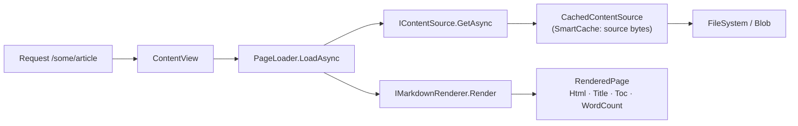
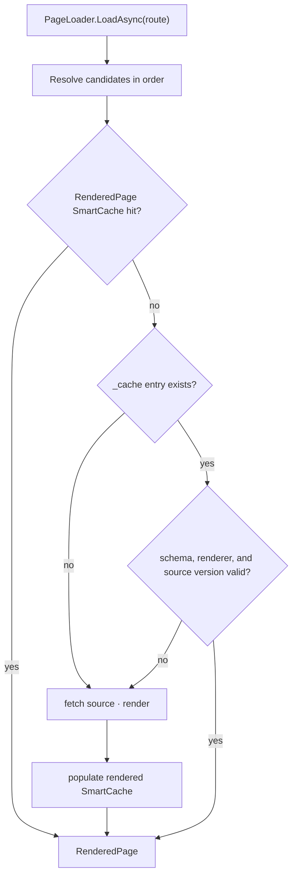

# Prerendered Markdown cache — render once, serve many

> **Status: `in-progress`.** Execution began on 2026-09-05. The implementation will proceed through the shared cache contract, server fallback, publish operation, and environment validation workstreams; items are marked done only after their acceptance evidence exists.

## 📚 Table of contents

- [Goal](#-goal)
- [Answering the question that was asked](#-answering-the-question-that-was-asked)
- [How rendering works today](#-how-rendering-works-today)
- [Where the time actually goes](#-where-the-time-actually-goes)
- [The design](#-the-design)
- [Decisions taken](#-decisions-taken)
- [Execution steps](#-execution-steps)
- [Exit criteria](#-exit-criteria)
- [Open decisions](#-open-decisions)
- [Discovery](#-discovery)
- [Park lot](#-park-lot)
- [References](#-references)

## 🎯 Goal

Produce the rendered form of every article at publish time, store it beside the content under `_cache`, stamped so staleness is detectable, and consume it ahead of live rendering — so that rendering happens once per content version rather than once per cold request and once per browser navigation.

## 🧭 Answering the question that was asked

The request asked four things directly. Three are yes. One is no, and it is load-bearing.

**Is the shape of the idea right?** Yes, with one correction: the first tier must be a **rendered-page** SmartCache, not the existing source-byte SmartCache. The correct ladder is: rendered `RenderedPage` SmartCache → validated `_cache` entry → source bytes plus live render.

**Can it work?** Yes, and § The design specifies how.

**Will it improve *startup* latency?** **No.** Nothing renders at startup. Rendering is lazy and per request: [`ContentView`](src/Diginsight.SmartDocs.Web.Shared/Components/ContentView.razor.cs) calls `PageLoader.LoadAsync` when a page is requested, never at boot. The one thing that *does* run at startup is the **navigation** warm-up, `WarmAllLevelsAsync` in [Program.cs](src/Diginsight.SmartDocs.Web/Program.cs#L271), which walks the content hierarchy and computes folder counts. That is a listing cost, not a rendering cost, and this plan does not touch it. Prerendering articles will leave startup time unchanged. What it improves is **first-view latency per article** and **in-browser navigation latency**.

This matters because if startup is the actual complaint, this plan is the wrong plan and the navigation warm-up is the right target.

**Is the request clear, unambiguous, and fully actionable now?** Yes. The original request left five implementation choices open; this plan resolves each one into a fixed contract:

| # | Original ambiguity | Fixed contract |
|---|---|---|
| 1 | The performance benefit was assumed rather than measured. | WS-0 measures server rendering, client rendering, and source retrieval. D1 defines the 5 ms p95 or 10% latency-reduction threshold for enabling each tier. |
| 2 | Validating a cache entry by hashing Markdown would require downloading the source again. | D2 uses `IContentVersionSource.GetVersionAsync`; unavailable version metadata rejects the rendered entry and uses the normal source-byte fallback. |
| 3 | A source version cannot detect renderer changes. | Every rendered entry carries `RendererVersion`; D3 requires a version bump whenever the pipeline or URL rewriting changes. |
| 4 | Runtime writes to `_cache` would require giving the web app content-store write permission. | `D4-configurable-runtime-persistence` makes persistence configurable: SmartDocs always works in non-persistent mode, and writes runtime results only when explicitly enabled and the source grants write access. |
| 5 | A browser request that receives unchanged Markdown may be cheaper to avoid than to replace with a rendered-page request. | D6 and WS-0 compare conditional `/_content` requests with rendered-page delivery before enabling the more complex tier. |

### Review and proceed

The plan is ready to proceed when the reviewer accepts these fixed boundaries:

1. Keep the existing Markdown source-byte SmartCache as the default correctness-preserving fallback.
2. Add a separate rendered-page SmartCache; never reinterpret `CachedContentSource` as a rendered-page cache.
3. Stage Markdown first, then ask SmartDocs to generate `_cache` through its authenticated administrative prerender operation, using the complete `RenderedPage` contract and source/renderer version stamps.
4. Configure runtime persistence explicitly: default to SmartCache-only operation; enable `_cache` writes only for a source that implements `IWritableRenderedPageStore` and grants the required permission. Publish-time release writes use a separate staging-release writer and are awaited before promotion.
5. Publish through a versioned staging release and update the active-release marker last.
6. Use the existing `X-Invalidate-Key` / `Site:InvalidateApiKey` keyed mechanism for the first administrative endpoint version; defer Azure AD authentication to a later plan.
7. Run WS-0 before enabling either rendered tier. The measured result may enable the server tier, the client tier, both, or neither; it may not change the cache contracts or fallback behavior.

No user-facing content request, upload-triggered rendering, or startup navigation warm-up is hidden inside this scope. Those remain explicitly excluded or parked below.

## 🔍 How rendering works today

Read from source on 2026-09-04.


```mermaid
flowchart LR
  A["Request /some/article"] --> B["ContentView"]
  B --> C["PageLoader.LoadAsync"]
  C --> D["IContentSource.GetAsync"]
  D --> E["CachedContentSource<br/>(SmartCache: source bytes)"]
  E --> F["FileSystem / Blob"]
  C --> G["IMarkdownRenderer.Render"]
  G --> H["RenderedPage<br/>Html · Title · Toc · WordCount"]
```

Three facts about this flow drive the whole design:

- **[`PageLoader`](src/Diginsight.SmartDocs.Web.Shared/Services/PageLoader.cs) lives in the shared project and runs on both sides.** `MarkdigMarkdownRenderer` is registered in [the server](src/Diginsight.SmartDocs.Web/Program.cs#L171) *and* in [the client](src/Diginsight.SmartDocs.Web.Client/Program.cs#L16). So a first page view renders the same Markdown **twice** — once on the server during prerender, once in the browser after hydration — and every subsequent in-app navigation renders once more, in the browser.
- **[`CachedContentSource`](src/Diginsight.SmartDocs.Web/ContentSources/CachedContentSource.cs) caches source bytes, never rendered HTML.** Its own doc comment says so. A SmartCache hit there still reaches `IMarkdownRenderer.Render`; it is not the first tier in the new rendered-page ladder. The new design adds a separate rendered-page cache above source loading.
- **Rendering produces a page and page metadata, not HTML alone.** The current shape is `RenderedPage(Html, Title, Toc, WordCount)`. The planned shape is `RenderedPage(Html, PageMetadata)`, where `PageMetadata` preserves `Title`, `Toc`, and `WordCount` as typed fields and carries an additive extension map for future page-level values. A cache that stores only HTML would force a re-parse to recover metadata, which would defeat itself.

`metadata.yml` needs a precise boundary here. In this repository, `metadata.yml` is currently **folder metadata** used by navigation (`label`, `short`, `icon`, `order`, `hidden`, and related folder options). It is not the article's rendered-page metadata and must not be copied into every `RenderedPage` entry. The rendered cache should serialize the normalized page-level `PageMetadata` contract; folder metadata remains a separate navigation input and cache.

## ⏱️ Where the time actually goes

The local SmartDocs corpus is **85 Markdown files, 715 KB total, 8.4 KB average, and 105.7 KB largest**. That is a development sample, not a safe production sizing assumption. The shared Learn deployment already has **1,300+ Markdown files** and may grow to several thousand.

Markdig parses and renders in the low tens of MB/s, but total publish cost scales with file count, total bytes, metadata extraction, storage writes, retries, and concurrency. At thousands of files, a full release render can become a meaningful CI/CD and storage operation even when each individual article is cheap. The plan therefore treats corpus size, total bytes, p95 file time, peak concurrency, total duration, and failure rate as release-level measurements.

That comparison produces the uncomfortable observation this plan is built around:

> On the **server**, replacing "fetch `.md`, then render" with "fetch prerendered `.json`" removes the *cheap* part and keeps the *expensive* part. It is still one round trip to storage. The saving is CPU that may be under a millisecond.

The saving is real in two other places, and they are where the value is:

1. **The browser.** WASM .NET runs several times slower than server .NET, so the same render costs materially more after hydration — and it is paid again on every client-side navigation, where there is no server prerender to hide it. Serving a rendered envelope to the client removes that entirely, and opens the door to dropping Markdig from the WASM payload (§ Park lot).
2. **Cold multi-instance starts**, where SmartCache is empty and every first view pays full cost.

For a multi-thousand-file Learn corpus, full publish-time generation remains the default correctness target, but it MUST run as a bounded batch operation rather than an unbounded request. The operation needs a durable operation ID, progress counters, bounded parallelism, retryable file failures, cancellation, and a maximum execution duration. A release is promotable only when every eligible file has a valid entry; partial output remains in the staging release.

### The cheaper competing option: conditional HTTP caching

The content source already computes a strong `ETag` ([`FileSystemContentSource`](src/Diginsight.SmartDocs.Web/ContentSources/FileSystemContentSource.cs) hashes the bytes; `BlobContentSource` uses the blob ETag), but the endpoint does not yet expose conditional-response behavior. Adding `ETag` to `/_content` responses and honoring `If-None-Match` would let the browser receive `304 Not Modified` and skip the Markdown payload when the source has not changed. That can be cheaper than requesting a rendered-page envelope, especially on repeat navigation.

This option is now part of the plan. WS-0 measures it before enabling prerendering. If conditional HTTP caching meets the client latency target with less complexity, implement it as the first optimization and disable the rendered-page client tier. If it does not meet the target, retain it as a measured negative result and continue with the rendered-page decision. The two options may also be enabled together when the measurements show a benefit: conditional caching protects the source endpoint, while prerendering removes client-side Markdown parsing and rendering.

## 🧩 The design

### The cache entry

One entry per source file, mirroring its path: `06.00-reference/02-http-endpoints.md` → `_cache/06.00-reference/02-http-endpoints.md.json`.

```jsonc
{
  "schema": 1,
  "rendererVersion": "3",          // bumped when the pipeline or URL rewriting changes
  "sourceVersion": "etag:...",     // published source version
  "sourceKey": "06.00-reference/02-http-endpoints.md",
  "renderedUtc": "2026-09-04T12:00:00Z",
  "metadata": {
    "title": "HTTP endpoints",
    "wordCount": 1180,
    "toc": [ { "level": 2, "text": "Content", "id": "content" } ],
    "extensions": {}
  },
  "html": "<h2 id=\"content\">…"
}
```

`_cache` needs no navigation work: [`NavRules`](src/Diginsight.SmartDocs.Web.Shared/Navigation/NavRules.cs#L99) already excludes any name starting with `_`, which is why `_evidence` and `_validation` are invisible today.

### The lookup order


```mermaid
flowchart TD
  A["PageLoader.LoadAsync(route)"] --> L["Resolve candidates in order"]
  L --> B{"RenderedPage SmartCache hit?"}
  B -- yes --> Z["RenderedPage"]
  B -- no --> C{"_cache entry exists?"}
  C -- no --> R["fetch source · render"]
  C -- yes --> D{"schema, renderer, and source version valid?"}
  D -- no --> R
  D -- yes --> Z
  R --> Y["populate rendered SmartCache"] --> Z
```

Every negative branch lands on live rendering. The cache can be absent, stale, corrupt or wholly disabled and the site still serves correct pages — only slower. That property is non-negotiable and is the first exit criterion.

### Why a manifest

Validating a source hash by hashing the source requires **fetching the source**, which is the cost the cache exists to avoid. The runtime therefore compares a published cache entry against a cheap source-version operation. `IContentVersionSource.GetVersionAsync(key)` returns the Blob ETag in production and a content hash derived from file metadata or bytes for the filesystem source. If version metadata is unavailable, validation fails closed for the cache tier and the normal source-byte render path runs.

```jsonc
{ "schema": 1, "releaseId": "2026-09-04T12:00Z", "rendererVersion": "3", "entries": { "index.md": { "sourceVersion": "etag:...", "cacheKey": "index.md" } } }
```

The publish workflow uploads source files and assets under a unique staging-release prefix, asks SmartDocs to render that release, verifies the complete manifest, and changes one active-release marker last. The application reads only the release named by that marker. Staging writes use a dedicated `IPrerenderReleaseWriter`, not the best-effort runtime writer. A partial upload cannot become active, and stale cleanup MUST never delete the active release.

### Why the Markdown source-byte cache remains the default

The existing source-byte cache is intentionally retained even after rendered-page caching is added:

- **Markdown is the source of truth.** A rendered page is derived output and must never replace the source used for publishing, fallback rendering, diagnostics, or future renderer changes.
- **Source bytes are reusable across renderer versions.** If Markdig, URL rewriting, Mermaid handling, or metadata extraction changes, the Markdown remains valid. The rendered cache must be invalidated by `RendererVersion`, but the source-byte cache does not need to be discarded for that reason.
- **The fallback needs the source.** A missing, corrupt, stale, or disabled rendered entry must fetch Markdown and render it. Keeping source bytes cached makes that fallback fast and preserves current behavior.
- **The caches have different invalidation keys.** Source-byte SmartCache is keyed by content path and source freshness. Rendered-page SmartCache is keyed by source key, source version, renderer version, and cache schema. Combining them would make invalidation and correctness ambiguous.
- **The design remains additive.** Existing source reads, binary assets, navigation, and content invalidation continue to work unchanged. The rendered cache can be enabled or disabled independently.

The default is therefore: **source-byte SmartCache is the correctness-preserving fallback; rendered-page SmartCache and published `_cache` are optional performance tiers above it.**

### Publish-time ownership

Publish-time prerendering is the default production path. CI/CD owns **transport and release promotion**, while SmartDocs owns **rendering and cache-entry creation**:

```text
CI/CD: upload Markdown and assets to release R under a staging prefix
  -> SmartDocs: POST /_admin/prerender/R with X-Invalidate-Key and a folder/file scope
  -> SmartDocs: render every eligible Markdown source in R
  -> SmartDocs: write and validate R/_cache entries and manifest
  -> CI/CD: poll the operation until succeeded
  -> CI/CD: update the active-release marker to R
```

CI/CD MUST NOT implement a second Markdown renderer or generate `_cache` entries independently. The administrative operation MUST be release-scoped, authenticated, authorization-protected, idempotent for the same `(ReleaseId, RendererVersion)`, and unable to promote a release. If it fails, the active-release marker remains unchanged and the previous release remains live. The normal article request path still handles any missing entry by fetching Markdown and rendering it through the live fallback.

The release model is explicit: `ReleaseId` names a storage prefix, `active-release.json` contains exactly one promoted `ReleaseId`, and `PublishedReleaseContentSource` resolves source, metadata, and `_cache` reads through that active prefix. `scope: release` creates or replaces the complete manifest and is the only scope eligible for promotion. `scope: folder` and `scope: file` update only the staging release and never promote it; they merge their validated entries into the staging manifest while preserving valid entries outside the selected scope.

## 🧩 Decisions taken

Recorded here because the plan is being written without a live reviewer; each is reversible and each names what would reverse it.

### D1-measure-before-enabling — measure before building

WS-0-measure-and-select-tiers measures the local sample and at least one representative 1,300+ file Learn corpus slice against the relevant request, navigation, and publish costs. Enable the server rendered-page tier only if its p95 render time is at least 5 ms **or** removing it reduces cold article latency by at least 10%. Enable the client rendered-page endpoint if client-side rendering is at least 5 ms p95 **or** removing it reduces client navigation latency by at least 10%. Full publish generation additionally MUST complete within the configured publish budget with documented maximum concurrency and no unexplained failed files. If neither runtime threshold is met, or generation exceeds the publish budget without an approved batch strategy, retain the existing source-byte SmartCache and close or narrow the rendered tier. *Reverses if* later measurements show the threshold is met.

### D2-source-version-metadata — validate without downloading source bytes

Per § Why a manifest. Runtime validation uses `IContentVersionSource.GetVersionAsync` and compares the current source version with the entry. The application never trusts a rendered entry when version metadata is unavailable. *Reverses if* the content source gains an atomic release/version API that makes manifest-only validation authoritative.

### D3-renderer-version-stamp — stamp the renderer version, not only the content

A content hash cannot detect a cache made wrong by a **code** change. Today's rename of `/_content-raw` to `/_content` ([sibling plan](01-content-endpoint-fix.plan.md)) is precisely such a change: every source file was byte-identical afterwards, yet every previously rendered HTML fragment became wrong, because the renderer rewrites asset URLs. `rendererVersion` is a constant in the renderer, bumped by hand whenever the pipeline or the URL rewriting changes. *Reverses if* it is ever derived automatically and reliably.

### D4-configurable-runtime-persistence — runtime `_cache` writes are optional

The request suggested rendering on miss and saving the result. SmartDocs supports two explicit modes:

- **Non-persistent mode, the default:** runtime misses populate rendered SmartCache only. No content-store write permission is required, and the result is lost when SmartCache expires or is cleared.
- **Persistent mode, opt-in:** when `Prerender:RuntimeWriteEnabled: true` is configured **and** the configured content source implements `IWritableRenderedPageStore`, runtime misses may write the validated `PrerenderedPage` to `_cache`. The write requires the source's configured authorization and never blocks serving the freshly rendered page.

Persistent mode MUST use an atomic create-or-replace operation, write the complete envelope to a temporary key, verify the serialized entry, and then promote it to the final `_cache` key. It MUST never overwrite a newer entry with an older `SourceVersion` or `RendererVersion`. The request that performed the live render MUST return its `RenderedPage` immediately after the rendered SmartCache entry is accepted; it MUST NOT await the storage write. A denied, failed, or unavailable write is a warning-level cache event, not a content failure: SmartDocs returns the live `RenderedPage` and retains the rendered SmartCache result. *Reverses if* the application is prohibited from receiving write permission in a deployment; that deployment stays in non-persistent mode.

The cache tiers have deliberate eventual-persistence semantics. A rendered SmartCache hit returns immediately and does not re-read `_cache`; `_cache` is consulted only after a rendered SmartCache miss. If the background write has not completed when another request misses rendered SmartCache, that request may read the old or absent `_cache` entry and render Markdown again. This is correct but potentially wasteful, so the implementation MUST use a bounded hosted background queue with graceful shutdown, durable retry state where persistence is required, and coalescing by `(releaseId, SourceKey, SourceVersion, RendererVersion)`. A later request MUST never re-render merely because the current request's persistence operation is still pending when its own rendered SmartCache entry is available. Publish-time release writes are not best-effort: the administrative operation awaits them before reporting success.

### D5-retain-source-cache-as-default — keep the existing Markdown cache

Keep `CachedContentSource` unchanged as the default source-byte cache. Do not replace it with rendered-page caching, and do not make rendered-page caching a prerequisite for serving content. Proceed with the rendered tier only after `WS-0-measure-and-select-tiers` confirms that its measured benefit meets the thresholds in `D1-measure-before-enabling`; otherwise retain the current source-byte cache and close this plan with the measured negative result. This decision reverses only if a later design makes Markdown unavailable as the source of truth or removes the live fallback entirely.

### D6-compare-conditional-http-cache-first — compare the cheaper option before adding complexity

Measure `ETag` and `If-None-Match` behavior for repeated `/_content` requests before enabling the client rendered-page endpoint. If conditional HTTP caching reduces client navigation latency by at least 10% and avoids the rendered-page complexity for the measured workload, implement it first and leave the client rendered-page tier disabled. If it misses that threshold, record the negative result and proceed according to `D1-measure-before-enabling`. If both independently meet their thresholds, enable both only when E1 proves that the two cache layers do not change content correctness.

### D7-reuse-existing-keyed-authentication — defer Azure AD

The first administrative prerender endpoint reuses the existing `X-Invalidate-Key` header and `Site:InvalidateApiKey` configuration already used to protect navigation invalidation. This avoids introducing another CI/CD secret and another configuration surface. The check MUST use the same constant-time comparison and return `401` for a missing or invalid key. When `Site:InvalidateApiKey` is unset, the administrative prerender endpoint MUST remain disabled and return `404` or `503`; unlike local navigation invalidation, it MUST NOT become publicly callable. Azure AD authentication, identity-based authorization, and key rotation are deferred to a later security plan.

### D8-define-page-metadata-projection — return only article metadata needed by the application

The initial `PageMetadata` projection contains `Title`, `Author`, `Date`, `Categories`, `Description`, `Toc`, and `WordCount`. `Title`, `Toc`, and `WordCount` remain typed runtime fields. Top front matter is the input source; `word_count` is used when declared and otherwise computed; bottom validation metadata is excluded from the page projection. Unknown front-matter fields are excluded until explicitly allow-listed. The extension map accepts JSON scalars, arrays, and objects only. Folder `metadata.yml` remains navigation metadata and is not copied into article page metadata.

### D9-measured-gate-outcome — rendering is not the dominant cost (added 2026-09-05)

WS-0 measured the premise instead of assuming it. An article whose Markdig render costs 1.9 ms still takes 308 ms to serve, and that ~308 ms floor does not vary with article size. Rendering accounts for 0.7% of document latency at p25, 1.2% at the median, 3.1% at p75 and 8.4% for the largest article in the corpus — and roughly 1% of a 517 ms in-app navigation. Perfect prerendering of every article therefore leaves p50 document latency between 283 ms and 418 ms.

Two consequences follow. First, the size-independent ~308 ms floor is the larger target and belongs to a separate investigation, not to this plan. Second, publish-time cost is far below the plan's assumption: a 1 300-file release renders in about 3 seconds of CPU, so the resumable durable operation state, publish-duration budget and batch tuning in WS-C are sized for a problem the measurement does not show and should be reduced to a bounded parallel sweep unless a Learn-scale measurement contradicts this.

### D10-http-caching-is-configurable — measure the two mechanisms apart (added 2026-09-05)

Conditional requests and response freshness are different optimizations with different economics, so `Site:ContentCache` exposes them separately and both default to today's behaviour.

`ConditionalRequestsEnabled` (default `true`) emits an `ETag` and answers a matching `If-None-Match` with `304`. It removes the body but still costs a **round trip**, which is why a low content change rate never makes it cheaper — only more frequently applicable. Interleaved measurement puts it **within 0.81 ms of an unconditional `200`** (p50 58.30 vs 60.21 ms), so it is latency-neutral; its value is bandwidth on remote clients, which loopback cannot measure. The `ETag` itself is not a per-request cost: `CachedContentSource` caches the whole `ContentResult` including the `ETag` in SmartCache at `MaxAge` `7.00:00:00`, so the source read and hash happen once per cache entry.

`MaxAgeSeconds` (default `0`) is the setting that converts a low change rate into a saving, because a fresh entry costs no request at all. Measured at `300`, the browser served 28 of 29 repeat fetches from its own cache and content-fetch p50 fell from 29.0 ms to 4.7 ms. The default is `0` because a non-zero value serves stale Markdown until it expires and there is no content-invalidation endpoint to cut that short. *Reverses if* content invalidation gains a purge path, which would make a longer `max-age` safe.

## 🛠️ Execution steps

### WS-0-measure-and-select-tiers (⚠️ blocked — measured; gate outcome contradicts the plan premise)

All measurements are recorded in [_validation/02-prerender-benchmark.md](_validation/02-prerender-benchmark.md).

- **0.1.** Benchmark the local 85-file sample and a representative 1,300+ file Learn corpus slice through `MarkdigMarkdownRenderer`; use 10 warm-up renders followed by 30 measured renders for a stratified sample of small, median, large, and metadata-heavy files, then extrapolate total duration and p95. Record total files, total bytes, p50/p95 render time, peak concurrency, and failure rate. (⚠️ partial — the local corpus is measured at 86 files / 778 649 bytes: p95 render is 2.71 ms at p25, 5.41 ms at the median, 24.12 ms at p75 and 53.72 ms for the largest file; the whole corpus renders in 204.4 ms with 0 failures. The Learn-scale slice is **blocked**: `Learn.01` is absent, so 1 300 files is extrapolated to ≈3.1 s rather than measured.)
- **0.2.** Measure client-side `PageLoader.LoadAsync` after hydration for one median-size article and the largest article, with 10 warm-up navigations followed by 30 measured navigations. (⚠️ partial — in-app navigation measures p50 517 ms / p95 628 ms, but the WASM render share was not isolated from navigation, so the client-tier arm of `D1-measure-before-enabling` remains undecidable.)
- **0.3.** Measure cold source retrieval separately for filesystem and Blob Storage, recording p50 and p95 latency and excluding navigation warm-up. (⚠️ partial — filesystem retrieval through `/_content` measures p50 24.7 ms / p95 29.8 ms; Blob Storage is **blocked** pending a deployed environment.)
- **0.4.** Establish the baseline first: measure repeated browser navigation with the current `/_content` behavior, using 10 warm-up navigations followed by 30 measured navigations for the same article matrix used by WS-E. Record request count, response status, transferred bytes, and p95 navigation latency. (✅ done — baseline `200` responses measure p50 24.7 ms / p95 29.8 ms at 6 248 body bytes per request; document responses measure p50 308.5 ms at p25 rising to 456.5 ms for the largest article.)
- **0.5.** Add conditional response support to `/_content`: emit the source `ETag`, return `304 Not Modified` for a matching `If-None-Match`, and preserve the existing `200` body and content type for a missing or non-matching validator. (✅ done — devdocs browser probe returned `200` with an ETag and then `304` with a zero-byte body; the implementation builds cleanly. **Ordering defect:** this shipped before 0.4 was measured; the 0.4 baseline was recovered afterwards by issuing requests without a validator.)
- **0.5a.** Make HTTP caching configurable so the two mechanisms can be measured apart and on deployments with different change rates. (✅ done — `Site:ContentCache:ConditionalRequestsEnabled` (default `true`) and `Site:ContentCache:MaxAgeSeconds` (default `0`), bound through `IOptionsMonitor`. All three modes verified at runtime: conditional off → `200` with no `ETag`; conditional on with `MaxAgeSeconds: 0` → `ETag` + `no-cache` + `304`; `MaxAgeSeconds: 300` → `public, max-age=300`.)
- **0.6.** Repeat the browser measurement with conditional HTTP caching enabled, using the same matrix and iteration counts, then compare against the baseline. (✅ done — `304` responses remove **100% of body bytes** at **no latency cost**. The first comparison reported +3.9 ms, but it compared two separate batches; re-measured **interleaved** over 60 pairs the delta is **+0.81 ms mean** with p50 favouring `304` (58.30 vs 60.21 ms) — inside the noise. The earlier explanation that the server re-reads and re-hashes per request was **wrong**: `CachedContentSource` caches the `ContentResult` including its `ETag` in SmartCache for 7 days. **A low change rate still cannot improve this**, because a `304` costs a round trip regardless.)
- **0.6a.** Measure `Cache-Control: max-age` under normal browser cache semantics. (✅ done — at `MaxAgeSeconds: 300` the browser answered **28 of 29** repeat fetches from its own cache, cutting content-fetch p50 from 29.0 ms to **4.7 ms** and p95 from 34.5 ms to **10.0 ms**, about **6x**. This is roughly 5% of a 517 ms navigation and is the largest measured win in this plan. It trades staleness: there is no content-invalidation endpoint, so the default stays `0`.)
- **0.7.** Record the measurements, corpus sizes, publish budget, selected tiers, batch size, maximum concurrency, and negative branches in `_validation/02-prerender-benchmark.md`. (✅ done)
- **0.8. Gate.** First verify that the existing source-byte SmartCache still serves the live fallback path. Then apply `D6-compare-conditional-http-cache-first`: retain conditional HTTP caching when it meets its target; enable the server rendered-page tier only when its threshold in `D1-measure-before-enabling` is met; enable the client rendered-page tier only when its own threshold is met after accounting for conditional HTTP caching. If a threshold is not met, retain the source-byte cache, disable that rendered tier, and document the negative result. If no optimization meets its threshold, close this plan without adding rendered-page caching. (⚠️ blocked — see `D9-measured-gate-outcome`. The live fallback path is verified (0 render failures across 86 files). Conditional HTTP caching is retained as a **bandwidth-only** optimization, not a latency one. The server tier passes the literal first arm of `D1` (p95 ≥ 5 ms) but fails the second arm (≥ 10% latency reduction) at 0.7–8.4%. The client tier is undecidable until 0.2 isolates the WASM render. **A scope decision is required before WS-A onward proceeds.**)

### WS-A-rendered-page-contract (⚠️ partial — A1 and the metadata projection landed; the rest awaits the gate decision)

- **A1.** Add `RendererVersion` as a constant on `MarkdigMarkdownRenderer`, and bump it whenever the Markdig pipeline or relative-URL rewriting changes. (✅ done — `public const string RendererVersion = "1"` with a comment stating the manual-bump rule.)
- **A2.** Add `PageMetadata`, `PrerenderedPage`, `PrerenderManifest`, and `IContentVersionSource.GetVersionAsync(key)`, implementing the projection in `D8-define-page-metadata-projection`. (⚠️ partial — `PageMetadata` exists and `RenderedPage` carries it with backward-compatible `Title`/`Toc`/`WordCount` accessors, so no consumer changed. The `D8` projection is implemented: `FrontMatter.ParsePageFields` reads `description` and `categories` from the **top** block only, in inline-flow, block-sequence and scalar forms, and author/date come from `FrontMatter.Parse`. Verified across 87 files — 65 author, 69 date, 65 description, 22 categories. `PrerenderedPage`, `PrerenderManifest` and `IContentVersionSource` are **not** added, because they exist only to serve the rendered-page tier the gate has not approved.)
- **A3.** Add `IRenderedPageCache.TryGetAsync(sourceKey, rendererVersion, sourceVersion)` and implementations for rendered-page SmartCache and published `_cache` storage. The existing `CachedContentSource` remains the source-byte cache and is not changed into this abstraction. (🟡 todo)
- **A4.** Add `IWritableRenderedPageStore.TryWriteAsync(page)` with atomic create-or-replace semantics, source/renderer version protection, and a result that distinguishes `Written`, `AlreadyNewer`, `Disabled`, and `Failed`. (🟡 todo)
- **A5.** Add `IPrerenderReleaseWriter` for staging-release writes and promotion-safe manifest updates, separate from `IWritableRenderedPageStore` used by optional runtime persistence. Add source-generated JSON serialization for the cache envelope and manifest, keeping the client trimming-compatible. (🟡 todo)

### WS-B-resolve-and-consume-on-server (🟡 todo)

- **B1.** Refactor `PageLoader` behind an `IPageLoader` interface and keep `ContentView` dependent on that interface. For each route, try candidates in this exact order: `<path>.md`, `<path>.qmd`, `<path>/index.md`, `<path>/index.qmd`, `<path>/overview.md`, `<path>/overview.qmd`, `<path>/readme.md`, `<path>/readme.qmd`, `<path>/README.md`, `<path>/README.qmd`; preserve the first resolved `SourceKey` for relative URL rewriting. (🟡 todo)
- **B2.** For each candidate, query rendered-page SmartCache first, then published `_cache`, validating `Schema`, `RendererVersion`, `SourceKey`, `SourceVersion`, and the complete `Metadata` contract. On a miss or validation failure, fetch source bytes through the existing `IContentSource`, render with the existing renderer, populate rendered-page SmartCache, and, only when `Prerender:RuntimeWriteEnabled` is true and `IWritableRenderedPageStore` is available, enqueue a version-aware persistent write without awaiting it. The response MUST use the already-rendered page; persistence completion MUST NOT trigger a second render in that request. (🟡 todo)
- **B3.** Add a `PublishedReleaseContentSource` wrapper that reads the active-release marker once, prefixes every source, cache, and listing key with that release prefix, and exposes the active release's source-version metadata. Missing or malformed release data MUST log a warning and fall back to the current unversioned content source without failing startup. (🟡 todo)
- **B4.** Load the active-release manifest through a singleton `IRenderedPageCache`; missing, malformed, or unavailable cache data MUST log a warning and fall back to live rendering without failing startup. (🟡 todo)
- **B5.** Add server configuration `Prerender:Enabled`, defaulting to `false`, and `Prerender:RuntimeWriteEnabled`, also defaulting to `false`. When the first is false, the server skips rendered-page lookup and `GET /_render/{**sourceKey}` returns `404`; when the second is false, no runtime `_cache` write is attempted. The WASM client treats a disabled or unavailable rendered endpoint as a cache miss and falls back to the existing Markdown path. (🟡 todo)

### WS-C-smartdocs-owned-publish-prerender (🟡 todo)

- **C1.** Add a SmartDocs-owned, bounded prerender service that walks the `.md` and `.qmd` files in a specified staging release, resolves each source directory, renders the complete `RenderedPage`, and writes one validated `_cache` entry per source key through `IPrerenderReleaseWriter`. The service MUST use the same `IMarkdownRenderer`, `PageMetadata`, renderer version, and serialization contract as normal article requests; no second rendering algorithm is permitted. It MUST support bounded concurrency, progress counters, retryable failures, cancellation, and resumable durable operation state for multi-thousand-file releases. (🟡 todo)
- **C2.** Add `POST /_admin/prerender/{releaseId}` protected by the existing `X-Invalidate-Key` / `Site:InvalidateApiKey` mechanism. The request body MUST be `{ "scope": "release" | "file" | "folder", "path": "<relative content path>" }`; `release` requires `path: null`, `file` renders exactly one `.md` or `.qmd` source, and `folder` renders every eligible `.md`/`.qmd` source beneath that folder recursively. The endpoint MUST reject invalid scope/path combinations, path traversal, paths outside the staging release, and unsupported file types. It MUST render only the selected scope, write only that release's `_cache` prefix, and never change the active-release marker. It returns an operation ID and status URL; it MUST return `401` for a missing/invalid key, `403` for an authorized key without permission for the requested release, and remain disabled when no key is configured. (🟡 todo)
- **C3.** Add `GET /_admin/prerender/{operationId}` for status polling, protected by the same `X-Invalidate-Key`. The operation reports `queued`, `running`, `succeeded`, or `failed`, includes the requested scope and path, counts processed, skipped, retried, and failed files, reports total bytes and elapsed time, and exposes bounded-concurrency progress. A `release` operation MUST create a complete manifest; a `folder` or `file` operation MUST merge only validated scoped entries into the staging manifest and MUST never promote. Transient storage or rendering failures are retried up to a configured limit; excluded files are skipped; missing or invalid eligible sources are permanent failures. Any unrecoverable failure fails the operation and prevents release promotion. (🟡 todo)
- **C4.** Update [03.PublishDocsContent.yml](.github/workflows/03.PublishDocsContent.yml) to upload Markdown and non-Markdown assets to a unique staging release, call the authenticated `scope: release` prerender endpoint, poll to terminal success, verify the complete manifest and eligible-file count, and update the active-release marker only after success. A failed or incomplete staging release MUST remain unreachable, and stale cleanup MUST not delete the active release. (🟡 todo)
- **C5.** Define the deployment sequencing and configuration requirement: the SmartDocs version containing the administrative prerender endpoint and staging-release write capability MUST be deployed with `Prerender:PublishEnabled: true` and `Site:InvalidateApiKey` configured before the workflow invokes it. `Prerender:RuntimeWriteEnabled` remains independent and may stay `false`. If the administrative endpoint is disabled, unauthenticated, or unavailable, CI/CD MUST fail the publish rather than silently promoting Markdown without `_cache`. (🟡 todo)

### WS-D-consume-rendered-pages-in-client (🟡 todo)

- **D1-render-endpoint.** Add `GET /_render/{**sourceKey}` returning `200 application/json` with a `PrerenderedPage` containing `Html` and `Metadata` for a valid entry, `404` when the tier is disabled or no candidate resolves, and `503` only when the rendered tier is temporarily unavailable and live source fallback is also unavailable. (🟡 todo)
- **D2-client-rendered-page-source.** Implement the client `IRenderedPageCache` over `/_render`, and make the shared `IPageLoader` try the rendered endpoint before fetching Markdown. The client MUST retain live Markdown rendering as a fallback until payload-size measurements approve its removal. (🟡 todo)
- **D3-hydration-equivalence.** Compare the serialized `RenderedPage` values from the server and client before Mermaid JavaScript enhancement; separately verify that the final browser content, title, TOC, and word count remain correct. (🟡 todo)

### WS-E-validate-performance-and-fallbacks (🟡 todo)

`testing-validation.instructions.md` applies: this changes runtime behaviour under `src/*Web*/**`.

- **E1.** In a **visible browser**, compare tier-on and tier-off rendering for a root article, a nested article, a `.qmd` article, an article with a relative image, and an article with a relative non-Markdown asset. (🟡 todo)
- **E2.** Corrupt one `_cache` entry and remove its rendered SmartCache entry; confirm the page renders through live fallback, a warning is logged, and no error reaches the browser. (🟡 todo)
- **E3.** Change `RendererVersion` without regenerating; confirm the stale entry is rejected and the page falls back to live rendering. (🟡 todo)
- **E4.** Publish an incomplete staging release without changing the active-release marker; confirm the application continues serving the previous active release. (🟡 todo)
- **E5.** Call the administrative prerender endpoint without a key, with an invalid key, with a valid key and an invalid release/path, and with file/folder scopes; confirm unauthorized requests and invalid scopes are rejected and valid file/folder scopes render only their selected content. (🟡 todo)
- **E6.** Run a staged full-release publish through the endpoint, poll until success, verify the manifest and entry count, and confirm the active-release marker changes only after successful prerendering. (🟡 todo)
- **E6a.** Run the staged operation against a multi-thousand-file test corpus or representative Learn-scale fixture; confirm bounded concurrency, progress reporting, resumability after interruption, retry behavior, and enforcement of the publish-duration budget. (🟡 todo)
- **E7.** Measure the selected latency targets from `D1-measure-before-enabling` with the tier on and off, and record the result. (🟡 todo)
- **E8.** Send a repeated `GET /_content/<sourceKey>` with the response `ETag` in `If-None-Match`; confirm the endpoint returns `304 Not Modified` with no Markdown body, and confirm a missing or non-matching validator returns `200` with the existing content type and body. (🟡 todo)
- **E9.** With `Prerender:RuntimeWriteEnabled: false`, confirm a rendered miss still serves successfully and no `_cache` write is attempted. With it enabled against a writable test store, confirm the request returns before persistence completes, the entry is eventually written and reused after SmartCache expiry, and a concurrent request does not overwrite it with an older version. With write permission denied or the write operation failing, confirm the page still serves successfully from rendered SmartCache and the failure is logged. (🟡 todo)
- **E10.** Record the run as a validation-sequence document with screenshots under `_validation/`. (🟡 todo)

## ✅ Exit criteria

- The rendered-page SmartCache is distinct from the existing source-byte SmartCache, and a rendered SmartCache hit returns a complete `RenderedPage` with `Html` and `PageMetadata` without calling `IMarkdownRenderer.Render`.
- Candidate resolution is identical for live and cached paths, including `.md`, `.qmd`, nested index, overview, readme, and README candidates; the selected source key is preserved for relative URL rewriting.
- With `_cache` absent, corrupt, stale, or from an inactive release, every page still renders correctly through the live source-plus-render fallback; proven by E2, E3, and E4.
- Rendered output and `PageMetadata` are equivalent with the tier on and off for the defined article matrix; proven by E1 and E3.
- The selected latency target from WS-0 is met, or the relevant tier is disabled and the negative measurement is recorded as the reason; proven by E5.
- Conditional HTTP caching either meets its target and is enabled, or misses its target and the negative result is recorded; its `304 Not Modified` behavior is verified in the browser and at the endpoint.
- Non-persistent mode works with no content-store write permission, and persistent mode writes only when explicitly enabled and authorized; denied or failed writes never prevent a page response.
- The application reads only the active release marker, and an incomplete staging upload cannot replace the active release; proven by E4.
- The publish workflow cannot promote a release until SmartDocs has successfully rendered its Markdown and published a complete manifest; proven by E6.
- `_cache` remains invisible in navigation and folder counts.

## 🕳️ Open decisions

None. The client retains Markdig as a fallback in this plan; removing it requires a separate payload-focused plan. Conditional HTTP caching is now an explicit optimization path governed by `D6-compare-conditional-http-cache-first`.

## 🔭 Discovery

- **Is rendering genuinely on the critical path for a cold view, or is it lost inside the blob round trip and the navigation warm-up?** `WS-0-measure-and-select-tiers` answers this. **Answered 2026-09-05: it is lost.** Rendering is 0.7–8.4% of document latency and about 1% of in-app navigation; a size-independent ~308 ms floor dominates. See `D9-measured-gate-outcome` and [_validation/02-prerender-benchmark.md](_validation/02-prerender-benchmark.md). **Negative branch:** if a tier misses its `D1-measure-before-enabling` threshold, disable that tier, record the measurement in `_validation/02-prerender-benchmark.md`, and continue only with the tier whose threshold is met. If neither tier meets its threshold, close this plan without enabling prerendering and redirect startup work to the navigation warm-up.
- **Can the current workspace run `devlearn`?** The `devlearn` configuration points to `..\..\..\..\darioairoldi\Learn.01`, which is absent in this workspace. **Negative branch:** keep devlearn validation pending and require a workspace containing that sibling clone before marking the environment acceptance complete; do not substitute the devdocs corpus for Learn validation.
- **Pre-existing defect found while validating: compressed static assets are served empty.** `GET /app.css` returns `200` with a **zero-byte body and no `Content-Encoding` header** whenever the client sends any `Accept-Encoding` other than `identity`; with `identity` it correctly returns 26 626 bytes of `text/css`. Every browser therefore renders the site unstyled. The endpoint manifest routes the compressed variant to `app.css.gz`, and the only matching artifact on disk is `obj/Debug/net10.0/compressed/v1k4wz93ry-{0}-tbnl5v9ce9-tbnl5v9ce9.gz` — a name containing an unexpanded `{0}` token. A clean rebuild does not fix it. **Confirmed pre-existing:** with this plan's source changes stashed, the baseline reproduces the defect identically (`gzip` → 0 bytes, `identity` → 26 626 bytes). It is unrelated to this plan and needs its own work item; until it is fixed, every browser validation here runs against an unstyled page, which is adequate for content and metadata comparison but not for visual comparison.

## 📦 Park lot

- **Dropping Markdig from the WASM payload** — potentially the largest single win here, measured in download size rather than milliseconds. → *defer to a separate payload-size plan after `WS-D-consume-rendered-pages-in-client`.*
- **User-facing upload-triggered rendering** — the same SmartDocs prerender service can later be called from an authenticated upload path, but that workflow and its authorization model are outside this plan. → *defer until an upload path exists.*
- **`_cache` is anonymously retrievable** via `/_content/_cache/…`, since the endpoint has no authentication. It exposes nothing that the source Markdown does not already expose, so this is not a new exposure class, but it belongs with the existing unauthenticated-content item in the [content-management plan](../../202608/20260818.01-docmanager-improvement/01-content-management-artifacts-improvement.plan.md). → *route there.*
- **Navigation warm-up cost at startup** — the real startup cost, out of scope here, and the correct target if startup latency is the actual complaint. → *sibling plan.*

## 📚 References

- **📄** [01-content-endpoint-fix.plan.md](01-content-endpoint-fix.plan.md) — the sibling rename that motivates the renderer-version stamp in `D3-renderer-version-stamp`
- **📄** [src/docs/03.00-architecture/04-shared-library.md](src/docs/03.00-architecture/04-shared-library.md) — the shared abstractions this plan extends
- **📄** [src/docs/04.00-use-cases/01-reading-a-document.md](src/docs/04.00-use-cases/01-reading-a-document.md) — the request flow the new tier inserts into
- **📖** `.github/instructions/testing-validation.instructions.md` — the browser-validation requirement WS-E satisfies
