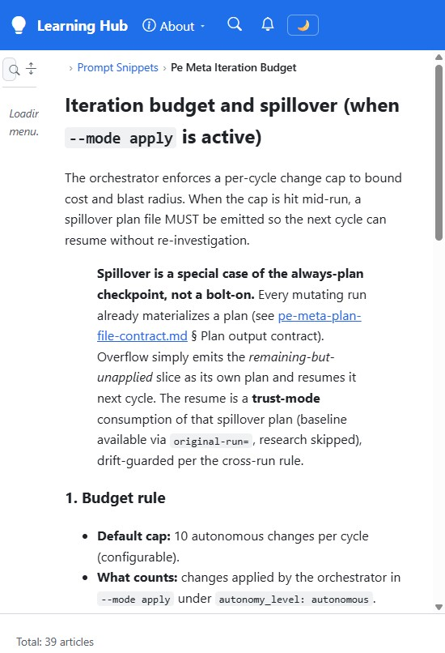

# Validation sequence - Learning Hub tab title fallback

This run validates the browser tab title behavior for a Learning Hub page that has no article-level title. A passing run proves that the page no longer falls back to the hard-coded SmartDocs name when the active site is configured as Learning Hub.

## 🧪 Environment

| Item | Value |
|---|---|
| URL | `http://localhost:5280/.github/prompt-snippets/pe-meta-iteration-budget` |
| Build | `dotnet build src/Diginsight.SmartDocs.slnx -c Debug` -> PASS |
| Run | `dotnet .\\bin\\Debug\\net10.0\\Diginsight.SmartDocs.Web.dll --urls http://localhost:5280` with `AppsettingsEnvironmentName=devlearn` |
| Browser | Visible headed browser window, viewport captured by VS Code browser tooling |
| Date | September 4, 2026 |

## ✅ Sequence and results

| # | Precondition | Action | Expected | Observed | Result |
|---|---|---|---|---|---|
| 1 | The app is running with `AppsettingsEnvironmentName=devlearn`, and `/_site` returns `title: Learning Hub`. | Go to `/.github/prompt-snippets/pe-meta-iteration-budget`, a Markdown page with no frontmatter `title` and no H1. | The browser tab title uses the configured site title, `Learning Hub`, instead of `Diginsight SmartDocs`. | `document.title = "Learning Hub"`; brand text = `Learning Hub`; first H1 = `null`; URL = `http://localhost:5280/.github/prompt-snippets/pe-meta-iteration-budget`. | PASS |

## 🖼️ Evidence

| Step | Screenshot |
|---|---|
| **Step 1** - The Learning Hub shell renders the no-title page while the browser tab title is `Learning Hub`. |  |

## 📝 Notes

The first root navigation to the Learning Hub tree warmed the dynamic menu and briefly showed the shell default before `/_site` applied `Learning Hub`. The passing assertion was read from the live DOM after the page settled.

This run didn't cover every route type, browser back/forward navigation, or production Blob-backed content. It covered the previously failing fallback path for a rendered Markdown page without an article title.
