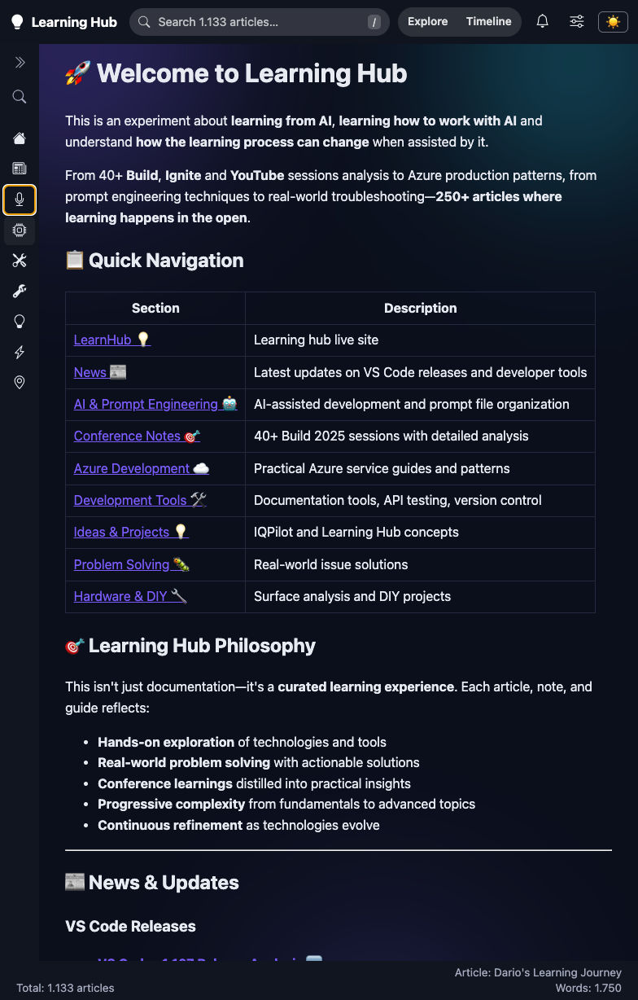
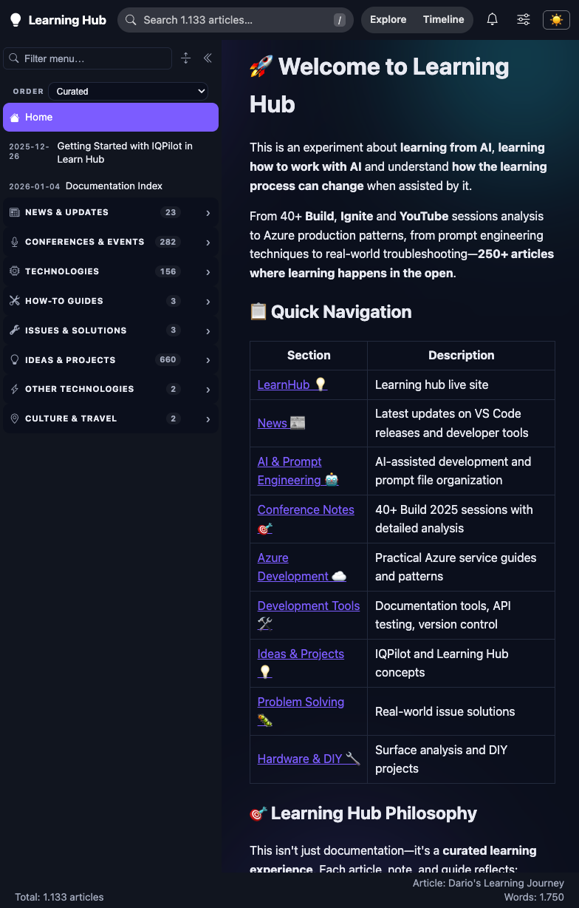

# Validation sequence - collapsed sidebar no longer opens on hover

This run validates that putting the navigation menu away actually puts it away. A passing run proves the collapsed rail stays a rail while the pointer rests on it and while keyboard focus moves through it, and that the menu still comes back on a deliberate click.

## 🧪 Environment

| Item | Value |
|---|---|
| URL | `http://localhost:5280/` |
| Build | `dotnet build src/Diginsight.SmartDocs.slnx -c Debug` -> PASS (0 errors, 0 warnings) |
| Run | `dotnet run --no-launch-profile --urls http://localhost:5280` from the web project, with `AppsettingsEnvironmentName=devlearn` and `Site__Spaces__0__FileSystem__RootPath` pointed at the Learning Hub content |
| Content | Learning Hub, 1.133 articles, `/_nav` -> HTTP 200 |
| Browser | Visible headed browser window driven through the VS Code browser tooling |
| Date | September 9, 2026 |

The server was stopped before building and restarted afterwards. Building while it runs leaves the browser holding a manifest from one build and WASM files from another, which fails the integrity check and takes the whole navigation down.

## ✅ Sequence and results

| # | Precondition | Action | Expected | Observed | Result |
|---|---|---|---|---|---|
| 1 | The sidebar is expanded and the tree is showing. | Click **Collapse menu** in the sidebar toolbar. | The icon rail replaces the tree and the panel is not rendered. | `.dynnav.is-collapsed` present, `.sidebar-rail` present, panel `display: none`, panel width `0px`. | PASS |
| 2 | The sidebar is collapsed. | Move the pointer onto the icon rail and leave it resting there for 1.6s — well past the 0.2s delay that used to open the flyout. | Nothing appears; the rail stays a rail. | Panel still `display: none`, width `0px`. No flyout over the article. | PASS |
| 3 | The sidebar is collapsed and the pointer is on the rail. | Click the rail's **Open menu** button. | The full tree returns as a docked panel and the rail disappears. | `is-collapsed` cleared, `.sidebar-rail` gone, panel `display: block`, width `292px`. The article reflows beside it rather than being covered. | PASS |
| 4 | The sidebar is collapsed. | Focus the rail's **Open menu** button from the keyboard, then <kbd>Tab</kbd> through four rail buttons. | Focus moves along the rail without the menu opening itself. | Panel stays `display: none` at every step; `document.activeElement` walks from `Open menu` to `Conferences & Events`. | PASS |
| 5 | The sidebar is expanded. | Click a menu entry (`Home`), then hover the menu entries. | The entry is selected and no native tooltip appears over any label. | Navigated to `/home`; `.nav-label[title], .nav-title[title]` count = `0`; no black tooltip box. | PASS |

## 🖼️ Evidence

| Step | Screenshot |
|---|---|
| **Step 2** - The pointer rests on the collapsed icon rail and the navigation tree stays away; the article keeps the full width. |  |
| **Step 3** - After clicking Open menu, the tree returns as a docked panel and the article reflows beside it. |  |

## 📝 Notes

Keyboard focus used to open the flyout on purpose, through a `:focus-within` rule that the pointer guard did not cover. That is now moot: while collapsed the panel is `display: none`, so nothing inside it can take focus, and step 4 confirms tabbing stays on the rail.

This run did not cover the responsive breakpoint that collapses the sidebar automatically on a narrow viewport, touch input, the resize handle, or the reduced-motion path. It covered the reported defect — the menu reappearing on hover — together with the deliberate reopen, keyboard focus, and the tooltip removal that preceded it in the same work item.
