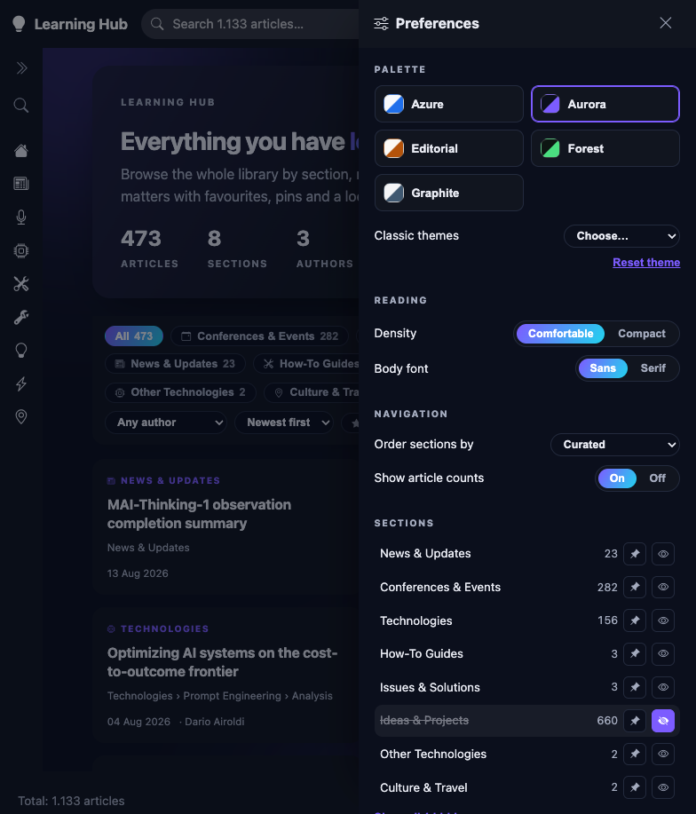

# Validation: hidden sections disappear from Explore

Preferences already hid a section from the sidebar. This run checks that the same toggle now empties
it out of Explore as well — chip, articles and counts together — and that nothing is left pointing at
content the page can no longer show.

## Environment

| Item | Value |
| --- | --- |
| URL | `http://localhost:5280/explore` |
| Content root | `/Users/caruanagianni/progetti code/Hackatlon/Learn` (1,133 articles, 9 sections) |
| Build | Debug, .NET 10 — 0 errors, 0 warnings |
| Server | Restarted after the build, visible Terminal window |
| Browser | Chromium, visible window |
| Date | 2026-09-09 |

The section used throughout is **Ideas & Projects** (660 articles), chosen because it is large enough
that a failure to filter would be unmistakable in every count on the page.

## Sequence and results

| # | Precondition | Action | Expected | Observed | Result |
| --- | --- | --- | --- | --- | --- |
| 1 | No sections hidden | Load `/explore` and read the hero and the chips | Full library: 1,133 articles, 9 sections, 3 authors, every section chip present, no "hidden" indicator | 1,133 articles · 9 sections · 3 authors · 20 Aug 2026 · chips for all 9 sections · no indicator · "1.133 shown" | PASS |
| 2 | Baseline from #1 | Open preferences, hide **Ideas & Projects** with the eye toggle, close the drawer | Chip gone; articles 1,133 → 473; sections 9 → 8; a "1 hidden" indicator appears | `hidden: ["Ideas & Projects"]` persisted · 473 articles · 8 sections · chip absent · "1 hidden" shown · "473 shown" · last update moved to 13 Aug 2026 | PASS |
| 3 | State from #2 | Reload the page | The preference survives; the same reduced figures come back | 473 articles · 8 sections · chip still absent · "1 hidden" still shown | PASS |
| 4 | State from #3 | Select the **Technologies** chip (156 shown), then hide **Technologies** from preferences | The now-meaningless filter is released rather than leaving an empty page | Selection returned to **All 317** (473 − 156) · 7 sections · 2 authors · "2 hidden" · "317 shown" | PASS |
| 5 | Two sections hidden | Click the "2 hidden" indicator | Both sections return, everything back to baseline | 1,133 articles · 9 sections · 3 authors · all chips restored · indicator gone · `hidden: []` | PASS |

The author count falling from 3 to 2 in step 4 is the intended consequence, not a side effect: an
author whose only articles live in hidden sections is no longer offered in the author filter.

## Evidence

| Explore with two sections hidden | Explore after restoring them |
| --- | --- |
|  |  |

The preferences drawer, where the toggle lives:

## Notes

Clicks were dispatched as DOM events rather than synthesised pointer input: Playwright's actionability
check never settled on this page, and coordinate clicks landed unreliably. The events are the ones
Blazor's delegated listener handles, and every step was confirmed against both the rendered state and
the persisted `smartdocs.prefs.v1` payload, so the outcome is not an artefact of the harness. The
actionability behaviour itself was not investigated and is outside this change.

Not covered by this run:

- The **top bar**, which filters on the folder metadata flag `TopbarHidden` and not on user
  preferences. It has the same shape of gap and was deliberately left alone.
- **Global search** from the top bar, which was not checked against the hidden set.
- The `Root` pseudo-section, which Explore synthesises for leaves sitting at the content root. It
  has no entry in the drawer and so cannot be hidden.
- Narrow viewports and the responsive breakpoint.
