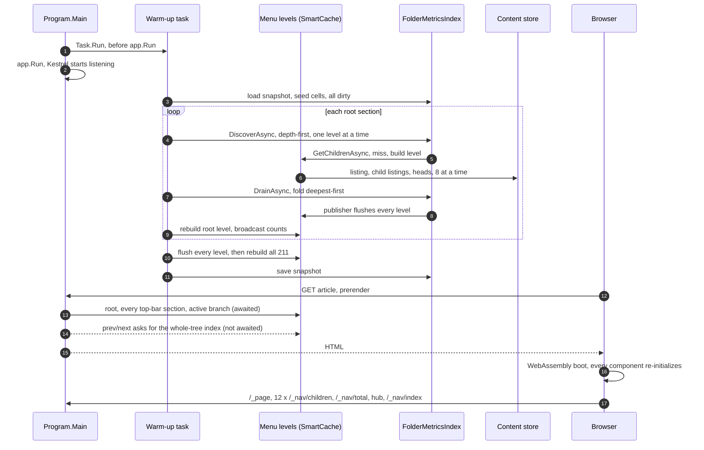
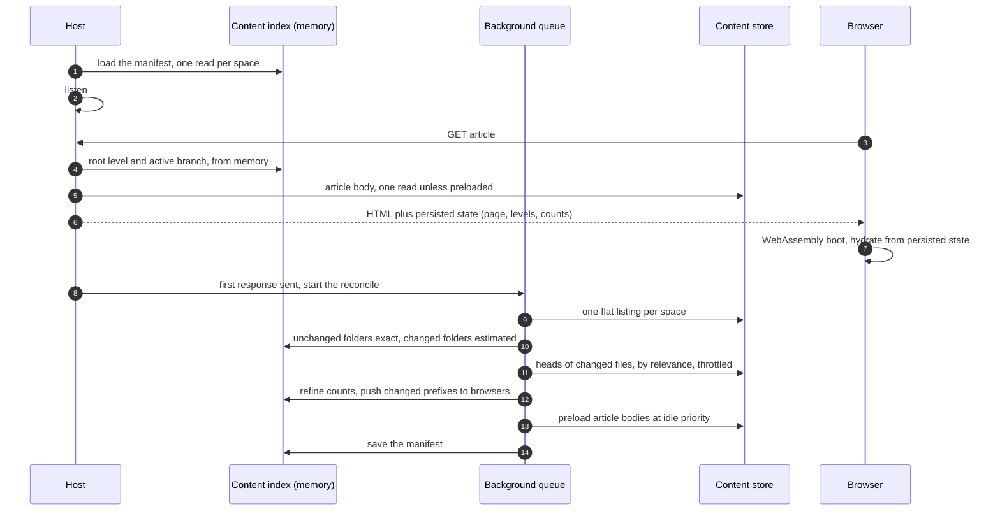

# Startup and navigation: current flow, measured cost, and target sequence

**Date:** 2026-09-25
**Revised:** 2026-09-29 — re-verified against the working tree (multi-space mounting included) and measured at runtime; the earlier revision was reasoned from code alone
**Author:** Dario Airoldi
**Status:** Analysis revised — steps 1–6 of the earlier revision landed; the dominant cost is identified and measured; the target sequence is proposed, not implemented
**Component:** `Diginsight.SmartDocs.Web` (host, navigation, content sources), `Diginsight.SmartDocs.Web.Client` (menus, hydration), `Diginsight.SmartDocs.Web.Shared` (page loading)
**Framework:** .NET 10 / ASP.NET Core / Blazor Web App (server prerender + global interactive WebAssembly)
**Companion:** [`20260925.01-perfanalysis`](../20260925.01-perfanalysis/overview.md) — branch comparison, `main` vs `feature/newstyle`

## 📚 Table of contents

- [🎯 Summary](#-summary)
- [🔍 How startup works today](#-how-startup-works-today)
  - [The moving parts](#the-moving-parts)
  - [From process start to an interactive page](#from-process-start-to-an-interactive-page)
  - [After the first page](#after-the-first-page)
  - [What the tree really costs](#what-the-tree-really-costs)
- [📏 What the measurements show](#-what-the-measurements-show)
  - [How it was measured](#how-it-was-measured)
  - [Server startup](#server-startup)
  - [Where the CPU goes](#where-the-cpu-goes)
  - [What the browser sees](#what-the-browser-sees)
  - [What a publish does to the counts](#what-a-publish-does-to-the-counts)
- [🔬 Is the previous analysis still accurate?](#-is-the-previous-analysis-still-accurate)
- [🔬 New findings](#-new-findings)
- [🏗 Target startup sequence](#-target-startup-sequence)
  - [Principles](#principles)
  - [Phase 0 — before the first request](#phase-0--before-the-first-request)
  - [Phase 1 — the first request](#phase-1--the-first-request)
  - [Phase 2 — background refinement](#phase-2--background-refinement)
  - [Phase 3 — steady state and navigation](#phase-3--steady-state-and-navigation)
  - [Folder attributes: approximate first, exact later](#folder-attributes-approximate-first-exact-later)
  - [Where structure should live](#where-structure-should-live)
  - [Expected timeline](#expected-timeline)
- [✅ Recommended sequence](#-recommended-sequence)
- [🧪 Verification](#-verification)
- [🎓 Lessons learned](#-lessons-learned)
- [📡 Signal sweep](#-signal-sweep)
- [📚 References](#-references)

## 🎯 Summary

The earlier revision of this analysis reasoned from the code that startup was expensive because the warm-up crawled the content tree several times and flushed its caches between passes. Steps 1–6 fixed most of that, yet startup stayed slow. Measuring it shows why: **the dominant cost isn't I/O — it's instrumentation.**

- **Every instrumented method call re-binds its logging options from configuration.** Diginsight's activity emitter reads `DiginsightActivitiesOptions` at every activity start and stop. That options type is registered as *dynamic*, so its cache is bypassed and the `Diginsight:Activities` section is bound again each time. A full navigation crawl makes roughly 9,000 instrumented calls. With the emitter on — the default — the warm-up over the Learning Hub content didn't finish in five minutes, held about one core throughout, and the first page took **56 s**. With the emitter gated off for the `Diginsight.*` sources, the same warm-up finished **20 s** after the host started listening, using **about 20 CPU-seconds**, and the first page took **3 s**. A sampled trace puts about 93% of the process's non-idle time in that rebinding. The log level doesn't help: the options are resolved before the level is checked, so deployments that log at `Warning` pay it too.
- **Without that cost, the flow still does more than a page needs, in the wrong order.** The crawl starts before the host listens and competes with the first request at the same priority. Counts are baked into cached menu levels, so every count update flushes every level, and the warm-up ends by rebuilding all 211 of them. The first page view triggers a whole-tree index build for its prev/next links. Hydration throws the prerendered page away: the article and the menu flash to "Loading…" for about 1.4 s while the browser issues 17 requests, mostly for data the server had just rendered, including a 394 KB uncompressed index.
- **Counts go stale after every publish.** The publish pipeline invalidates without a path, which refolds only the site-root cell. A section that gained an article keeps its old count, still marked exact.

The target inverts the approach: **load structure, don't crawl for it; render approximate values first and refine them; serve the foreground first.** On restart, one manifest read gives the host the whole navigable tree with last-known counts before the first request arrives. The first page renders from memory and hands its state to the browser, which hydrates without refetching. After the first response, one background reconcile per space — a single flat listing, not a folder-by-folder crawl — promotes unchanged folders to exact counts, marks changed folders as estimates, and reads only the changed files, in relevance order, throttled, yielding to requests.

The following table compares the measured default, the measured effect of the first mitigation, and the estimated effect of the full target.

| | Default configuration (measured) | Emitter off for `Diginsight.*` (measured) | Target (estimated) |
|---|---|---|---|
| First page response after start | 56 s | 2.8–3.3 s | close to steady state, rendered from memory |
| Background startup work complete | not within 5 min | 20 s after listening | under a second with a manifest |
| CPU spent on it | about one core, continuously | about 20 CPU-seconds, once | one listing plus the changed files |
| Counts at first paint | `…` or a lower bound | exact from the snapshot on restart; a lower bound on a fresh start | last-known on restart; `~N` estimates within one listing on a fresh start |
| Requests at hydration | 17, with a loading flash | 17, with a loading flash | none for data already on screen, no flash |

Five changes carry most of the value, in this order: silence per-call instrumentation on hot paths, start background work after listening behind a foreground gate, stop baking counts into cached levels, hydrate from persisted prerender state, and replace the crawl with a manifest plus a flat-listing reconcile. [✅ Recommended sequence](#-recommended-sequence) orders all of them.

## 🔍 How startup works today

This section describes the working tree of 2026-09-29, which already includes steps 1–6 of the earlier revision and the multi-space mounting change.

### The moving parts

Navigation is served from six layers. Since the multi-space change, every space is mounted into one path namespace by `SpaceMountedContentSource`, so a single instance of each layer covers all spaces.

| Layer | What it holds | Built by | Cached where, for how long |
|---|---|---|---|
| Structure | folder listings (`children`) and front-matter heads (`head`) | `CachedContentSource` over `SpaceMountedContentSource` over one FileSystem or Blob source per space | SmartCache, read tolerance five minutes |
| Menu levels | one built level per folder, **including each child folder's count** | `DynamicNavBuilder` behind `CachedDynamicNavBuilder` | SmartCache `nav-level`, read tolerance five minutes |
| Flat index | every navigable article, for menu search and prev/next | a whole-tree walk over the levels | SmartCache `nav-index`, seven days, dropped by invalidation |
| Folder metrics | recursive article count, newest date, and `Coverage` per section | `FolderMetricsIndex` discovery plus a debounced drain | memory, plus `nav-metrics-snapshot.json` between runs |
| Article bodies | Markdown bytes | `CachedContentSource.GetAsync` | SmartCache `content`, five minutes (30 s for "not found") |
| Browser | levels, index, and total | `HttpNavProvider` | per tab, for the session; counts patched by hub pushes |

### From process start to an interactive page

The sequence below is what happens on a cold start followed by a first visit.

1. **Host build.** `Program.Main` configures Diginsight observability, SmartCache, one physical content source per space joined behind a single `CachedContentSource`, and the navigation singletons.
2. **Warm-up launch, before listening.** `NavChangePublisher.Wire()` subscribes to drain results. `Task.Run` then starts the warm-up, and only after that does `app.Run()` start Kestrel. The crawl and host startup share the thread pool from the first millisecond.
3. **Seed.** The warm-up loads `nav-metrics-snapshot.json` — beside the binaries in local runs, under `D:\home\data\` in deployments, where the build workflow sets `Site__MetricsSnapshotPath`. Seeded cells keep their stored coverage and are all marked dirty. When anything was seeded, every menu level is flushed and the root counts are broadcast.
4. **Discover and fold, one root section at a time.** For each root section — nine for the Learning Hub, plus any space mount — `DiscoverAsync` walks the subtree depth-first, one level at a time. Building a level that isn't cached takes one listing of the folder plus, eight entries at a time, a listing and an optional `metadata.yml` read for each child folder and a head read for each article. `DrainAsync` then folds the dirty cells deepest-first. Every drain that changes a value makes `NavChangePublisher` flush **every** cached level and push deltas, and `PublishCountsReadyAsync` rebuilds the root level to broadcast root counts.
5. **Settle and rebuild.** Unreachable cells are pruned, the root cell is refolded, every level is flushed once more, and `WarmAllLevelsAsync` rebuilds all of them, fanning out eight per call at every depth. Counts are broadcast a final time and the snapshot is saved.
6. **First request.** The router is a global interactive WebAssembly component with prerendering enabled, so the server renders the whole shell and waits for all of its asynchronous initialization before sending anything. That's the root level, the level of **every top-bar section** (the two `TopMenu` instances fetch them one after another for their dropdowns), the active branch (`DynNavNode` opens it), the article (up to five candidate file names probed in turn), and the breadcrumb levels. `ContentView` also starts `LoadPrevNextAsync`, which asks for the whole-tree index. The response doesn't wait for it, but the server builds it.
7. **Hydration.** The browser shows the prerendered page, downloads the WebAssembly runtime, fetches `/_site`, and starts the interactive router. Every component initializes again from scratch. `ContentView` renders "Loading…" and refetches the article through `/_page`. `DynNav` renders "Loading menu…" and refetches the root level. The top bar refetches every section level, the active branch refetches its levels, and `DynNav` asks `/_nav/total`, polling every five seconds while the total isn't exact. The SignalR hub connects, and the server rebuilds the root level to send it counts. Prev/next downloads the whole index. Each `/_nav/children` request also starts a fire-and-forget warm of three levels below it on the server.

In short, the warm-up preloads structure — every folder listing, every `metadata.yml`, and the front-matter head of every article — together with the menu levels and counts derived from it. It doesn't preload article bodies: each one is read on its first request and cached for five minutes.

The diagram shows the same sequence with the actors involved.



### After the first page

Three behaviors shape everything that follows the first page.

- **Client navigation is already lean.** A click issues one `/_page` request; levels, index, and total come from the client cache. This part is fine today and the target keeps it.
- **Every server cache entry goes stale after five minutes.** Levels, listings, heads, and articles all carry a five-minute tolerance, checked on read (`ContentFreshness`). After five quiet minutes the next reader pays the rebuild — on Blob, with origin round trips. The startup warm-up is therefore a five-minute state.
- **A publish drops everything and refolds almost nothing.** The pipeline uploads the whole content set, removes stale blobs, and calls `POST /_nav/invalidate` without a path. Every cached entry is dropped, the index and all levels are rebuilt in the background, and only the site-root metrics cell is refolded.

### What the tree really costs

The earlier revision counted everything under the navigable roots. The figures below count what navigation actually visits, obtained by emulating `DynamicNavBuilder`'s rules over the local Learning Hub clone and cross-checked against the application's own 211 metric cells and 1,133-article total.

| | Earlier revision | What navigation visits |
|---|---|---|
| Levels built (root plus sections) | 829 "navigable folders" | **211** |
| Folder listings per full pass | about 1,657 | **562** — 561 child folders plus the root; a section's own level reuses the listing its parent made |
| Head reads per full pass | about 2,093 | **1,144** — 1,134 articles and single-article folders, plus 10 `metadata.yml` |
| Navigable articles | 1,265 | **1,133** — 1,171 Markdown files exist under the navigable roots |
| Origin operations per full pass | about 3,750 | **about 1,700** |
| Deepest level | 12 | **11** locally, **6** for real content — see [`N9-exclusions-root-only`](#n9-exclusions-root-only--infrastructure-folders-are-crawled-below-the-root) |

The whole corpus is small: 11 MB of Markdown, and 1,847 files in total (376 MB) once images are included. That matters for the target, because it means the complete structure, every front-matter header, and even every article body fit comfortably in memory.

## 📏 What the measurements show

### How it was measured

Every figure in this section comes from local runs of the working tree on 2026-09-29.

- **Build and content.** Release publish of the working tree, run from a separate folder with the `devlearn` environment (the local Learning Hub clone through a FileSystem source) on a separate port, in a visible console window.
- **Harness.** A script started the host, sampled process CPU time every 0.5 s, polled `/_nav/total` and the diagnostic `/_nav/metrics` endpoint (exposed by `Testing:ContentMutationEnabled`) every second, and timed requests with `curl`. The warm-up counts as complete when the snapshot file is written.
- **Variables.** Activity emitter on (the default) or gated off with `Diginsight:Activities:ActivitySources:Diginsight.*` set to `false`; log levels as configured locally or forced to `Warning`; snapshot absent or present; request probes during the warm-up or none.
- **Profile.** `dotnet-trace` sampled thread time for 25 s during a warm-up with the emitter on, plus `dotnet-stack` snapshots.
- **Browser.** Headless Chromium through Playwright, cold browser cache, warm server; requests and DOM mutations recorded.
- **Caveat.** The machine (22 logical cores) was shared and about 60% busy with other work. A plain single-threaded crawl of the same tree took 15–69 s at the time, where about a second is normal. Wall-clock figures are therefore inflated and vary between runs. CPU-seconds, request counts, and the with-and-without comparisons are the reliable signals. **Nothing was measured on the deployed Blob environment.**

### Server startup

Each row is one start of the host over the Learning Hub content. "Listening" counts from process creation; the first page request was issued the moment the host listened.

| Run | Activity emitter | Log levels | Snapshot | Probes | Listening | First page response | Warm-up | CPU |
|---|---|---|---|---|---|---|---|---|
| A | on (default) | local default (`Trace`/`Debug`) | none | yes | 56 s | 57 s | not done after 5 min — 12 of 211 cells | 239 CPU-s in 5 min |
| B | on | `Warning` | none | yes | 42 s | 56 s | not done after 5 min — 39 of 211 cells | 317 CPU-s in 5 min |
| C | on | `Warning` | none | no | 25 s | — | not done after 4.5 min — 40 of 211 cells | 203 CPU-s in 4.5 min |
| D | off | `Warning` | none | no | 19 s | — | done 115 s after listening, on a starved disk | 30 CPU-s in total |
| G | off | `Warning` | none | yes | 14 s | 3.3 s | done 20 s after listening | 25 CPU-s to completion |
| F | off | `Warning` | present | yes | 8 s | 2.8 s | done 20 s after listening | 22 CPU-s to completion |

Run E had run C's configuration and was used for the CPU profile in [where the CPU goes](#where-the-cpu-goes). A cell is one tracked section, so 211 cells is the whole tree. The runs also showed the following:

- **Request latency during the warm-up.** With the emitter on, `/_nav/children` took 3.1–13.4 s and a single raw Markdown fetch through `/_page` took 7.7–9.8 s. With it off, 54–172 ms and 0.6–0.8 s.
- **Steady state (run G, after the warm-up).** Server-rendered pages reached their first byte in 261–290 ms; `/_nav/children` answered in 57–89 ms; `/_nav/index` took 1.0 s cold and 0.64 s warm for 394 KB of uncompressed JSON.
- **The snapshot helps the display, not the work.** Run F served the exact total (1,133, `Complete`) from its first poll, but its warm-up did the same work as a cold start.
- **The crawl starts before listening.** With the emitter on, the process had already used 13–17 CPU-seconds before it was listening; with it off, 5–8.
- **Local logging multiplies the cost.** Run A, logging at the local default levels to a file appender that opens and closes the file for every line, reached 12 cells in five minutes; run B, at `Warning`, reached 39.

### Where the CPU goes

The sampled trace (run E: emitter on, `Warning` logs, no probes) attributes thread time as follows. Thread-time sampling includes idle threads, so the idle share is listed too.

| Frame, inclusive | Share of sampled thread time |
|---|---|
| `ClassAwareOptionsMonitor.Get` → `ClassAwareOptionsFactory.Create` → `ConfigurationBinder.Bind` | 26.0% |
| — of which `FilteredConfiguration.CoreGetChildren` (enumerating configuration children) | 22.7% |
| — of which `ConfigurationProvider.GetChildKeys` (collecting and sorting keys) | 15.5% |
| `DynamicNavBuilder.ScoreEntryAsync` — the navigation work, including the binds it triggers | 21.2% |
| Idle: thread-pool parking, I/O completion polling, and monitor and handle waits | about 72% |

Non-idle time is about 28% of the samples, so the rebinding accounts for about 93% of the work the process was actually doing, including the garbage-collection pauses its allocations cause. The mechanism is described in [`N1-activity-options-rebind`](#n1-activity-options-rebind--every-instrumented-call-re-binds-its-logging-options).

### What the browser sees

The timeline below is a first visit to a deep article, measured from navigation start in headless Chromium against a warm server running with the emitter off.

| Moment | Time | What the reader sees or the browser does |
|---|---|---|
| Prerendered HTML parsed | 7.1 s | complete article, 45-item sidebar, footer `≥ 1,131 articles` |
| WebAssembly runtime | — | 61 files, 2.9 MB compressed |
| Hydration starts | 12.7 s | the article is removed and replaced by "Loading…"; the sidebar by "Loading menu…" |
| Article back | 14.1 s | re-rendered from a second fetch of the same Markdown |
| Network idle | about 19 s | 17 data requests since the HTML: `/_site`, `/_page`, 12 × `/_nav/children`, `/_nav/total`, the hub negotiation, and `/_nav/index` (394 KB) |
| Click on "Next" | +0.25 s | one request, `/_page` — client navigation is already lean |

The 12 `/_nav/children` requests are the root level, eight top-bar sections, and three levels of the active branch — every one of them already rendered in the prerendered HTML. Each also started a three-level warm on the server. The footer moved from `≥ 1,131` (the sum of root sections, a lower bound) to `1,133` only after hydration, although the server held the exact value all along.

### What a publish does to the counts

This test used a copy of this repository's documentation content, served locally. One article was added to a section, and one new two-article section was added to a month folder. The table shows the counts after each `POST /_nav/invalidate` call.

| Step | Site total | Section with the new article | Month folder with the new section |
|---|---|---|---|
| Before | 47 | 5 | 7 |
| Invalidation without a path, as the pipeline calls it | 47 — should be 50 | 5 — should be 6 | 7 — should be 9 |
| Invalidation with the path of the new article | 48 | 6 | — |
| Invalidation with the path of an existing article in the month folder | 48 | — | 7, and dirty from then on |

Every stale value stayed marked `Complete`. The menu levels did show the new article and the new section, so the tree and the counts disagreed.

## 🔬 Is the previous analysis still accurate?

The table checks each finding and figure of the earlier revision against the working tree of 2026-09-29.

| Earlier item | Verdict | What holds today |
|---|---|---|
| Finding 1 — the tree is walked at least three times | Partly fixed | Structure is read once per pass now, thanks to the listing and head caches. The level projection is still built at least twice — during discovery, then by `WarmAllLevelsAsync` after a global flush — the root level many more times, and the first page view adds the whole-tree index walk. |
| Finding 2 — the level cache is discarded R + 2 times | Moved, not fixed | Step 2 removed the flush from the per-root loop in `Program.cs`, but `NavChangePublisher.OnMetricsChangedAsync` flushes every level after any drain that changes a value, and every per-root drain does. See [`N2-counts-baked-into-levels`](#n2-counts-baked-into-levels--a-count-change-flushes-every-menu-level). |
| Finding 3 — the index walk bypasses the cache | Fixed by step 3; premise wrong | The walk reads levels through the cache now. But the index has two consumers, not one: since the first implementation (2026-08-17) `ContentView` has requested it for prev/next on every page, on the server during prerender and again in the browser. See [`N4-first-page-builds-index`](#n4-first-page-builds-index--prevnext-needs-the-whole-tree). |
| Finding 4 — listings and heads aren't cached | Fixed by step 6 | With a five-minute read tolerance, so the warm state lasts five minutes. See [`N7-freshness-decays-warmup`](#n7-freshness-decays-warmup--a-warm-cache-that-expires-in-five-minutes). |
| Finding 5 — double enumeration and blind probe | Fixed by step 5 | — |
| Finding 6 — the seed is written by nobody; the snapshot is instance-local | Half right | Nobody writes `article-count` or `latest-article` — still true. But deployments don't keep the snapshot beside the binaries: `00.BuildSmartDocsWeb.yml` sets `Site__MetricsSnapshotPath=D:\home\data\nav-metrics-snapshot.json`, which survives restarts and deployments and is shared by instances. Only local runs use the default. |
| Finding 7 — navigation is single-space by construction | Outdated | The working tree mounts every space into one path namespace behind one `CachedContentSource`; navigation, metrics, and warm-up cover all spaces. A new caveat is [`N9-exclusions-root-only`](#n9-exclusions-root-only--infrastructure-folders-are-crawled-below-the-root). |
| Finding 8 — `MaxConcurrency: 1` | Fixed by step 1 | Parallelism is now eight per call and nests without a global limit. See [`N3-warmup-competes-with-first-request`](#n3-warmup-competes-with-first-request--no-priority-no-global-budget). |
| Finding 8 — `/_nav/children` warms three levels | Still accurate | A first page view issues 12 such requests, each starting a server-side walk. |
| Finding 8 — the client re-asks the total; `ConvergeTotalAsync` polls | Still accurate | The prerendered footer also shows a lower bound although the server holds the exact total. |
| Finding 8 — `Clients.All`, unused `WatchForChanges`, unbound `SmartCache:Enabled` | Still accurate | — |
| Tree figures — 829, 1,265, 12, about 3,750 | Corrected | 211, 1,133, 11 (6 for real content), about 1,700. See [what the tree really costs](#what-the-tree-really-costs). |
| "Startup latency is genuinely fine; the cost lands afterwards" | Wrong | The first page after a start took 56 s with the default configuration, and the warm-up delayed listening itself by competing for CPU. |
| Steps 7–9 — per-folder records written by the publish pipeline | Superseded | See [where structure should live](#where-structure-should-live). |
| Steps 10–13 | Still open | Folded into [✅ Recommended sequence](#-recommended-sequence). |

The central premise of the earlier revision — that cost scales with the number of storage operations — was a reasonable reading of the code, but it wasn't the bottleneck. Nothing had been timed.

## 🔬 New findings

Each finding carries a readable identifier so the recommended changes can refer to it.

### `N1-activity-options-rebind` — every instrumented call re-binds its logging options

This is the dominant cost. Nearly every method on the crawl path starts a Diginsight activity (`StartMethodActivity`): the content sources, `SpaceMountedContentSource`, SmartCache's `GetAsync` and `SetValue`, `ParallelService`, and the navigation builders. Counting from the call path, a full pass makes roughly 9,000 of them — at least four per head read, five per child-folder listing, and seven per level.

At every start and stop, `ActivityLifecycleLogEmitter` resolves `IOptionsMonitor<DiginsightActivitiesOptions>.CurrentValue` before it looks at `LogBehavior` or the log level. `Diginsight.Components.Configuration` registers that options type with `VolatilelyConfigureClassAware` and `DynamicallyConfigureClassAware`; the second calls `FlagAsDynamic`, and `ClassAwareOptionsCache.GetOrAdd` never caches a dynamic type. Each resolution therefore binds the whole `Diginsight:Activities` section again, enumerating and sorting configuration keys across every provider.

The effect is measured above: a warm-up that doesn't finish in five minutes against one that finishes in 20 s, and a first page in 56 s against 3 s. Two consequences follow:

- **Production pays it too.** The deployed environment overlays set no `Logging` or `Diginsight:Activities` section, so the base `appsettings.json` applies: the emitter listens to `Diginsight.*` and filters records at `Warning` — after paying for the bind. A small App Service instance has far fewer cores than the development machine, so a continuous one-core burn is most of it. This is inferred from configuration, not measured.
- **The fix belongs upstream; the mitigation belongs here.** Caching the options unless a dynamic override is active is a Diginsight change (see [`SIG-1`](01-signals.md#sig-1--diginsight-re-binds-activity-logging-options-from-configuration-on-every-activity-start-and-stop)). Until it ships, SmartDocs can gate the emitter off for the sources on its hot paths and keep activities at operation granularity.

### `N2-counts-baked-into-levels` — a count change flushes every menu level

Counts live inside cached `NavChild` records (`ArticleCount`, `CountCoverage`), because `DynamicNavBuilder.FolderAggregate` reads the metrics index while a level is being built. A count change therefore makes cached levels wrong, and `InvalidateLevels()` can't scope the damage: its empty-path rule matches every level on every node. The warm-up runs one drain per root section, each followed by a global flush, and ends with another flush plus a rebuild of all 211 levels. The same coupling makes every content change flush the whole menu (`PublishChangeAsync`).

Overlaying counts at read time removes all of it: levels are cached without counts, and counts are looked up from the metrics index — a dictionary read per child — when a level is served.

### `N3-warmup-competes-with-first-request` — no priority, no global budget

The warm-up has nothing that lets a request go first.

- It starts before `app.Run()`, on the same thread pool that serves requests.
- `WarmLevelAsync` runs `ForEachAsync` with eight workers at every depth, and each level build runs its own `WhenAllAsync` with eight more. The per-call limit doesn't bound the total.
- Every `/_nav/children` request starts another three-level walk, fire-and-forget, with no cancellation and no deduplication; a first page view issues 12.
- `FileSystemContentSource.ListChildrenAsync` enumerates synchronously on a pool thread.

### `N4-first-page-builds-index` — prev/next needs the whole tree

`ContentView.OnParametersSetAsync` starts `LoadPrevNextAsync`, which calls `GetIndexAsync`. On the server that happens during the prerender of the first page, so the first visitor after a start — or after any invalidation, which drops the index — triggers a whole-tree walk. In the browser it downloads the full index, 394 KB uncompressed because no response compression is configured, on the first page of every session, only to pick two neighbors. The neighbors are already known: the article's parent level is part of the active branch the page renders anyway.

### `N5-hydration-discards-prerender` — a loading flash and 17 refetches

No component persists its prerendered state, so the WebAssembly runtime initializes everything again: about 1.4 s of "Loading…" and "Loading menu…" over content that was already on screen, and 17 requests, most of them for data the prerendered HTML already contained. The client's `Program.cs` also awaits `/_site` before `RunAsync`, delaying hydration by a round trip. .NET 10 persists prerendered state declaratively with `[PersistentState]` on component properties, and on services registered with `RegisterPersistentService`.

The prerendered footer shows `≥ 1,131` because `DynNav` asks for the exact total only in the browser, although `ServerNavProvider.GetTotalAsync` would answer it from memory during prerender.

### `N6-prerender-waits-for-topbar` — the first byte waits for every section

Prerendering waits for all asynchronous initialization of the interactive tree. `TopMenu` loads the root level and then, one section after another, the children of every top-bar section for its dropdowns. The first byte of a cold page therefore waits for every section's level on top of the active branch. The comment in `TopMenu.LoadAsync` about rendering the top-level buttons immediately only helps after hydration: during prerender, intermediate renders aren't streamed to the browser.

### `N7-freshness-decays-warmup` — a warm cache that expires in five minutes

`ContentFreshness` applies a five-minute tolerance, checked on read, to levels, listings, heads, and articles. That bounds how long a lost invalidation stays invisible, but it also means the startup warm-up — the rebuild of all 211 levels included — is worth five minutes. On a quiet site most visitors arrive later and pay the rebuild on the request path; on Blob that means round trips for the listing and every head in the level.

Time-based expiry is the wrong freshness mechanism when detecting change is cheap. A flat blob listing returns every blob's ETag and last-modified time, up to 5,000 per call, and the Learning Hub container fits in one.

### `N8-publish-leaves-counts-stale` — a whole-site invalidation refolds only the root

The mechanism behind the [measured stale counts](#what-a-publish-does-to-the-counts) is short. `InvalidateNavCache` without a path calls `PublishChangeAsync("")`, which calls `metrics.Invalidate("")`, which stamps only the root cell. The root fold then sums section cells that were never marked dirty.

Folders created after startup get no cell unless a path-scoped invalidation names a file inside them. If their parent is refolded later, the fold sees an unknown child and yields `Partial`, which can't replace the stored `Complete` value. The cell never settles, and the 400 ms drain re-arms indefinitely. Counts are right again only after a restart.

### `N9-exclusions-root-only` — infrastructure folders are crawled below the root

`IsTempRoot` excludes `src`, `deploy`, `docs`, `scripts`, `bin`, `obj`, `node_modules`, and `99.00-temp` only when the prefix is empty — the site root.

- **Build output deeper in the tree is crawled.** In the local clone, git-ignored `bin` and `obj` folders under one code sample add 54 empty sections and five levels of depth. The publish workflow strips `bin`, `obj`, and `node_modules`, so Blob-served content is unaffected.
- **A prefixed space's root isn't the site root.** Since the multi-space change, a FileSystem space mounted under a route base gets none of these exclusions at its own top level.

### Smaller items

These don't change the picture on their own but belong in the same pass:

- `BlobContentSource.GetAsync` calls `ExistsAsync` and then `DownloadContentAsync` — two round trips per article where one download that treats a 404 as "not found" would do.
- The server-side `PageLoader` probes up to five candidate names per route; on Blob each miss is a round trip, cached as "not found" for 30 s.
- `FrontMatter.ResolveTitle` parses a header that `FrontMatter.Parse` has just parsed — five regular expressions, twice per article.
- `ParallelService.ForEachAsync` and `WhenAllAsync` start an activity whose payload is the whole source sequence.

## 🏗 Target startup sequence

### Principles

Six principles shape the sequence; each answers one of the findings above.

1. **Load, then reconcile.** Structure and counts are data the host loads, not a result it has to recompute before it can answer.
2. **Approximate first, exact later — and say which is which.** Every folder attribute renders immediately from the best source available, and its coverage tells the reader how exact it is.
3. **Foreground first.** Background work starts after the host listens, never runs ahead of a request, and shares one concurrency budget.
4. **Pay once per change, not once per read.** A value stays valid until the content it came from changes; detection replaces expiry.
5. **Render once.** The server's prerendered state travels with the page, and the browser continues from it.
6. **Instrument operations, not iterations.** One activity per request and per background phase; none per file.

The diagram shows the target sequence end to end; the phases below describe each step.



### Phase 0 — before the first request

Nothing runs before listening except loading what's already known.

- The host builds with no crawl and no `Task.Run` ahead of `app.Run()`.
- For each space, the host loads one manifest — the successor of `nav-metrics-snapshot.json` — into an in-memory **content index**: folders; files with size, modified time, and ETag; a front-matter summary per Markdown file (title, date, author, and the publish and draft flags); and folded aggregates, marked `Snapshot`.
- The host starts listening. A missing or unreadable manifest isn't an error: the index starts empty and Phase 2 fills it.

### Phase 1 — the first request

The first request renders only what it shows, and hands it over.

- Menu levels, breadcrumb, counts, and prev/next come from the content index in memory. Prev/next uses the article's own level, not the whole-tree index.
- The article body comes from the body cache or one origin read. Its file name is resolved from the index, not probed.
- On a fresh instance with an empty index, the request builds its ancestor levels inline and seeds the index with them. Nothing else runs on the request path.
- The response carries persisted state: page HTML, table of contents, breadcrumb, the levels on screen, the exact total, and the site settings. Top-bar dropdowns aren't rendered during prerender; they load when first opened.
- The request marks its branch as *hot* for Phase 2.

### Phase 2 — background refinement

A `BackgroundService` starts on `ApplicationStarted`, waits until the first response has gone out or a short grace period has passed, and then works through the following steps.

1. **List each space flat.** On Blob, one `GetBlobsAsync` call per 5,000 blobs; on the file system, one recursive enumeration that applies the exclusion rules at every depth.
2. **Diff the listing against the index.** Folders whose subtree is unchanged are promoted from `Snapshot` to `Complete` at once, with no reads. Folders with new or changed files get a name-derived estimate (`Estimated`, shown as `~N`): Markdown files counted by the navigation rules, assuming they're all published.
3. **Read heads for new or changed Markdown files only,** from a priority queue: first folders on hot branches, then root sections and their direct children (the top bar and the first sidebar level), then newest-first date-prefixed content, then everything else breadth-first. Each read refines titles, dates, hidden flags, and counts, and aggregates fold upward in O(depth).
4. **Publish changed aggregates** in debounced batches over the hub: the changed prefixes plus the root.
5. **Preload article bodies** from the same queue at the lowest priority, hot branches and prev/next neighbors first. The whole Markdown corpus is 11 MB.
6. **Save the manifest** when the reconcile completes.

The queue runs with a small concurrency budget — for example two concurrent origin reads locally and four on Blob. It checks a foreground gate before each item: while requests are in flight it waits, with a maximum pause so it can't starve. It deduplicates keys, and a request that needs an item still in the queue does it inline.

### Phase 3 — steady state and navigation

Once the reconcile has run, the host keeps the index current by detection rather than expiry.

- **Navigation.** One request per article (`/_page`), served from memory; levels from the client cache; counts by push. Prefetching `/_page` when the pointer rests on a link is an optional extra.
- **Freshness.** A periodic reconcile — one flat listing per space every few minutes — replaces the five-minute expiry, and also runs immediately on `/_nav/invalidate` and, locally, on a file-system watcher event, which is what `WatchForChanges` was declared for. Entries stay valid until their ETag or modified time changes.
- **Publishing.** A whole-site invalidation becomes just a reconcile, so it's both cheap and correct.
- **Search.** The flat index is projected from the content index on demand, with no I/O, and the browser fetches it only when someone types in the filter, compressed.

### Folder attributes: approximate first, exact later

Coverage already distinguishes unknown, lower bound, and total. The target adds two tiers so a count can render the moment anything is known about it.

| Coverage | Source | Shown as | Replaced when |
|---|---|---|---|
| `None` | nothing known yet | `…` | anything arrives |
| `Estimated` (new) | file names from a fresh listing, before front matter is read | `~N` | the folder's changed heads are read |
| `Partial` | a fold with some children still unknown | `≥ N` | the missing children arrive |
| `Snapshot` (new) | the manifest from the last completed reconcile | `N` | the listing shows the folder unchanged (→ `Complete`) or changed (→ `Estimated`) |
| `Complete` | every descendant observed in this run | `N` | the content changes |

`Estimated` errs high — an article with `publish: false` or `draft: true` counts until its header is read — while `Partial` errs low, so the two must render differently. On a fresh instance with no manifest, every folder gets `~N` within one listing, and exact values follow as heads are read, hottest branches first. Today counts appear only in the footer; because every level payload carries them, the sidebar and the top bar could show them too.

### Where structure should live

The earlier revision recommended one derived record per folder, written by the publish pipeline, on the grounds that a single manifest could only be kept current by crawling the whole tree. Four facts established in this revision change that conclusion:

- The publish pipeline uploads the whole content set on every run and already lists every blob.
- A flat listing returns up to 5,000 blobs per call, with ETag and last-modified time, so knowing the whole tree costs one call for this content.
- The corpus is small: about 1,850 files, 11 MB of Markdown.
- The dominant cost was CPU in instrumentation, not the number of storage reads.

**Recommendation: one manifest per space, written by the host after each completed reconcile, and reconciled by a flat listing.** In deployments it already has a durable, shared home: `Site:MetricsSnapshotPath` points at `D:\home\data\`. Per-folder records would add about 210 derived files and a pipeline dependency to save reads that a flat listing already saves.

`metadata.yml` stays authored-only — label, short label, icon, order, and visibility. The unwritten `article-count` and `latest-article` seed keys can go, or stay as explicit authored overrides.

Having the publish pipeline also write the manifest into the container remains an option for later: it would let a fresh slot or instance start warm without its own first reconcile. It's worth doing only if the first flat listing of a fresh instance proves slow.

### Expected timeline

The target column is an estimate for the Learning Hub content, to be confirmed by the acceptance criteria in [🧪 Verification](#-verification).

| Moment | Today, emitter on (measured) | Today, emitter off (measured) | Target (estimated) |
|---|---|---|---|
| Host listening | 25–56 s on the loaded machine | 8–19 s on the loaded machine | host startup only; ReadyToRun can shorten JIT |
| First page response | 56 s | about 3 s | close to steady state |
| Counts at first paint | `…` or `≥ N` | exact on restart from the snapshot, otherwise `≥ N` | last-known on restart, otherwise `~N` within one listing |
| Hydration | flash plus 17 requests | flash plus 17 requests | no flash; no requests for data already on screen |
| Background CPU after start | about one core for minutes | about 20 CPU-seconds | one listing plus the changed heads |
| After a publish | index and all levels rebuilt; counts stale | the same | one reconcile; exact counts within seconds |

## ✅ Recommended sequence

The changes are ordered by value per unit of risk, in three waves; each wave stands on its own. Identifiers name the change; the leading number keeps the order stable for cross-references.

| # | Id | Change | Effort | Risk | Effect | Status |
|---|---|---|---|---|---|---|
| 1 | `C1-gate-hot-activities` | Gate the Diginsight emitter off for the library sources on hot paths (`Diginsight.SmartCache`, `Diginsight.Components`) everywhere, and for `Diginsight.*` in deployed environments, which filter method logs at `Warning` anyway | config | none | measured with `Diginsight.*` off: warm-up done in 20 s at about 20 CPU-s instead of not finishing; first page 3 s instead of 56 s | 🟡 todo |
| 2 | `C2-trim-hot-path-activities` | Remove `StartMethodActivity` from per-item methods — content sources, `SpaceMountedContentSource`, `ScoreEntryAsync`, `ClassifyFolderAsync`, `BuildLevelAsync`, level-cache reads, and the metrics walk and fold — and replace `IParallelService` in the crawl with one bounded loop; keep one activity per request and per background phase | about a day | low | lets the emitter stay on for request-level diagnostics | 🟡 todo |
| 3 | `C3-fix-options-cache-upstream` | Cache activity options unless a dynamic override is active, in Diginsight | upstream | medium | removes the cost for every Diginsight application | 📌 next steps — [`SIG-1`](01-signals.md) |
| 4 | `C4-start-after-listen` | Move the warm-up into a `BackgroundService` started on `ApplicationStarted`, behind a foreground gate and one concurrency budget; replace the per-request three-level warm with an enqueue | about a day | low | the first request no longer competes with the crawl | 🟡 todo |
| 5 | `C5-overlay-counts` | Cache levels without counts and overlay counts from the metrics index when a level is served; delete the level flushes in `NavChangePublisher` and `Program.cs`, and the startup `WarmAllLevelsAsync` | about a day | low | no global flushes; nothing is built twice at startup | 🟡 todo |
| 6 | `C6-refold-on-publish` | Treat an empty-path invalidation as "rediscover everything" — `InvalidateAll` plus a low-priority discovery — and stop re-arming the drain for a `Partial` fold whose unknown child isn't being discovered | hours | low | counts are correct after a publish | 🟡 todo |
| 7 | `C7-prev-next-from-level` | Compute prev/next from the article's parent level, request the index only for search, and enable response compression for JSON | hours | low | the first page neither builds nor downloads the index | 🟡 todo |
| 8 | `C8-exclusions-any-depth` | Exclude build output at every depth and infrastructure names at each space's root | hours | low | 54 fewer empty sections locally; prefixed FileSystem spaces handled | 🟡 todo |
| 9 | `C9-local-log-defaults` | Default local profiles to `Information`, with `Debug` and `Trace` on demand through the dynamic log level; delete the unbound `Diginsight:SmartCache:Enabled` | minutes | none | method-level lines leave local logs unless asked for | 🟡 todo |
| 10 | `C10-persist-prerender-state` | `[PersistentState]` on `ContentView`, `DynNav`, and `TopMenu`, plus a persistent navigation bootstrap service (`RegisterPersistentService`, singleton on WebAssembly) seeding `HttpNavProvider`, `NavStats` — with the exact total computed during prerender — and `SiteShellState`; drop the `/_site` fetch before `RunAsync` | two to three days | medium | no loading flash; none of today's 17 hydration requests for data already on screen | 🟡 todo |
| 11 | `C11-lazy-topbar` | Load dropdown children on first open, or at idle after hydration one at a time, never during prerender | hours | low | prerender waits for the root and the active branch only | 🟡 todo |
| 12 | `C12-hub-after-idle` | Connect SignalR after the first idle period and delete `ConvergeTotalAsync`, since the total is exact at first paint | hours | low | fewer startup requests; no four-minute polling | 🟡 todo |
| 13 | `C13-content-index` | Introduce an in-memory content index per space; levels, counts, flat index, prev/next, and route resolution become projections over it; retire the `nav-level` cache and the discovery walk | about a week | medium | the first page renders from memory; no per-folder crawl | 🟡 todo |
| 14 | `C14-manifest` | Persist the content index as one manifest per space at `Site:MetricsSnapshotPath`; add the `Estimated` and `Snapshot` coverage tiers | two days | low | full navigation and last-known counts before the first request | 🟡 todo |
| 15 | `C15-flat-reconcile` | Reconcile with one flat listing per space and heads for changed files only, in relevance order; run it on start, periodically, on invalidation, and on `WatchForChanges` | three days | medium | restart cost proportional to changes; detection replaces the five-minute expiry | 🟡 todo |
| 16 | `C16-preload-bodies` | Preload Markdown bodies from the background queue, hot branches first; fetch a blob in one round trip | a day | low | article requests served from memory | 🟡 todo |

Wave 1 (changes 1–9) stops the CPU burn and fixes the count defects. Wave 2 (changes 10–12) makes the first paint and hydration seamless. Wave 3 (changes 13–16) replaces crawling with loading. Three further options are worth considering only if measurement asks for them:

- Have the publish pipeline write the manifest into the container, so a fresh slot starts warm. (📌 next steps)
- Push hub updates to SignalR groups per expanded prefix instead of `Clients.All`. (📌 next steps)
- Publish ReadyToRun to cut JIT time on cold instances. (📌 next steps)

### What landed already

Steps 1–6 of the earlier revision are in the working tree. Two of them shifted a cost rather than removing it, as the notes record.

| Step | Change | Status | Note |
|---|---|---|---|
| 1 | Removed `MaxConcurrency: 1` from `appsettings.local.json` | ✅ done | Unclamped nesting is now part of `N3-warmup-competes-with-first-request` |
| 2 | Removed the per-root `InvalidateLevels()` from `Program.cs` | ✅ done | The flushes moved into `NavChangePublisher` — `N2-counts-baked-into-levels` |
| 3 | The index walk reads levels through the cache | ✅ done | — |
| 4 | Startup no longer builds the index | ✅ done | The first page view does — `N4-first-page-builds-index` |
| 5 | `metadata.yml` presence taken from the listing; one listing per folder | ✅ done | — |
| 6 | Listings and heads cached in `CachedContentSource` | ✅ done | With a five-minute tolerance — `N7-freshness-decays-warmup` |

## 🧪 Verification

### What this revision verified

The following checks were run for this revision:

- Every code path described in this page was re-read in the working tree of 2026-09-29, including the uncommitted multi-space changes. (✅ done)
- The tree figures were recomputed by emulating the navigation rules over the local Learning Hub clone and cross-checked against the application's 211 cells and 1,133-article total. (✅ done)
- Startup was measured in seven runs, varying the activity emitter, the log levels, the snapshot, and the request probes. (✅ done)
- CPU was attributed with a sampled thread-time trace and managed stack snapshots. (✅ done)
- The hydration timeline and request list were recorded in headless Chromium. (✅ done)
- The stale counts after a whole-site invalidation were reproduced on a copy of this repository's documentation content. (✅ done)
- The deployed Blob environment wasn't measured; the production share of the instrumentation cost is inferred from configuration. (🟡 todo)
- None of the recommended changes is implemented; the target figures are estimates. (🟡 todo)

### How to reproduce

The mitigation measured in runs D, F, and G is one setting. Its key contains `.` and `*`, so from PowerShell it has to be set through .NET rather than `$env:`. The other settings reproduce the quiet logs of runs B to G and the progress endpoint:

```powershell
# Gate the Diginsight activity emitter off for every Diginsight.* source (runs D, F, and G)
[Environment]::SetEnvironmentVariable('Diginsight__Activities__ActivitySources__Diginsight.*', 'false')

# Quiet logs (runs B to G)
foreach ($category in 'Default', 'Diginsight', 'Diginsight.*', 'Diginsight.SmartDocs', 'Diginsight.SmartDocs.Web') {
    [Environment]::SetEnvironmentVariable("Logging__LogLevel__$category", 'Warning')
}

# Local runs only: exposes /_nav/metrics, and also the content-mutation test endpoints
$env:Testing__ContentMutationEnabled = 'true'
$env:ASPNETCORE_ENVIRONMENT = 'Development'
$env:AppsettingsEnvironmentName = 'devlearn'
```

Start the published host with `--urls`, `--contentRoot` pointing at the project folder and `--webroot` pointing at the publish output's `wwwroot`, then poll `/_nav/total` until it reports `"coverage":2`. To profile a run, attach `dotnet-trace` while the warm-up is running:

```powershell
dnx dotnet-trace collect -p <pid> --profile dotnet-sampled-thread-time --duration 00:00:00:25 -o startup.nettrace
dnx dotnet-trace report startup.nettrace topN -n 30 --inclusive
```

### Acceptance criteria for the target

The target is done when these hold on the Learning Hub content:

- After a restart with a manifest, the first page reads nothing from the origin except its article, and its response time is within 20% of steady state. (🟡 todo)
- After hydration, no `.content-loading` or `.nav-loading` element appears, and no `/_page` or `/_nav/children` request is made for content already on screen. (🟡 todo)
- During a reconcile, foreground p95 latency stays within 10% of idle; a reconcile against an unchanged manifest makes one listing per space and no head reads. (🟡 todo)
- Counts are exact within one reconcile period after any publish, whole-site invalidation included. (🟡 todo)
- CPU and time-to-exact-counts are measured on the Learning Hub deployment before and after changes 1 and 2. (🟡 todo)

## 🎓 Lessons learned

The first six lessons come from this revision; the rest are kept from the earlier one, where they still hold.

**Instrumentation cost scales with the number of calls, not with the log level.** Every activity paid for a configuration bind before anything checked whether its record would be written. A log level at `Warning` made the logs quiet and left the cost exactly where it was.

**Measure before modeling.** The earlier revision modeled storage operations carefully and optimized them, but the bottleneck was somewhere else. One sampled trace pointed at the options binder within minutes, where the reasoning had pointed at the file system.

**A cache that expires on a timer isn't a preload.** Rebuilding every menu level at startup bought five minutes of warmth. On a quiet site, the visitors who arrive afterwards get none of it.

**A derived value baked into a cached projection turns every update into an invalidation.** Counts inside cached levels meant each count change had to flush levels, and the only flush available was global. Keeping the projection count-free and overlaying the value at read time removes the question.

**Prerendering is half a feature without persisted state.** The server rendered the page, and the browser threw it away and did it again — visibly, with a loading flash, and at the cost of 17 requests.

**The whole-site path must be the most thorough one, not the least.** The invalidation the pipeline actually uses, with no path, refolded less than the one it doesn't use.

**A decorator that caches one of three methods reads as a decorator that caches.** `CachedContentSource` once cached only the article fetch; the comment explaining why hid the gap until step 6 closed it.

**Invalidation scope is easy to write wider than intended.** An empty-path rule reads as "the root" and matches every entry on every node. It was the only tool available for count changes, which is why they flushed everything.

**Half-built ideas read as finished ones.** `article-count` is parsed, documented, and consumed with a deliberate coverage level — and written by nobody.

**Measure the tree the way the code walks it.** The earlier revision stated this lesson and still counted raw files; what navigation visits turned out to be less than half of what it counted.

**Granularity follows the update and the way change is detected.** Per-folder records looked right while knowing the whole tree seemed to require a crawl. One flat listing call reveals every change, and a single manifest is then as cheap to keep current as any set of per-folder records.

## 📡 Signal sweep

The conversation behind this revision was checked against the eight sweep questions of the signal-capture procedure. Two signals were recorded on [01-signals.md](01-signals.md).

| Sweep question | Result |
|---|---|
| What should happen that isn't this issue? | The Diginsight options-caching fix, in `diginsight/telemetry` and `diginsight/components` — `SIG-1`. |
| Which authority document does this contradict or extend? | `src/docs/03.00-architecture/05-caching-and-invalidation.md` describes count propagation for path-scoped changes only; the pipeline's whole-site call leaves counts stale — `SIG-2`, to be regenerated by the documentation stream. The earlier revision of this page is superseded in place. |
| Which changed artifacts have path-parallel peers in another repository? | None. This page has no internal companion in `diginsight/smartdocs.internal`, and this revision needs none: resources are named by role and no private configuration value is quoted. |
| What was decided and written to no file? | Nothing beyond this page. The single manifest over per-folder records, the coverage tiers, and the priority order are recorded here. |
| What references a path outside this workspace? | The Diginsight sources read to establish the root cause (sibling `telemetry` and `components` checkouts), the local Learning Hub clone used as the measured content, and the private environment overlays, read only to establish that the deployed ones set no `Logging` or `Diginsight:Activities` section. Measurement scripts and traces stayed in the session workspace. |
| What subject was opened but not developed? | Switching the router to `InteractiveAuto` for a faster first interaction, and returning rendered HTML instead of Markdown from `/_page` to spare the WebAssembly runtime the Markdig work. Both are in-domain options for this work item, to be judged after change 10 is measured, so they aren't signals. |
| What framing landed wrong and was corrected? | The earlier revision framed startup cost as a count of storage operations; the runtime profile shows CPU spent rebinding logging options. Corrected on this page and recorded as a lesson. |
| Which governing artifact underperformed? | None showed an execution shortfall. The repository-wide instructions name the web projects `src/Learn.Web*` while this repository's are `Diginsight.SmartDocs.Web*`; that caused no shortfall here, so it isn't recorded as a signal. |

## 📚 References

**[ASP.NET Core Blazor prerendered state persistence](https://learn.microsoft.com/en-us/aspnet/core/blazor/state-management/prerendered-state-persistence?view=aspnetcore-10.0)** 📘 [Official]  
Explains why prerendered components re-initialize and flicker on hydration, and how .NET 10 persists their state with `[PersistentState]` on component properties and `RegisterPersistentService` for services. The basis for change 10.

**[Prerender ASP.NET Core Razor components](https://learn.microsoft.com/en-us/aspnet/core/blazor/components/prerender?view=aspnetcore-10.0)** 📘 [Official]  
Describes how prerendering works with interactive render modes, including the double execution of component initialization that `N5-hydration-discards-prerender` measures.

**[Background tasks with hosted services in ASP.NET Core](https://learn.microsoft.com/en-us/aspnet/core/fundamentals/host/hosted-services?view=aspnetcore-10.0)** 📘 [Official]  
Covers `BackgroundService` and the host lifetime events, the pattern change 4 uses to start background work only after the host is listening.

**[List blobs with .NET](https://learn.microsoft.com/en-us/azure/storage/blobs/storage-blobs-list)** 📘 [Official]  
Documents flat versus hierarchical listing and the default page size of 5,000 results, which is what makes a one-call reconcile of a whole content container possible (changes 13–15).

**[Response compression in ASP.NET Core](https://learn.microsoft.com/en-us/aspnet/core/performance/response-compression?view=aspnetcore-10.0)** 📘 [Official]  
Shows how to compress dynamic responses such as the navigation JSON, relevant to the 394 KB index in change 7.

**[dotnet-trace performance analysis utility](https://learn.microsoft.com/en-us/dotnet/core/diagnostics/dotnet-trace)** 📘 [Official]  
Reference for collecting and reporting the sampled thread-time trace used in [where the CPU goes](#where-the-cpu-goes).

Related pages in this repository:

- [Signals for this work item](01-signals.md) — the two records the sweep produced.
- [Caching and invalidation](../../../03.00-architecture/05-caching-and-invalidation.md) — the architecture chapter `SIG-2` asks the documentation stream to refresh.
- [`20260925.01-perfanalysis`](../20260925.01-perfanalysis/overview.md) — the branch comparison that introduced the freshness bounds and the invalidation warm-up.

<!--
article_metadata:
  filename: "overview.md"
  created: "2026-09-25"
  last_updated: "2026-09-29"
  version: "0.3"
-->
