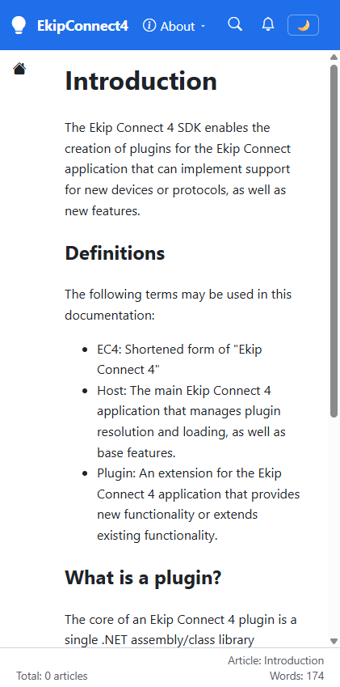

# Validation sequence — Visual Studio devec4 content root

This run validates the `https - devec4` launch profile and its corrected EkipConnect4 content root. A passing run proves that the root route renders the EC4 SDK introduction instead of showing the EkipConnect4 shell with a `Not found` page.

## 🧪 Environment

| Item | Value |
|---|---|
| URL | `http://localhost:5280/` |
| Build | `dotnet build .\src\Diginsight.SmartDocs.slnx --nologo` → PASS, 0 warnings, 0 errors |
| Run | `dotnet run --project .\src\Diginsight.SmartDocs.Web\Diginsight.SmartDocs.Web.csproj --launch-profile "https - devec4"` in a visible foreground PowerShell console |
| Browser | Visible headed browser window, viewport 421 × 849 |
| Date | September 29, 2026 |

## ✅ Sequence and results

| # | Precondition | Action | Expected | Observed | Result |
|---|---|---|---|---|---|
| 1 | The `https - devec4` profile is active, and its file-system root points to the existing EC4 `docs\content` tree. | Open `http://localhost:5280/` after the rebuilt server becomes ready. | The EkipConnect4 shell renders the EC4 SDK introduction without the `Not found` state. | Page title = `Introduction`; brand = `EkipConnect4`; H1 = `Introduction`; opening text begins `The Ekip Connect 4 SDK enables the creation of plugins`; `Not found` heading count = `0`. | PASS |

## 🖼️ Evidence

| Step | Screenshot |
|---|---|
| **Step 1** — The devec4 profile renders the EC4 SDK introduction. |  |

## 📝 Notes

The original EC4 root ended in `src\docs`, which doesn't exist in the sibling checkout. The corrected root ends in `docs\content`, where both `index.md` and `toc.yml` exist.

This run didn't cover DocFX `toc.yml` import, every nested article, other launch profiles, or production Blob Storage. It covered the local Visual Studio root-page scenario reported in this work item.
