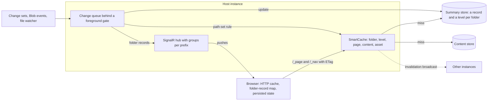

# Startup and navigation at any scale: run review, caching model, and target design

**Date:** 2026-10-01
**Revised:** 2026-10-02, version 1.4 — platform metrics confirmed `C32`'s effect over matched windows, and `C4` moved navigation warm-up after listening into one foreground-gated queue. Version 1.3 measured the deployed Learning Hub, read-only: a crawler trap, not navigation, took almost all of its CPU (`N20`), and `C32` ended it. Version 1.2, earlier the same day, recorded wave 1 as implemented and validated against the previous build. Version 1.1, of 2026-10-01, parked the instrumentation finding until a deployed instance is measured, generalized folder metadata from counts to one complete record per folder, added a cache-sizing finding, and re-ranked the strategy by what a runtime environment pays for
**Author:** Dario Airoldi
**Status:** Wave 1 and `C32` deployed on 2026-10-02; `C4` is implemented and locally validated. See [🔧 Wave 1 implementation record](#-wave-1-implementation-record) and [📏 Deployed baseline](#-deployed-baseline), where `M1` is measured in part. The rest of waves 2–4 remains open
**Component:** `Diginsight.SmartDocs.Web` (host, navigation, caching), `Diginsight.SmartDocs.Web.Client` (menus, hydration), `Diginsight.SmartDocs.Web.Shared` (page loading, rendering)
**Framework:** .NET 10 / ASP.NET Core / Blazor Web App (server prerender + global interactive WebAssembly), Diginsight.SmartCache 3.8.0.2, Diginsight.Core 3.8.0.2
**Builds on:** [`20260925.02-startup-optimization`](../../202609/20260925.02-startup-optimization/overview.md) — the analysis of 2026-09-29 this page reviews and extends

## 📚 Table of contents

- [🎯 Summary](#-summary)
- [🔁 Review of the 2026-09-29 analysis](#-review-of-the-2026-09-29-analysis)
- [🔍 What the runs of 2026-10-01 show](#-what-the-runs-of-2026-10-01-show)
  - [Setup and content](#setup-and-content)
  - [Timeline](#timeline)
  - [Latency during and after the warm-up](#latency-during-and-after-the-warm-up)
  - [Where the work goes](#where-the-work-goes)
- [📦 How caching works today](#-how-caching-works-today)
  - [Every cache in one table](#every-cache-in-one-table)
  - [Rendered documents](#rendered-documents)
  - [Folder metadata](#folder-metadata)
  - [SmartCache behaviors that shape the design](#smartcache-behaviors-that-shape-the-design)
  - [Where caching is inconsistent](#where-caching-is-inconsistent)
- [🔬 New findings](#-new-findings)
- [📈 Designing for an unlimited number of documents](#-designing-for-an-unlimited-number-of-documents)
  - [What changes when the corpus has no upper bound](#what-changes-when-the-corpus-has-no-upper-bound)
  - [Cost per operation, today and in the target](#cost-per-operation-today-and-in-the-target)
  - [Three records: folder, level, and page](#three-records-folder-level-and-page)
  - [Persisting records per folder](#persisting-records-per-folder)
  - [One caching model on SmartCache](#one-caching-model-on-smartcache)
  - [Smooth startup](#smooth-startup)
  - [Smooth navigation](#smooth-navigation)
  - [Smooth metadata notification and update](#smooth-metadata-notification-and-update)
  - [Large folders and search](#large-folders-and-search)
- [🧭 Best strategy](#-best-strategy)
  - [What a runtime environment pays for](#what-a-runtime-environment-pays-for)
  - [The levers, ranked](#the-levers-ranked)
  - [Why this order](#why-this-order)
- [✅ Recommended sequence](#-recommended-sequence)
  - [Step 0 — measure a deployed instance](#step-0--measure-a-deployed-instance)
  - [Wave 1 — remove accidental work](#wave-1--remove-accidental-work)
  - [Wave 2 — one folder record, nothing waits](#wave-2--one-folder-record-nothing-waits)
  - [Wave 3 — render once, cache one way](#wave-3--render-once-cache-one-way)
  - [Wave 4 — any size](#wave-4--any-size)
  - [Measured first — the crawler trap](#measured-first--the-crawler-trap)
  - [Changes outside the waves](#changes-outside-the-waves)
- [🔧 Wave 1 implementation record](#-wave-1-implementation-record)
  - [What changed](#what-changed)
  - [Decisions the plan left open](#decisions-the-plan-left-open)
  - [What the validation showed](#what-the-validation-showed)
  - [What wave 1 didn't change](#what-wave-1-didnt-change)
- [📏 Deployed baseline](#-deployed-baseline)
  - [How it was measured](#how-it-was-measured)
  - [What the deployed instance pays for](#what-the-deployed-instance-pays-for)
  - [`C32-end-the-crawler-trap` — what changed](#c32-end-the-crawler-trap--what-changed)
  - [What it changes in the plan](#what-it-changes-in-the-plan)
  - [What M1 didn't measure](#what-m1-didnt-measure)
- [🚦 C4 implementation record](#-c4-implementation-record)
- [🗂️ C29 implementation record](#-c29-implementation-record)
- [♻️ C22 implementation record](#-c22-implementation-record)
- [🧭 C11 and C12 implementation record](#-c11-and-c12-implementation-record)
- [🖨️ C21 and C10 implementation record](#-c21-and-c10-implementation-record)
- [🧩 C23 implementation record](#-c23-implementation-record)
- [🧊 Parked items](#-parked-items)
- [🧪 Verification](#-verification)
- [💡 Conclusion](#-conclusion)
- [🎓 Lessons learned](#-lessons-learned)
- [📡 Signal sweep](#-signal-sweep)
- [📚 References](#-references)

## 🎯 Summary

This page answers four questions. Does the startup analysis of 2026-09-29 still describe the code? What do the runs of 2026-10-01 show? How does SmartDocs cache rendered documents and folder metadata? And what should startup, navigation, and metadata updates look like when the number of documents has no upper bound?

- **The earlier analysis still holds, and none of its 16 changes has landed.** The `spaces support` commit of 2026-10-01 commits the multi-space work that analysis had measured as uncommitted changes. A second content set — three spaces, 88 sections, and 913 articles served from local clones — reproduces every mechanism it described. The warm-up finished at 134 s and 153 s in the two runs that completed it, and hadn't finished after 580 s in the third. Every menu level was built about twice, and requests made during the warm-up were between 10 and several hundred times slower than the same requests afterward. The runs used a debug profile that instruments every call, so their wall-clock figures are inflated; the counts of reads, builds, and requests are what carries over to a deployed instance.
- **Three new defects are cheap to fix and expensive to keep.** The browser's request for `/favicon.ico` falls into the catch-all content route: it prerenders a full page, probes five Markdown files, and starts the whole-tree index walk. The answer is 13 KB of HTML marked `no-store`, so the browser asks again — once, three times, and six times in the three runs. The warm-up's first drain folds every snapshot cell, building the other spaces' menus before discovering them, for 32–154 s, only to confirm values the snapshot already held. And image folders become menu sections: 10 of the 88 sections are image folders without a single article.
- **The cache is mostly full of text nothing reads.** Every front-matter read caches the first 8 KB of the file as text, though navigation uses a few hundred characters of it. For the Learning Hub's content that's an estimated 8.84 million of the 10 million units SmartCache holds by default, which leaves every listing, every level, and every cached article to share the rest — room for about a hundred average articles at most. This is runtime behavior, independent of logging and instrumentation.
- **Rendered documents aren't cached at any layer.** SmartCache holds Markdown bytes. Every prerender runs Markdig, every browser navigation downloads Markdown again and renders it in WebAssembly, and no response carries a validator — so a repeat view of an unchanged page costs a full round trip and a full render. Images bypass every cache: a 144 KB image is sent in full on every view.
- **Folder metadata has no record of its own, and the client sees only part of it.** A folder's authored metadata — its `metadata.yml` — is cached as raw text and parsed at every level build, and every key the parser doesn't know is dropped. Its derived metadata — the article count, newest date, and coverage — lives outside SmartCache, in a private dictionary saved to a JSON snapshot. Both are copied into the parent's cached level, so any count change flushes every level, and the browser sees only what a level carries: never a folder's description, and never the newest article's author, although two contracts already have a field for it.
- **The instrumentation question is parked.** In the debug profile, SmartCache's own activities and log records dominated the trace. A deployed instance logs at `Warning` and samples traces at 10%, and instrumentation at the debug level is enabled on purpose, for debugging. Whether a deployed instance pays anything for it is parked as [`PL-1-runtime-instrumentation-cost`](#pl-1-runtime-instrumentation-cost--what-instrumentation-costs-in-a-deployed-instance) until one is measured.
- **An unlimited document set overturns three of the earlier conclusions.** One manifest per space, preloading every article body, and a whole-tree index for search and prev/next all grow with the corpus — and so does a cache warmed with every header. The target keeps the earlier principles — load instead of crawl, approximate first, foreground first, render once — and adds one: **no request, startup step, or change may cost work proportional to the size of the corpus.** Three records carry everything a reader sees — a folder record holding all of a folder's metadata, a level, and a rendered page — each cached in SmartCache, versioned for the browser, and updated by change events instead of by crawling.

The following table compares the primary run with the target. The target column is an estimate; it holds at any corpus size by construction, not by measurement.

| | Today — 18:58 run, debug profile, measured | Target — estimated, independent of corpus size |
|---|---|---|
| Work at startup | a crawl that starts before listening: about 1,120 file operations, done at 134 s | nothing that grows with the corpus |
| First page | 4.7 s of prerender competing with the crawl; every space's top level loaded for the top bar | the active branch's levels and folder records, and one cached rendered page |
| Requests during startup | `/_nav/children` p50 616 ms, `/_page` up to 15.4 s, `/_nav/index` 33 s | the same as afterward: there's no crawl to compete with |
| Repeat view of an unchanged page or image | full download, plus a Markdig render for a page | `304 Not Modified`, or no request at all while an image is fresh |
| What the cache holds | after a warm-up, an estimated 78–88% of its cap is raw header text | records first, rendered pages next, bodies last, in a cap sized for the instance |
| Folder metadata in the browser | label, short label, icon, top-bar flags, and counts, inside the parent's level | the whole folder record — every `metadata.yml` key, classification, counts, newest article — cached, served, and pushed on its own |
| After a change | publish: whole-site invalidation and full rebuild; any count change: every level flushed | one level and one record per changed folder, one refold per ancestor, pushes to the readers of those levels |
| `/favicon.ico` | a full prerender plus the whole-tree walk, never cached | a static file |

[🧭 Best strategy](#-best-strategy) ranks the levers by what a runtime environment pays for, and [✅ Recommended sequence](#-recommended-sequence) turns them into steps: measure a deployed instance, remove accidental work in hours, make the folder record the one unit of folder metadata in days, render once, and — over weeks — persist records per folder and react to change events.

**Wave 1 is implemented.** On 2026-10-02 its eight changes landed and were validated in a visible browser against the previous build serving the same content. A request for `/favicon.ico` now costs a `404` in 23 ms instead of a 680 ms prerender. A reload of an article page sends 3.6 KB instead of 22.8 KB. Counts follow a whole-site invalidation, where they used to stay stale. A restart no longer folds folders the crawl hasn't reached, and asset folders, build output, and empty sections leave the menus. [🔧 Wave 1 implementation record](#-wave-1-implementation-record) records how each change was resolved.

**A deployed instance pays for something else first.** `M1` measured the deployed Learning Hub on 2026-10-02 from its platform metrics, its web-server log, and requests from outside. For at least three days it had spent 77–88% of its single core, at about 2 s per response, on one crawler requesting routes that don't exist: 5,852 of the 5,854 paths it asked for in three hours. The application answers an unknown route with status 200 and a full page of relative links, and the crawler resolves those links against the page's own URL, so every answer breeds new unknown routes ([`N20`](#n20-crawler-trap--unknown-routes-answer-200-and-breed-more)). Wave 1 doesn't touch that cost. `C32` ends it — a 404 before prerendering, rooted links, and a `robots.txt`. Deployed the same day, it cut the Learning Hub's CPU from 160–228 to 4 CPU-seconds per five minutes, and [📏 Deployed baseline](#-deployed-baseline) re-ranks waves 2–4 around it.

## 🔁 Review of the 2026-09-29 analysis

The `spaces support` commit of 2026-10-01 commits the multi-space work — the mounted namespace, the generated space index, the space switcher, branding resolution, and the content freshness bounds — that the earlier analysis had measured as uncommitted changes. None of it changes the startup path that analysis described. The table checks each of its findings and changes against today's code and the new runs.

| Earlier item | Verdict on 2026-10-01 | What this review adds |
|---|---|---|
| [`N1-activity-options-rebind`](../../202609/20260925.02-startup-optimization/overview.md#n1-activity-options-rebind--every-instrumented-call-re-binds-its-logging-options) | Holds in every profile measured so far, all of them local. Its production share, inferred from configuration in the earlier analysis, is parked as [`PL-1`](#pl-1-runtime-instrumentation-cost--what-instrumentation-costs-in-a-deployed-instance). | Each warm-up starts 11,500–12,100 activities for about 1,120 file operations; 63–64% of them are SmartCache's own. |
| [`N2-counts-baked-into-levels`](../../202609/20260925.02-startup-optimization/overview.md#n2-counts-baked-into-levels--a-count-change-flushes-every-menu-level) | Holds. | 181 level builds for 89 tracked folders. The end-of-warm-up flush removed 92 levels, and rebuilding them took 40–49 s. The same coupling holds for authored folder metadata — [`N15`](#n15-folder-metadata-split--folder-metadata-has-no-record-of-its-own-and-the-client-sees-only-part-of-it). |
| [`N3-warmup-competes-with-first-request`](../../202609/20260925.02-startup-optimization/overview.md#n3-warmup-competes-with-first-request--no-priority-no-global-budget) | Holds. | During the warm-up, `/_nav/children` took 572–616 ms at the median against 39–51 ms afterward, and a local head read up to 7.3 s. |
| [`N4-first-page-builds-index`](../../202609/20260925.02-startup-optimization/overview.md#n4-first-page-builds-index--prevnext-needs-the-whole-tree) | Holds, with a second trigger. | `/favicon.ico` starts the same walk — [`N10`](#n10-favicon-renders-a-page--the-browsers-icon-request-renders-a-whole-page). The walk took 59 s, and `/_nav/index` 33–56 s. |
| [`N5-hydration-discards-prerender`](../../202609/20260925.02-startup-optimization/overview.md#n5-hydration-discards-prerender--a-loading-flash-and-17-refetches) | Holds. | No component or service persists prerendered state, and the client still awaits `/_site` before it starts. |
| [`N6-prerender-waits-for-topbar`](../../202609/20260925.02-startup-optimization/overview.md#n6-prerender-waits-for-topbar--the-first-byte-waits-for-every-section) | Holds, in a new form. | On the generated space index the top bar's sections are the spaces, so the first prerender loads every space's top level. |
| [`N7-freshness-decays-warmup`](../../202609/20260925.02-startup-optimization/overview.md#n7-freshness-decays-warmup--a-warm-cache-that-expires-in-five-minutes) | Holds, now measured. | Once the five-minute tolerance lapsed, a level went from 50 ms to 763 ms, a page from 82 ms to 707 ms, and the favicon from 1.25 s to 9.1 s. |
| [`N8-publish-leaves-counts-stale`](../../202609/20260925.02-startup-optimization/overview.md#n8-publish-leaves-counts-stale--a-whole-site-invalidation-refolds-only-the-root) | Holds; the code is unchanged. | Not re-measured. Its multi-instance form is part of [`N15`](#n15-folder-metadata-split--folder-metadata-has-no-record-of-its-own-and-the-client-sees-only-part-of-it). |
| [`N9-exclusions-root-only`](../../202609/20260925.02-startup-optimization/overview.md#n9-exclusions-root-only--infrastructure-folders-are-crawled-below-the-root) | Holds, with a second form. | Image folders inside a space become sections — [`N12`](#n12-asset-folders-become-sections--image-folders-become-menu-sections). |
| Smaller items | Hold. | The blob read in two round trips is folded into `C20`, and the double header parse into `C31`. |
| Changes 1–16 | None implemented. | [Changes outside the waves](#changes-outside-the-waves) says where each one went. |
| Target design | Its principles hold; three of its elements assume a small corpus. | One manifest per space (`C14`), preloading every body (`C16`), and the whole-tree index for search grow with the corpus — [designing for an unlimited number of documents](#-designing-for-an-unlimited-number-of-documents). |
| Measurements | Different content, build, and profile. | Three spaces from local clones and a Debug build in a Visual Studio session, all in the debug profile. The earlier runs served the Learning Hub from a Release build and varied the instrumentation. |

The earlier analysis remains the reference for how startup works step by step, for the CPU attribution of `N1`, and for the hydration timeline. This page doesn't repeat them.

## 🔍 What the runs of 2026-10-01 show

### Setup and content

The log of 2026-10-01 holds three starts of the same code; no source file changed between them. The run that started at 18:58 UTC was the latest when this analysis began, and it's the primary run here. The 18:42 run and the 19:11 run, which started afterward, are repeats. All three used a local three-space profile whose environment overlay lives in the internal configuration peer; this page names its spaces by their configuration order rather than by their identifiers.

- **Spaces.** Three prefixed spaces, each served by a FileSystem source from a local clone. No space is mounted at the site root, so `/` serves the generated space index.
- **Profile.** A debug profile: the activity emitter listens to `Diginsight.*`, Diginsight logs at `Debug` and SmartDocs at `Trace` to a log4net file, and traces are sampled at 100%, Diginsight's default for a Development host. A deployed instance runs the base settings instead — logs at `Warning`, traces sampled at 10% — because no deployed overlay or workflow setting changes them.
- **Build and host.** A Debug build in a Visual Studio session, with the browser-refresh middleware loaded. A metrics snapshot from the previous start was present every time.

The table shows the content the warm-up walks. Sections and navigable articles come from the metrics snapshot; the other columns were counted on disk.

| Space, in configuration order | Folders | Sections | Markdown files | Navigable articles | Images |
|---|---|---|---|---|---|
| First | 100 | 27 | 374 | 250 | 0 |
| Second | 80 | 42 | 349 | 346 | 735 |
| Third | 56 | 19 | 319 | 317 | 737 |
| **Total** | **236** | **88** | **1,042 (6.8 MB)** | **913** | **1,472** |

The corpus is smaller than the Learning Hub's 1,133 articles, so every cost below is overhead per unit, not volume. Wall-clock figures come from a debug profile on a shared developer machine running a Debug build, and they vary between runs: the 18:42 run's drain and rebuild took several times longer than the others'. Counts of operations, activities, and requests, and the comparisons between during and after the warm-up, are the reliable signals.

### Timeline

The table lists each run's milestones in seconds after the process started. A dash means the run didn't reach the milestone.

| Milestone | 18:42 run | 18:58 run (primary) | 19:11 run |
|---|---|---|---|
| Host listening | 4.2 | 2.0 | 12.2 |
| Site-root page prerendered | from 6.5 | 3.7–8.4 | 15.9–21.2 |
| First space discovered | 5.5–38.9 | 2.8–49.2 | 11.4–59.1 |
| First drain — 89 cells folded, none changed | 39.0–193.1 | 49.3–80.9 | 59.1–108.9 |
| Second and third spaces discovered | 193.3–204.9 | 81.0–84.5 | 109.0–112.4 |
| Every level flushed, then rebuilt | 205.3 until stopped | 84.7–134.2 | 112.6–152.9 |
| Warm-up done, counts pushed | — (stopped at about 580) | 134.3 | 153.0 |

The chart shows the primary run. The crawl overlaps everything a visitor asks for, and the whole-tree index walk — started by a favicon request — runs for most of it.

```mermaid
gantt
    title The 18:58 run in minutes and seconds after process start
    dateFormat HH:mm:ss
    axisFormat %M:%S
    section Host
    Build and listen               : 00:00:00, 00:00:02
    section Warm-up
    Discover the first space       : 00:00:03, 00:00:49
    First drain over all spaces    : 00:00:49, 00:01:21
    Discover the other spaces      : 00:01:21, 00:01:25
    Flush and rebuild every level  : 00:01:25, 00:02:14
    section Requests
    Site-root prerender            : 00:00:04, 00:00:08
    First favicon prerender        : 00:00:09, 00:00:16
    Whole-tree index walk          : 00:00:17, 00:01:16
    Resolving a section route      : 00:00:29, 00:00:44
    Browser index download         : 00:00:43, 00:01:16
```



### Latency during and after the warm-up

The table compares each kind of request while the warm-up was running with the same request after it. The "during" figures are medians and maxima of the logged handler durations. The "after" figures come from the 19:11 run's log and from direct requests to that instance once its warm-up had finished. All of them were taken in the debug profile, so they show where time goes rather than what a deployed instance would take.

| Request | During the warm-up, 18:58 run | During the warm-up, 19:11 run | After the warm-up |
|---|---|---|---|
| `/_nav/children` | p50 616 ms, max 5.5 s (16 calls) | p50 572 ms, max 3.3 s (44 calls) | 39–51 ms; 763–886 ms once the level's tolerance lapsed |
| `/_page` | 2.3 s and 15.4 s (2 calls) | p50 3.1 s, max 11.1 s (5 calls) | 82 ms; 707 ms once the page's tolerance lapsed |
| `/_nav/index` | 33.1 s | 56.2 s | 115 ms from the cache; 228 KB uncompressed |
| `/_nav/total` | 29 ms | 21 ms | 4–6 ms |
| Site-root prerender | 4.7 s | 5.3 s | — |
| `/favicon.ico` prerender | 4.1–18.7 s (3 calls) | 3.6–15.6 s (6 calls) | 1.25 s; 9.1 s once its levels' tolerance lapsed |

The 15.4 s `/_page` call resolved a section route that has no page of its own. The server probed five candidate file names, and each probe of a local file took between 0.8 and 5.7 s because the thread pool was saturated. The physical operations underneath tell the same story: a local head read took 38 ms at the median and up to 7.3 s, and a folder listing 31 ms at the median — operations that normally complete in well under a millisecond on a local disk.

### Where the work goes

The log's own counts explain the slowness better than its timings. Per warm-up:

- **About 1,120 physical file operations** — 940 head reads, 171 folder listings, and a few full reads — for 913 articles and 88 sections.
- **181 level builds for 89 tracked folders.** Each level is built while the crawl discovers it, flushed with all the others at the end, and built again.
- **A 55% hit ratio.** Of 2,983 SmartCache lookups in the primary warm-up, 1,647 hit and 1,336 missed.
- **11,500–12,100 activities**, 10–11 per file operation. SmartCache accounts for 63–64% of them: every lookup opens two nested `GetAsync` activities, every store a `SetValue` activity, and every removal an `OnEvicted` activity.
- **About 30,000 log records, 6.4–7.1 MB, per start.** SmartCache writes 70% of them: besides its activities, it logs `Cache entry found`, `Cache hit`, or `Cache miss` at `Debug` on every lookup.

The first three counts are properties of the code, and they carry over to any profile; the design below targets them. The last two are properties of the debug profile. In it, every activity also pays the configuration rebind measured in [`N1-activity-options-rebind`](../../202609/20260925.02-startup-optimization/overview.md#n1-activity-options-rebind--every-instrumented-call-re-binds-its-logging-options), which the earlier analysis found to be 93% of the non-idle CPU, so ten activities per file operation multiply every wall-clock figure above. What a deployed instance pays for its own instrumentation is parked as [`PL-1`](#pl-1-runtime-instrumentation-cost--what-instrumentation-costs-in-a-deployed-instance).

## 📦 How caching works today

SmartDocs caches in three places: SmartCache inside the host, a private metrics index beside it, and hand-written maps in the browser. HTTP caching — the tier that would let a browser skip a request — is used only for fingerprinted static assets and the brand mark.

### Every cache in one table

The table lists every place the running system keeps derived data. *Freshness* says when a stored answer stops being served; *invalidated by* says what removes it early; *capped* says whether its memory has a bound.

| Where | What it holds | Key | Freshness | Invalidated by | Capped | Survives restart |
|---|---|---|---|---|---|---|
| SmartCache `content` | Markdown bytes, `.md` and `.qmd` only | file | read tolerance: 5 min if found, 30 s if missing | path-branch rule | yes, shared cap | no |
| SmartCache `children` | one folder listing | folder | 5 min | path-branch rule | yes | no |
| SmartCache `head` | up to the first 8 KB of a file as text: an article's front matter, or a whole `metadata.yml` | file | 5 min | path-branch rule | yes | no |
| SmartCache `nav-level` | one built menu level, **counts and child folders' metadata included** | folder | 5 min | path-branch rule; `InvalidateLevels()` drops all | yes | no |
| SmartCache `nav-index` | every navigable article | site | core `MaxAge`, 7 days | any rule on any path | yes | no |
| `FolderMetricsIndex` | count, newest date, and coverage per section | folder | until refolded | `Invalidate(prefix)`, on this instance only | no — one cell per section | JSON snapshot |
| Brand mark | its location only; bytes read on every request | — | the process lifetime | restart | — | — |
| Binary assets | nothing; every request reads the origin | — | — | — | — | — |
| `IMemoryCache` | nothing — registered twice, by `Program.cs` and by SmartCache's builder, and resolved by nothing | — | — | — | — | — |
| Browser `HttpNavProvider` | levels per prefix, and the whole index | prefix | the tab's lifetime | pushes patch counts; a reconnect refetches the root | no | no |
| Browser `NavStats` | root and site totals | root | the tab's lifetime | pushes | — | no |
| Browser HTTP cache | fingerprinted static assets and the brand mark | URL | `max-age` | URL change | browser | yes |

`/_page`, `/_nav/*`, and `/_content` responses carry no `ETag`, `Last-Modified`, or `Cache-Control`. `/favicon.ico` is answered with `no-cache, no-store`.

### Rendered documents

Rendered documents aren't cached anywhere — only their Markdown source is. The path a page takes depends on where it renders:

- **Prerender.** `PageLoader` tries up to five candidate keys through `CachedContentSource`, takes the Markdown bytes from SmartCache or from the origin, and renders them with Markdig. The HTML goes into the response and is discarded.
- **Browser navigation.** `HttpContentSource` asks `/_page/{path}`, the server resolves the candidates through the same cache, and returns Markdown bytes. The WebAssembly runtime runs Markdig, builds the table of contents, resolves the title, and counts words. Nothing keeps the result, so the next view of the same page repeats the request and the render.
- **Images and attachments.** `/_content/{key}` bypasses SmartCache by design, to keep a Redis store free of large payloads, and it sends no validator, so the browser can't reuse its copy either. On Blob storage, every image on every view is an origin round trip and a full transfer.

The consequences follow directly. Rendering costs one Markdig pass per view instead of one per change, and for browser navigation that pass runs in the WebAssembly runtime, which executes .NET far slower than the server does unless the app is compiled ahead of time. Repeat visits never get a `304`. And the WebAssembly download has to carry Markdig.

### Folder metadata

"Folder metadata" covers two different things, cached in two different ways, and neither reaches the client whole.

**Authored metadata** is a folder's `metadata.yml`: label, short label, icon, order, visibility, and top-bar placement. It reaches the menu in four steps:

1. Building a level lists each child folder, and reads the child's `metadata.yml` only when that listing shows the file.
2. The file's text is cached as a SmartCache `head` entry for five minutes.
3. `FolderMeta.Parse` turns the text into overrides at every level build. It keeps nine known keys and drops every other one, so a key such as `description` never leaves the server.
4. The overrides are baked into the parent's `nav-level` entry. Label, short label, icon, and top-bar flags travel to the client inside it; order and visibility are applied on the server.

An edit becomes visible once both entries refresh: within five minutes, or immediately when an invalidation names the file, because the parent level sits on the file's branch. Two more gaps follow from how the overrides are consumed. The `article-count` and `latest-article` keys are parsed and used as a lower bound when no computed value exists — and nothing writes them. And a section's landing page titles itself from the folder name, ignoring the label the sidebar shows.

**Derived metadata** is the recursive article count, the newest date, and their coverage. It travels a longer path:

1. `FolderMetricsIndex` keeps one cell per section in a private `ConcurrentDictionary`, outside SmartCache.
2. A cell is computed by folding its level: section children contribute their own cells, articles contribute one each. The fold tracks the newest date but not the article it belongs to, so the newest article's author — a field in both `NavAggregateDelta` and `FolderArticleStats` — always reaches the client as null.
3. The whole index is saved as one JSON snapshot after the warm-up and loaded at the next start, with every cell dirty.
4. Values are copied into levels as they're built (`FolderAggregate`), so a count change makes cached levels wrong, and `NavChangePublisher` flushes all of them.
5. Browsers receive counts four ways: inside levels, from `/_nav/total`, through the hub's `CountsReady` (site and root sections, at warm-up milestones and on every connection), and through `MetadataChanged` (changed folders plus the site, to every client). `DynNav` also polls `/_nav/total` every five seconds while the total isn't exact.

The metrics don't take part in cross-instance invalidation. When the Service Bus companion is configured, SmartCache broadcasts each invalidation rule and every instance drops its cached levels — but an instance that didn't receive `POST /_nav/invalidate` keeps its old counts and rebuilds its levels with them. With no SignalR backplane, its browsers receive no push either. This follows from the code; no multi-instance deployment was measured.

### SmartCache behaviors that shape the design

Six behaviors of SmartCache 3.8.0.2 matter here. Each was read in the library's source and, where the binary shows it, checked against the shipped package.

- **`MaxAge` is a read tolerance, not an expiry.** An entry older than the tolerance is fetched again — synchronously, on the reader's request. That's what turned a 50 ms level into a 763 ms one after five quiet minutes.
- **Memory is capped, and SmartDocs doesn't size it.** `AddSmartCache` sets a size limit of 10,000,000 units on its private memory cache — units of estimated size, two per character of a string and one per byte of an array. Entries of 20,000 units or more get low priority, entries from 10,000 normal, and smaller ones high, so compaction removes article bodies first and menu levels last. An entry that would push the total over the limit isn't stored at all. [`N19`](#n19-cache-cap-filled-by-raw-heads--a-warm-up-nearly-fills-the-cache-with-header-text) shows that a warm-up nearly fills it with header text.
- **Sizing a `byte[]` costs one boxed visit per byte.** Entry size is estimated by walking the object graph, and Diginsight.Core has no special case for arrays, so a cached 30 KB article is measured element by element on every store. An envelope that implements `ISizeableHeuristically` can report its size in constant time.
- **Invalidation scans every key.** Each rule asks every key in memory whether it's affected, and an empty path matches everything. With a companion, the rule is broadcast and runs on every instance — and a key can return a callback that then runs on every instance, a hook nothing uses today.
- **Single-flight is opt-in per call.** All five kinds opt in, which is why concurrent requests for the same level share one build.
- **Its own instrumentation is fine-grained.** Two nested activities per lookup, one per store, one per eviction, and one or two `Debug` records per lookup made 63–64% of the warm-up's activities and 70% of its log in the debug profile. What a deployed instance pays for them is parked as [`PL-1`](#pl-1-runtime-instrumentation-cost--what-instrumentation-costs-in-a-deployed-instance).

The log's only warning in each run is SmartCache reporting that it downgraded to in-memory mode because no passive location, such as Redis, is configured. That's expected for a single instance.

### Where caching is inconsistent

Seven inconsistencies make caching harder to reason about than it needs to be:

1. **Two freshness systems.** `ContentFreshness` passes per-kind tolerances on each call, while `Diginsight:SmartCache` sets a seven-day `MaxAge`, a 31-day absolute expiration, and a seven-day sliding one. A comment in `Program.cs` describes class-aware overrides that no configuration uses, and `Diginsight:SmartCache:Enabled` binds to nothing.
2. **Folder metadata has no record of its own.** Authored keys travel inside levels, counts travel through four channels, and the counts live outside SmartCache with their own store, invalidation, debounce, and persistence — and no cross-instance path.
3. **Rendered pages, binary assets, and the brand mark have no server cache.**
4. **Kinds are string literals spread over three classes,** and levels have two invalidation shapes: the path-branch rule and a kind-wide flush.
5. **Headers are cached as raw text** — the first 8 KB of each file — and parsed again at every level build: five regular expressions, twice per article.
6. **`IMemoryCache` is registered twice and used by nothing.** `Program.cs` calls `AddMemoryCache()`, and so does SmartCache's own builder; SmartCache then creates a private memory cache of its own. Removing the SmartDocs call changes nothing at runtime.
7. **The browser keeps its own maps** with their own invalidation — patched by push, refetched on reconnect — and has no HTTP validator to fall back on.

## 🔬 New findings

Each finding continues the numbering of the earlier analysis, so `N1`–`N9` keep their meaning and the recommended changes can cite both. This revision moved the first version's `N16-smartcache-overhead` to the parked items as [`PL-1`](#pl-1-runtime-instrumentation-cost--what-instrumentation-costs-in-a-deployed-instance), and added `N19`. Version 1.3 added `N20`, the one finding measured on a deployed instance.

### `N10-favicon-renders-a-page` — the browser's icon request renders a whole page

Browsers ask for `/favicon.ico` unless the page declares an icon. `App.razor` declares none, and `wwwroot` has no icon, so the router's catch-all route `/{*path}` claims the request. The host then prerenders a full page for `favicon.ico`:

- the root levels for the menus,
- five Markdown candidates, from `favicon.ico.md` to `favicon.ico/README.md`,
- the children of `favicon.ico/`, in case it's a section,
- the breadcrumb,
- and, through `ContentView.LoadPrevNextAsync`, the whole-tree index.

The answer is 13 KB of HTML with `Cache-Control: no-cache, no-store`. It isn't an icon and can't be cached, so the browser asks again on later navigations. The runs logged one, three, and six such requests, each taking 3.6–18.7 s during the warm-up and 1.25 s after it. In the primary run, the first favicon request started the 59 s index walk. Any path that ends in a file name — `robots.txt`, `apple-touch-icon.png`, a mistyped image URL — costs the same, which makes a request for an unknown file one of the most expensive requests the host serves.

### `N11-first-drain-folds-every-space` — the first drain re-verifies the snapshot before discovery

On a start with a snapshot, `LoadSnapshotAsync` seeds all 89 cells as dirty. The warm-up discovers the first space and drains — and the drain folds every dirty cell, deepest first, including the cells of the second and third spaces, which aren't discovered yet. Folding a cell reads its level, so the drain builds those spaces' levels inline: in the primary run, 7 level builds, 372 head reads, and 61 listings, over 31.6 s (49.8 s and 154 s in the other runs). Every fold returned the value the snapshot already held — the log reads `89 folders, 0 changed` — so the startup crawl spent its time confirming an unchanged tree.

### `N12-asset-folders-become-sections` — image folders become menu sections

`NavRules.IsAssetFolder` is documented as "asset folders … never form menu sections", but the code applies it only when deciding whether a *parent* has meaningful subfolders. The asset folder itself is scored like any other. `assets` becomes a section as soon as it holds a subfolder with a non-asset name, such as `icons` or `screenshots`, and `asset`, in the singular, isn't recognized at all.

In the measured content, 10 of the 88 sections are image trees — `<space>/assets` and `<space>/asset` with their `icons`, `icons/azure`, `icons/azure/svg`, and `screenshots` subfolders — and none contains an article. Four more sections are work-item folders with no navigable article. All 14 are crawled at every start, refolded, rebuilt, and shown: both `assets` folders sit at the top of their spaces, so they appear as top-bar tabs, and the top bar preloaded their contents during the 19:11 run.

### `N13-rendered-pages-not-cached` — every view renders the page again

As [rendered documents](#rendered-documents) describes, no layer keeps a rendered page. The server renders on every prerender, and the browser renders on every navigation — including a return to a page it rendered a minute earlier. A warm `/_page` response took 82 ms in the latest run before the browser's own Markdig pass; nothing in the design makes the second view cheaper than the first.

### `N14-responses-carry-no-validators` — nothing the browser fetches can be revalidated

`/_page`, `/_nav/children`, `/_nav/index`, and `/_content` send neither `ETag` nor `Cache-Control`, and no response is compressed. The content sources already compute an entity tag — a SHA-1 of the bytes for files, the blob's own tag for Blob storage — and the endpoints discard it. The measured effects:

- The index is 228 KB of uncompressed JSON for 913 articles, even when the request accepts `gzip` and `br`.
- A 144 KB image is transferred in full on every view.
- A new tab re-downloads every level it shows, even when nothing changed.

### `N15-folder-metadata-split` — folder metadata has no record of its own, and the client sees only part of it

A folder's metadata is two things held in two places. Its authored part is raw text in SmartCache, parsed again at every level build, with every unrecognized key dropped. Its derived part — the count, newest date, and coverage — sits outside SmartCache in a dictionary with its own invalidation, debounce, and persistence, and no cap. Neither is an entity anyone can ask for: both are copied into the parent's cached level, which is why a count change flushes every level ([`N2`](../../202609/20260925.02-startup-optimization/overview.md#n2-counts-baked-into-levels--a-count-change-flushes-every-menu-level)), and the client sees only the fields a level carries. The losses are concrete:

- A `description`, or any other key a publisher adds to `metadata.yml`, never leaves the server.
- The newest article's author is a field in two contracts and is always sent as null; the newest article's title and route aren't tracked at all.
- A section's landing page titles itself from the folder name instead of the label the sidebar shows.
- SmartCache's cross-instance broadcast doesn't reach the counts, so a scaled-out deployment shows different counts on different instances after a publish.

Caching only the counts as a record of their own would fix the flushes and leave the rest. The target therefore gives every folder one record holding all of its metadata — authored and derived — cached, served, and pushed as a unit.

### `N17-whole-site-work-grows-with-n` — every whole-site path grows with the corpus

Every path that touches the whole tree costs work proportional to the corpus. At 913 articles each one is tolerable; at a hundred times that, each one becomes an outage.

- **The discovery crawl** reads every listing and every head, before the first request can be served at full speed.
- **The final rebuild** reads every level again.
- **The snapshot** holds every section's cell and is loaded and saved whole, at about 80 bytes per section.
- **The whole-tree index** is built on the server for prev/next, for search, and for every favicon request, and downloaded by the browser at about 250 bytes per article — 25 MB at 100,000 articles.
- **An empty-path invalidation** drops every cached entry, and the publish pipeline sends exactly that.
- **Pushes** go to every connected client, whatever it displays.

### `N18-hub-reconnects` — the hub reconnected five times in 14 minutes

In the 19:11 run, the browser's hub connection was re-established at 148, 194, 226, 371, and 842 s. Each reconnect refetched `/_nav/total` and the space's root level: cheap while cached, and 886 ms at 842 s, when the level's tolerance had lapsed. The cause isn't established. The log records no disconnect reason, and the run was a Visual Studio session with browser-refresh tooling attached. It's worth knowing before the hub becomes the only path for metadata updates.

### `N19-cache-cap-filled-by-raw-heads` — a warm-up nearly fills the cache with header text

SmartCache's memory cache holds 10,000,000 units of estimated size by default, and SmartDocs doesn't change it. A front-matter read caches the first 8 KB of the file as text, at two units per character, although navigation uses a few hundred characters of it: the title, date, author, and two flags. Reproducing that read over every eligible file of both content sets gives the totals in the following table. The warm-up reads nearly all of them: the runs logged 940 header reads, and the earlier analysis counted 1,144 for the Learning Hub.

| Content | Files read for their header | Cached header text | Share of the 10 M cap |
|---|---|---|---|
| The three measured spaces | 945 | 7.82 M units | 78% |
| The Learning Hub, from a local clone of its deployed content | 1,157 | 8.84 M units | 88% |

After a warm-up, every listing, every level, and every cached article share what's left: for the Learning Hub, 1.16 M units, or room for about a hundred articles of average size. Past the cap, the memory cache stores nothing new and compacts by priority. Entries of 20,000 units or more go first — the larger articles — and entries of 10,000–20,000 next, which include 487 of the Learning Hub's headers; a later level build then reads those headers from the origin again.

None of this depends on logging or instrumentation, and it grows with the corpus while the cap doesn't. The totals assume a file system source; a Blob source reads its header through a network stream that can return less than 8 KB at a time, so they're the upper bound there. SmartCache records its total size and its evictions by reason as metrics, so a deployed instance can confirm the effect directly.

### `N20-crawler-trap` — unknown routes answer 200 and breed more

On the deployed Learning Hub, almost all of the work is one crawler walking routes that don't exist. Its web-server log for 08:38–11:40 UTC on 2026-10-02 holds 6,103 requests: 6,085 from OpenAI's GPTBot and 5 from browsers. GPTBot asked for 5,854 distinct paths, 5,852 of which name nothing in the content, each of them once, at a median of 34 requests a minute. The paths are real segments recombined — an article's folder, then `_framework`, `js`, and other sections' folder names — eight to twelve segments deep.

Three behaviors combine into the trap:

- **An unknown route is a full page with status 200.** The page router's catch-all route claims every path and renders "Not found" inside the application shell, with status 200, so a crawler can't tell it from an article.
- **The page's links are relative.** Menu links, breadcrumbs, prev/next, and the `_framework` and `js` script sources were written relative to `<base href="/">`. A browser resolves them against the base; this crawler resolves them against the page's own URL, so every link on an unknown page names a new, deeper unknown route.
- **Each answer costs a prerender** — the menus, the Markdown probes, and the layout: a median of 1.3 s and a p95 of 3.3 s of server time in the log.

The platform's metrics put a price on it. Every six-hour period from 2026-09-29 to 2026-10-02 consumed 16,500–19,000 CPU-seconds of the 21,600 that one core supplies, for 8,500–12,000 requests averaging about 2 s each. The plan is a single Basic B1 instance shared with other apps, so the docs site pays too: idle most of the time and with Always On off, its rare visits cold-start on a busy core and averaged 12–29 s, and the first request measured on 2026-10-02 got a `504` after 110.7 s.

No local run can show this, because it lives in traffic rather than in a code path. And unlike every other finding on this page, it doesn't depend on the content's size: ten articles trap the crawler as surely as a million.

## 📈 Designing for an unlimited number of documents

### What changes when the corpus has no upper bound

"Unlimited" doesn't mean infinite. It means no design decision may assume the corpus fits a budget — of memory, of startup time, or of download size. Four assumptions don't survive that test, three of them in the earlier target and one in today's code:

- **The whole structure fits in one file.** One manifest per space costs a read, a parse, and memory proportional to the corpus at every start, and a full rewrite after every reconcile. At the densities measured here — about 80 bytes per section in the snapshot and 250 bytes per article in the index — a million articles make a manifest of hundreds of megabytes.
- **Every body fits in memory.** SmartCache caps its memory and evicts bodies first; preloading all of them only churns the cache.
- **The browser can hold the whole tree.** The index is 228 KB for 913 articles, and it would be about 250 MB for a million.
- **The cache can hold the working set.** A warm-up that caches every header already fills an estimated 78–88% of the default cap at about a thousand articles ([`N19`](#n19-cache-cap-filled-by-raw-heads--a-warm-up-nearly-fills-the-cache-with-header-text)). At any larger size, warming everything only churns the cache.

A flat listing per space also stops being a cheap reconcile: Blob storage returns 5,000 entries per call, so a million blobs take 200 sequential calls. That's fine as a nightly safety net, and wrong as the way the host learns about change.

The earlier analysis listed six principles. This target keeps all of them and adds a seventh: **bounded work.** No request, startup step, or change may cost work proportional to the corpus. A request costs what its page shows. A change costs what it touched. A restart costs nothing that grows.

### Cost per operation, today and in the target

The table states each operation's cost as a function of a few quantities: *N* articles, *F* sections, *D* depth of the deepest active branch, *L* entries in the largest level, *P* entries in one page of a level, *C* files changed by a publish, and *K* search results returned.

| Operation | Today | Target |
|---|---|---|
| Before the first request | a crawl of *F* listings and *N* headers starts before listening | nothing that depends on *N* |
| After start | *F* + *N* reads, every level built twice, an *F*-cell snapshot loaded and saved | optional warm of each space's top two levels, bounded by *P* |
| First page | *D* levels, every top-bar section's level, the article; the *N*-sized index if prev/next or the favicon asks | *D* levels and folder records, and one rendered page |
| Prev/next | the *N*-sized index | the parent's level; *D* levels at a folder's edge |
| Menu search | an *N*-sized download and an *N*-sized filter per keystroke | a server query returning *K* results |
| Expanding a folder | the whole level, *L* entries | one page of it, *P* entries, with its folder children's records |
| Folder metadata on screen | fields copied into the parent's level, after an *F* + *N* warm-up | one lookup of the folder record |
| A publish of *C* files | whole-site drop and an *F* + *N* rebuild | at most *C* levels and *C* × *D* folder records, and pushes to the readers of those levels |
| Restart | an *F* + *N* crawl | nothing; records and levels persist |
| Server memory | metrics uncapped; SmartCache capped at 10 M units, an estimated 78–88% of it header text after a warm-up | every tier capped and sized; cold records reloaded from the store |

### Three records: folder, level, and page

Everything the menus, breadcrumbs, landing pages, and counters show comes from three records. Each is cached in SmartCache and carries a version that doubles as its HTTP `ETag`; the first two are also persisted per folder.

| Record | Holds | Changes when | Reaches the browser |
|---|---|---|---|
| Folder record | everything known about one folder: every key of its `metadata.yml` — the known ones typed, any other passed through; its classification as a section, a collapsed link, or hidden; its route and icon; and its aggregates — the article count, the newest article's date, title, route, and author, and the coverage | its `metadata.yml` changes, its own children change, or an aggregate below it changes | beside every level that lists the folder, on its own from `/_nav/folder`, in prerendered state, and by push |
| Level | a folder's children in display order: folder children by reference, article children with their parsed front matter — title, date, and author | a direct child is added, removed, retitled, reordered, or hidden | from `/_nav/children`, a page at a time, revalidated by version |
| Page | the rendered article: HTML, table of contents, title, and word count | the article changes | from `/_page`, revalidated by version |

Every folder gets a record — sections, folders collapsed into a link, and hidden folders alike, although a hidden folder's record never leaves the server — so a folder's metadata never depends on how the menu happens to show it. One rule decides what goes where: **a level holds identity and order; the folder record holds everything else.** Aggregates change with every publish below a folder, so they live only in folder records, and a count change never touches a level. A `metadata.yml` edit changes the folder's own record and, because order and visibility are applied by the parent, its parent's level. An added article changes its folder's level and record, then the records of its ancestors.

In the browser, folder records sit in one map keyed by prefix, and every component reads folder metadata from it: the sidebar, the top bar, the breadcrumb, the section landing page — which then titles itself with the folder's label and can show its description — and the footer, whose totals are the site's and the space's own records. A push replaces a record in the map; nothing patches a cached level. `/_nav/total`, `CountsReady`, and `MetadataChanged` collapse into one record type and one push.

The following example is the response of `/_nav/children` for one folder: its level, and the records of the folders it lists.

```json
{
  "level": {
    "prefix": "02.00-events/2026",
    "version": "\"a41c3e\"",
    "rules": 3,
    "children": [
      { "kind": "folder", "prefix": "02.00-events/2026/20260915-conference" },
      { "kind": "article", "route": "02.00-events/2026/20260901-meetup", "title": "2026-09-01 - Meetup", "date": "2026-09-01", "author": "Dario Airoldi" }
    ]
  },
  "folders": {
    "02.00-events/2026/20260915-conference": {
      "version": "\"5f1c09\"",
      "kind": "section",
      "route": "02.00-events/2026/20260915-conference",
      "metadata": { "label": "2026-09-15 - Conference", "icon": "calendar-event", "order": 1, "description": "Talks and notes from the conference" },
      "aggregate": {
        "articles": 12,
        "coverage": "Complete",
        "latest": { "date": "2026-09-16", "title": "Closing keynote", "route": "02.00-events/2026/20260915-conference/closing-keynote", "author": "Dario Airoldi" }
      }
    }
  }
}
```

`rules` is the version of the navigation rules that produced the level, so a code change can recompute stale levels lazily. Each record's `version` hashes its content, and the response's `ETag` combines the level's version with its folder children's. `metadata` is the folder's `metadata.yml` as written, so a key a publisher adds reaches the browser with no code change.

### Persisting records per folder

The target persists each folder's record and its level in a **summary store** — a dedicated container in deployments, a local folder in development — and not among the content, because the publish pipeline deletes every blob in the content container that has no local counterpart. The record and the level are separate documents because they change at different rates: an article added deep in the tree rewrites one level and *D* small records, never *D* levels.

The costs that make this the right unit:

- **Reading a level is one read**, plus one record read per folder child on a cache miss, whatever the size of the corpus.
- **A change rewrites only what it touched**: the changed folder's level and record, then one record per ancestor as the aggregates refold — with no listing beyond the changed folder.
- **A restart loads nothing.** The first request reads what it shows.
- **A missing record or level is computed on demand** from one listing and the headers of that folder only, then persisted. Its aggregates stay `Partial` until its subfolders' records are known.

Each persisted document carries the version of the navigation rules that produced it, so a code change can recompute stale ones lazily. Who writes them is a trade-off, compared in the following table.

| Writer | When it writes | Strength | Weakness |
|---|---|---|---|
| The host | on a miss, and when it processes a change | one implementation of the navigation rules; no pipeline dependency | concurrent instances need conditional writes on each document's entity tag |
| The publish pipeline | after uploading, from the change set it already computes | a fresh instance starts with every record in place | the navigation rules must run outside the host, for example as a small tool over `Diginsight.SmartDocs.Web.Shared` |

The recommendation is the host, with conditional writes, fed by the change set the pipeline sends. A pipeline-side writer stays an optimization for later, worth adding if fresh instances must start warm.

This reverses the earlier analysis's preference for one manifest per space over per-folder records. That preference rested on a small corpus. With no upper bound, the per-folder document is the only shape whose read and write costs don't grow with the corpus.

### One caching model on SmartCache

The target separates four tiers and gives each one rule:

- **The content store** holds authoritative content. Nothing caches it wholesale.
- **The summary store** holds folder records and levels durably. It isn't a cache: a missing record is recomputed from content.
- **SmartCache** is the only server cache, in front of both. It's sized for the instance, optionally shared through Redis, and invalidated by path rules that its companion broadcasts to every instance.
- **The browser** keeps what HTTP lets it keep, revalidated with the same versions SmartCache uses, plus the state persisted at prerender.

The diagram shows how the tiers connect. Requests read through SmartCache; changes flow through one queue that updates records, invalidates SmartCache, and pushes changed folder records to the browsers that show them.



Every server-side kind goes through SmartCache, as listed in the following table. *Replaces* names what the kind retires; *priority* is the order in which the sized cap keeps entries.

| Kind | Key | Value | Replaces | Freshness | Priority |
|---|---|---|---|---|---|
| `folder` | folder | the folder record | the metrics cells and the cached `metadata.yml` text | by change, never by time | kept longest |
| `level` | folder and page of children | the level | `children`, `head`, and `nav-level` | by change; revalidated in the background | kept long |
| `asset` | file | validators only — entity tag, length, and content type; the bytes stream from the origin | nothing — new | by change | kept long |
| `page` | file and renderer version | the rendered page | nothing — new | by change | kept while hot |
| `content` | file | Markdown bytes, read only to render a page | `content` | by change | evicted first |

All kinds share the same mechanics:

- one key type, `ContentPathCacheKey(kind, path)`, with the kind names as constants in one place;
- one rule type that carries a **set** of paths, so a publish of *C* files is one scan of the cache instead of *C* scans;
- one configuration source — SmartCache's class-aware options — in place of `ContentFreshness`;
- a cap sized for the instance with `SetSizeLimit`, and priority thresholds set so the table's order holds;
- parsed values only: a header is parsed once, and only the fields navigation uses are stored;
- envelopes that implement `ISizeableHeuristically`, so a store costs constant time;
- single-flight on every kind;
- an invalidation callback on `folder` keys that refolds on whichever instance holds the key, which is what makes counts follow a broadcast invalidation everywhere;
- SmartCache's own metrics — total size, evictions by reason, and hit sources — as the evidence that the sizing works.

The `nav-index` kind disappears with the whole-tree index, and so do SmartDocs's redundant `AddMemoryCache()` call and the unbound `Diginsight:SmartCache:Enabled`. Three things deliberately stay outside SmartCache: the browser, whose native cache is HTTP; fingerprinted static assets, which `MapStaticAssets` already serves with long-lived headers; and the summary store, which is data rather than cache.

### Smooth startup

Smooth startup means the first visitor after a restart waits for nothing the restart caused. The sequence:

1. **Build the host and listen.** Nothing reads content before listening — the brand mark included, which today is located with synchronous reads, one per space until a space carries it, before `app.Run()`.
2. **Render the first request from records.** The active branch costs *D* level and folder-record reads; the page comes from the `page` cache, or from one origin read and one render. The top bar's dropdowns aren't part of the prerender.
3. **Hand the state to the browser.** `[PersistentState]` carries the levels, folder records, and page on screen, and the site settings, so hydration requests nothing already shown.
4. **Do bounded background work after the first response.** A `BackgroundService` behind a foreground gate warms each space's top two levels, processes change events that arrived while the host was down — from a persisted cursor — and revalidates what it has served. Its total work depends on the change backlog, not on the corpus.
5. **Fill gaps lazily.** On a fresh store with no records, the first request builds its *D* folders' records and levels inline. Everything else is computed when first shown, from a relevance-ordered queue with a fixed concurrency budget, and persisted as it completes.

### Smooth navigation

Smooth navigation means one request per new page, none for a page the browser has already seen unchanged, and no wait for anything the server could have done earlier.

- **One request per page, served rendered.** `/_page` returns the cached `page` entry as JSON — HTML, table of contents, title, and word count — with its version as `ETag` and `Cache-Control: no-cache`, so an unchanged page costs a `304`. The browser stops running Markdig, and the WebAssembly download can drop it once nothing else renders Markdown.
- **Levels the same way.** `/_nav/children` returns one page of a level and its folder children's records, with an `ETag`.
- **Prefetch on intent.** When the pointer rests on a link, or a link receives focus, the browser fetches that page once, cancellably.
- **Prev/next from the parent's level.** At a folder's edge it walks up — *D* levels at worst, never the whole tree.
- **Images with validators.** `/_content` sends the source's entity tag and a `Cache-Control` that lets the browser keep and revalidate its copy, and a revalidation is answered from the `asset` record without touching the origin. Large binaries stream from the origin without entering SmartCache.
- **Freshness off the request path.** A level or page older than its revalidation interval is served as is, while one background check compares its version with the origin's — one listing for a folder, one conditional read for a file. Readers never wait for the check.
- **No page for files.** `/favicon.ico` is a static asset, and any other path whose last segment has a non-Markdown extension gets a fast 404 without a prerender.

### Smooth metadata notification and update

The goal: every piece of folder metadata — a count, a newest date, a label, a description — is on screen from the first paint, says how exact it is, and changes within seconds of the content, at a cost that depends on what changed, not on how much exists.

- **Folder metadata never lives inside levels.** Levels are cached and served with references to their folder children; the folder records travel beside them, and the browser keeps them in one map keyed by prefix. A changed record replaces its entry in the map; no cached level is patched or flushed.
- **Aggregates are persisted and incremental.** A changed file updates its folder's level and record, the record's aggregates refold from its children's records in memory, and the change climbs the ancestors: *D* refolds, and no listing beyond the changed folder.
- **Approximate first, and labelled.** The coverage tiers of the earlier analysis apply: `Snapshot` shows the last persisted value plainly, `Estimated` shows `~N`, `Partial` shows `≥ N`, and `Complete` shows `N`. A count never blocks rendering, and its box reserves its width, so a refined value doesn't shift the layout.
- **Pushed to the readers of a level, not to everyone.** A browser joins one SignalR group per prefix it shows — the space root and each expanded section. A changed folder record goes to the groups of its parent and of the folder itself; the space's and the site's records go to the space's group. Pushes are coalesced over a short window and capped. Past the cap, the server sends "records under this prefix changed", and the browser revalidates what it shows. A push carries the whole record, so a new label or description arrives the same way a new count does.
- **Correct on every instance.** The path rule that SmartCache's companion broadcasts triggers the `folder` callbacks on every instance, and a SignalR backplane — Azure SignalR Service or Redis — carries pushes to browsers connected elsewhere.
- **Change arrives as events.** In deployments, the publish pipeline sends the paths it uploaded and deleted to `POST /_nav/invalidate` as a change set instead of an empty path, and Blob events or the change feed cover edits made outside the pipeline. Locally, a `FileSystemWatcher` implements the `WatchForChanges` key that's declared today and read by no code. A low-priority sweep — one flat listing per space, at idle — remains a safety net, never the mechanism.
- **The hub is optional for correctness.** A browser that missed pushes revalidates the levels and records it shows when it reconnects, and gets a `304` for each one that didn't change.

### Large folders and search

Two features need their own shape at scale:

- **Paged levels.** `/_nav/children?prefix=…&after=…&take=…` returns one page and the total, and the sidebar renders long levels with Blazor's `Virtualize` component. Date-prefixed folders with thousands of entries can also be grouped by year and month when served.
- **Server-side search.** `/_nav/search?q=…&space=…` returns the top *K* matches from a title index that the same change events maintain. Full-text search, if wanted, belongs in an external index such as Azure AI Search. The 228 KB `/_nav/index` disappears.

## 🧭 Best strategy

### What a runtime environment pays for

The runs measured a debug profile; a deployed instance runs a different one. The strategy therefore ranks changes by costs that don't depend on the profile, in this order:

1. **Whole-tree work on the request path.** The index walk behind prev/next and behind every request for an unknown file, and the rebuilds a reader waits for once a tolerance lapses.
2. **Bytes and round trips repeated on every view.** Pages, levels, and above all images are sent in full every time, because no response carries a validator.
3. **Cache churn.** A cap filled with header text can't keep what readers ask for, so it's read from the origin again.
4. **Work repeated on every change.** Level flushes for count changes, and whole-site invalidations for a publish.
5. **Work at startup that grows with the corpus.** The crawl, the refold of an unchanged snapshot, and the rebuild of every level.

Instrumentation isn't on the list. It's a debug-profile cost until [`PL-1`](#pl-1-runtime-instrumentation-cost--what-instrumentation-costs-in-a-deployed-instance) shows otherwise.

### The levers, ranked

The table ranks seven levers by their effect on a runtime environment. *Holds at any size* says whether a lever keeps its effect as the corpus grows.

| Rank | Lever | What it removes in a runtime environment | Holds at any size | Effort | Changes |
|---|---|---|---|---|---|
| 1 | Stop accidental work | the whole-tree walk triggered by the first page and by every unknown file; the 228–394 KB index downloaded on every session's first page; image folders crawled and shown as sections; the refold of an unchanged snapshot | yes | hours each | `C17`, `C7`, `C18`, `C19` |
| 2 | Make every repeat free | full re-downloads of unchanged pages, levels, and images; uncompressed JSON; two round trips per blob | yes | a day | `C20` |
| 3 | Fit the cache to its purpose | origin re-reads caused by a cap filled with header text; a redundant registration | yes | hours | `C31`, `C30` |
| 4 | One record per folder, correct everywhere | level flushes on every count change; folder metadata that reaches the browser only in part; counts stale after a publish or different between instances | yes | days | `C29`, `C23`, `C6` |
| 5 | Nothing waits on the request path | the crawl competing with readers; rebuilds a reader waits for; top-bar levels in the prerender; the total polled at hydration | yes, once rank 7 retires the crawl | days | `C4`, `C22`, `C11`, `C12` |
| 6 | Render once | a Markdig pass in the browser on every view; the hydration flash and its refetches | yes | days | `C21`, `C10` |
| 7 | Persist records, react to change | the crawl, the snapshot, whole-site invalidations, and every other cost that grows with the corpus | yes — the only lever that removes them | weeks | `C24`, `C25`, `C26`–`C28`, `C16` |

### Why this order

- **Measure first.** The local runs used a debug profile on a shared machine. `M1-deployed-baseline` takes hours, changes nothing, ranks the levers by their effect on a deployed instance, and settles `PL-1`.
- **Levers 1–3 next, as wave 1.** Each change takes minutes to a day, is independent of the others, removes a cost every visitor pays today, and survives into the target unchanged.
- **The folder record before rendering once.** `C29` changes the contract the browser receives and persists, so `C10` should persist the new shape once rather than the old one first.
- **`C21` together with `C10`.** Both rework how `ContentView` loads a page.
- **Persistence last.** `C24` and `C25` need the folder record and the single cache model, and they're the only changes measured in weeks. Until they land, `C4` keeps the crawl off the request path, `C19` removes its refold of an unchanged snapshot, and `C6` keeps counts correct after a publish. `C4`'s background service and foreground gate then become the change queue `C25` needs; only `C6` and `C19`, a few hours each, retire with the crawl.

## ✅ Recommended sequence

The changes are grouped into a measurement step and four waves; each wave stands on its own and makes the next one cheaper to measure. Identifiers continue the earlier analysis: `C1`–`C16` keep their meaning, and `C17`–`C31` are this page's. Version 1.1 added `C29`–`C31`, which take over the folder-metadata, memory-cache, and header-parsing parts of `C23`, and renamed `C24-folder-summaries` to `C24-persisted-folder-records`. Version 1.3 added `C32` and `C33`, from the deployed measurement. *Addresses* names the findings each change answers.

### Step 0 — measure a deployed instance

The local runs measured a debug profile. One deployed baseline ranks the waves by their real effect, and it settles the parked instrumentation question.

| # | Id | Change | Addresses | Effort | Risk | Status |
|---|---|---|---|---|---|---|
| 0 | `M1-deployed-baseline` | On one deployed instance, before and after wave 1, record: time to listening and to the first page after a restart; p50 and p95 of `/_page` and `/_nav/children`, warm and after the five-minute tolerance lapses; bytes per navigation, images included; SmartCache's total size and evictions by reason; how long counts stay stale after a publish; and CPU and activities per request with the `Diginsight.SmartCache` and `Diginsight.Components` sources listened to and gated off. Measured in part, read-only, on 2026-10-02 — see [📏 Deployed baseline](#-deployed-baseline) | `PL-1`, `N19` | hours | none | 🟡 todo |

### Wave 1 — remove accidental work

The first wave is small fixes, from minutes to a day each, with no change to the design. All eight were implemented and validated on 2026-10-02; [🔧 Wave 1 implementation record](#-wave-1-implementation-record) states how each one was resolved.

| # | Id | Change | Addresses | Effort | Risk | Status |
|---|---|---|---|---|---|---|
| 1 | `C17-no-page-for-file-requests` | Serve a static icon and declare it in `App.razor`; answer any path whose last segment has a non-Markdown extension with a 404 before prerendering — resolved as a known extension that names nothing in the content; don't start prev/next for a page that wasn't found | `N10` | hours | low | ✅ done |
| 2 | `C7-prev-next-from-level` | Compute prev/next from the parent level and request the index only for search; the compression half of the earlier change is part of `C20` | `N4`, `N17` | hours | low | ✅ done |
| 3 | `C20-validators-and-compression` | Send the content source's entity tag and `Cache-Control` on `/_page`, `/_nav/children`, and `/_content`, and honour `If-None-Match`; compress JSON and Markdown; read a blob in one round trip instead of an existence check plus a download | `N14` | a day | low | ✅ done |
| 4 | `C31-size-the-cache` | Store parsed front matter instead of the first 8 KB of every file; size SmartCache's cap for the instance with `SetSizeLimit`; set the priority thresholds so records outrank bodies — resolved as a floor on body sizes, since SmartCache derives priority from size alone | `N19` | hours | low | ✅ done |
| 5 | `C18-asset-folders-never-sections` | Apply the asset-folder rule to the folder itself, recognize `asset` and configurable names, exclude build output at every depth (`C8`), and hide sections whose complete count is zero | `N9`, `N12` | hours | low | ✅ done |
| 6 | `C19-no-startup-refold` | Load the snapshot as last-known values, refold only folders whose level changed, and never fold a space before discovering it. Refolding only changed levels moved to `C24`, which brings a version per level | `N11` | hours | low | ✅ done |
| 7 | `C6-refold-on-publish` | Interim fix until `C25`: treat an empty-path invalidation as a rediscovery rather than a root-only refold | `N8` | hours | low | ✅ done |
| 8 | `C30-remove-redundant-memory-cache` | Delete `services.AddMemoryCache()` from `Program.cs`; SmartCache's builder registers its own, and nothing resolves either | — | minutes | none | ✅ done |

### Measured first — the crawler trap

`M1` found the deployed instance's cost in the shape of its traffic rather than in navigation. The changes it adds come before wave 2.

| # | Id | Change | Addresses | Effort | Risk | Status |
|---|---|---|---|---|---|---|
| 8a | `C32-end-the-crawler-trap` | Answer a route that names nothing in the content with a 404 before prerendering, root every link the application writes, and serve a `robots.txt` for the application's own endpoints | `N20` | hours | low | ✅ done |
| 8b | `C33-always-on` | Decide, per deployed app, whether to turn Always On on, so that an idle app isn't unloaded and its next visitor doesn't wait for a full start | `N20` | minutes | none | 🟡 todo |

### Wave 2 — one folder record, nothing waits

The second wave makes the folder record the one unit of folder metadata and takes every wait off the request path, days in total.

| # | Id | Change | Addresses | Effort | Risk | Status |
|---|---|---|---|---|---|---|
| 9 | `C29-folder-records` | Make the folder record a SmartCache `folder` entry holding every `metadata.yml` key, the folder's classification, and its aggregates, newest article included. Levels reference folder children instead of copying their metadata; `/_nav/children` returns the folder children's records beside the level, `/_nav/folder` returns one record, and the hub pushes changed records; the browser keeps one map of records; the global level flushes go. Supersedes `C5` | `N2`, `N15` | about three days | medium | ✅ done |
| 10 | `C4-start-after-listen` | Run the warm-up as a background service after `ApplicationStarted`, behind a foreground gate and one concurrency budget; turn the per-request three-level warm into an enqueue | `N3` | about a day | low | ✅ done |
| 11 | `C22-revalidate-in-background` | Serve cached levels, records, and pages past their interval and revalidate them in the background, so no reader pays a rebuild | `N7` | a day | low | ✅ done |
| 12 | `C11-lazy-topbar` | Load dropdown children on first open, never during prerender | `N6` | hours | low | ✅ done |
| 13 | `C12-hub-after-idle` | Connect the hub after the first idle period and delete `ConvergeTotalAsync` | `N5` | hours | low | ✅ done |

### Wave 3 — render once, cache one way

The third wave makes rendering a per-change cost and puts every derived value behind one cache model.

| # | Id | Change | Addresses | Effort | Risk | Status |
|---|---|---|---|---|---|---|
| 14 | `C21-cache-rendered-pages` | Add a SmartCache `page` kind; `/_page` returns rendered JSON with an `ETag`; the browser stops running Markdig | `N13` | two days | medium | ✅ done |
| 15 | `C10-persist-prerender-state` | `[PersistentState]` on `ContentView`, `DynNav`, and `TopMenu`, plus a persistent navigation bootstrap service carrying the levels, folder records, and page on screen; drop the `/_site` fetch before `RunAsync`. Done together with `C21` | `N5` | two to three days | medium | ✅ done |
| 16 | `C23-one-smartcache-model` | One key type with kind constants, a path-set rule, one configuration source replacing `ContentFreshness`, `ISizeableHeuristically` envelopes, and invalidation callbacks on `folder` keys so counts refold on every instance; remove the unbound `Diginsight:SmartCache:Enabled` | `N15`, `N19` | about a week | medium | ✅ done |

### Wave 4 — any size

The fourth wave replaces every whole-site path with per-folder work. It's weeks of work, worth starting with a prototype over a generated tree.

| # | Id | Change | Addresses | Effort | Risk | Status |
|---|---|---|---|---|---|---|
| 17 | `C24-persisted-folder-records` | Persist each folder's record and level in a summary store, computed on a miss and on a change, read through SmartCache; retire the crawl, the snapshot, and `FolderMetricsIndex`. With a version per level, a restart refolds only folders whose level changed — the part of `C19` that wave 1 left open. Supersedes `C13` and `C14` | `N11`, `N17` | one to two weeks | medium | 🟡 todo |
| 18 | `C25-change-driven-freshness` | Change sets from the pipeline, Blob events or the change feed, a `FileSystemWatcher` locally, and an idle sweep as the safety net. Supersedes `C15` as the freshness mechanism | `N8`, `N17` | about a week | medium | 🟡 todo |
| 19 | `C26-paged-levels` | Paged `/_nav/children` and virtualized menus | `N17` | days | low | 🟡 todo |
| 20 | `C27-server-side-search` | `/_nav/search` over a title index; retire `/_nav/index` | `N17` | days | low | 🟡 todo |
| 21 | `C28-targeted-pushes` | SignalR groups per displayed prefix, coalesced and capped pushes of folder records, and a backplane for multiple instances | `N15`, `N17` | days | medium | 🟡 todo |
| 22 | `C16-preload-bodies` | Narrowed: preload the hot set only — the active branch and prev/next neighbors — never the whole corpus | `N13` | a day | low | 🟡 todo |

### Changes outside the waves

The table says where each remaining change of the earlier analysis went.

| Id | Where it went |
|---|---|
| `C1-gate-hot-activities`, `C2-trim-hot-path-activities`, `C9-local-log-defaults` | Parked with [`PL-1`](#pl-1-runtime-instrumentation-cost--what-instrumentation-costs-in-a-deployed-instance). The debug profile keeps its instrumentation on purpose; these return to wave 1 only if a deployed instance shows a real cost. (📌 next steps) |
| `C3-fix-options-cache-upstream` | Parked with `PL-1`, and tracked upstream as `SIG-1` on the earlier work item's signals page. (📌 next steps) |
| `C5-overlay-counts` | Superseded by `C29-folder-records`, which takes every piece of folder metadata out of levels, not only counts. |
| `C8-exclusions-any-depth` | Folded into `C18`. |
| `C13-content-index`, `C14-manifest` | Superseded by `C24`. |
| `C15-flat-reconcile` | Superseded by `C25` as the freshness mechanism; a flat listing stays as its idle safety net. |

## 🔧 Wave 1 implementation record

Wave 1 was implemented on 2026-10-02 in the working tree on top of commit `71171ed`. It was validated the same day in a visible browser, side by side with a build of `71171ed` serving the same content; [the wave-1 validation sequence](_validation/20261002.01-validation-sequence.md) records the run with its screenshots and live DOM values.

### What changed

| Id | As implemented | Main files |
|---|---|---|
| `C17` | A static `favicon.svg`, declared in `App.razor`. A middleware answers `404` before prerendering when a page route's last segment ends in an extension the content-type map knows, other than Markdown, and the parent folder's listing holds no article or folder by that name. `ContentView` starts prev/next only for a page it found. | `FileRequestGuard.cs`, `App.razor`, `favicon.svg`, `ContentView.razor.cs` |
| `C7` | Prev/next walks the menu levels depth-first from the top level of the reader's space: the article's siblings first, then its ancestors' siblings, descending to the edge of any section on the way. The flat index is no longer requested for it. | `ContentView.razor.cs` |
| `C20` | `/_page` and `/_nav/children` send a strong entity tag with `Cache-Control: no-cache` and answer `If-None-Match` with `304`. `/_content` does the same, with `public, max-age` of the content tolerance for everything but Markdown. JSON, Markdown, plain-text, and SVG responses are compressed; HTML isn't. A blob read is one download that maps a `404` to "not found". | `HttpValidators.cs`, `ContentEndpoints.cs`, `NavEndpoints.cs`, `BlobContentSource.cs`, `Program.cs` |
| `C31` | Article headers and `metadata.yml` are cached parsed, as `article-head` and `folder-meta` entries; raw header text isn't cached at all. The cap comes from `Diginsight:SmartCache:SizeLimit`, 64,000,000 by default. A cached body reports its size in constant time, and at least the low-priority threshold. | `CachedContentSource.cs`, `FrontMatter.cs`, `IContentLister.cs`, `appsettings.json`, `Program.cs` |
| `C18` | Asset folders — `images`, `img`, `assets`, `asset`, `media`, `attachments`, `files`, and any name in `Site:AssetFolders` — are neither sections nor links, at any depth, and aren't crawled. Build output is excluded at any depth, and the infrastructure names at every space root. Menus hide sections whose complete count is zero. | `DynamicNavBuilder.cs`, `NavRules.cs`, `SiteOptions.cs`, `ServerNavProvider.cs`, `HttpNavProvider.cs` |
| `C19` | A folder seeded from the snapshot keeps its last-known value and isn't refolded until the crawl reaches it or an invalidation names it; the site root, whose level is built first, is the exception. A fold registers section children nothing has registered yet. | `FolderMetricsIndex.cs` |
| `C6` | An empty-path invalidation marks every folder for refold and starts one coalesced background rediscovery, which walks every root section, prunes folders that no longer exist, and refolds the site root. | `NavChangePublisher.cs` |
| `C30` | `services.AddMemoryCache()` is removed; SmartCache's builder registers the memory cache it uses. | `Program.cs` |

### Decisions the plan left open

- **`C17` tests extensions, not dots.** The plan said "any path whose last segment has a non-Markdown extension", but route segments here routinely contain dots — `03.00-tech`, `20260925.02-startup-optimization`. The guard therefore tests the 382 extensions the content-type map knows, and asks the parent folder's listing before refusing, so an article named `node.js` or a folder named `azure.ai` still renders. The listing is usually cached, and the path is rare. A path whose extension the map doesn't know still prerenders.
- **`C7` keeps the index's order exactly.** The walk reproduces the depth-first order of `/_nav/index`, scoped to the reader's space. For a space mounted at the root, the scope now excludes the other spaces' mount points. The index-based code didn't, so a root-mounted site's first article linked back into whichever space's mount point sorted first.
- **`C20` tags what it sends.** The tag of `/_page` covers the resolved key as well as the source's tag, because a `304` hands back the stored response, key header included. The tag of `/_nav/children` hashes the exact body sent. HTML isn't compressed: a prerendered page carries an antiforgery token beside reflected input, the combination compression side channels exploit. Markdown read through `/_content` — the client's fallback — revalidates every time, so a publish can't linger in a browser.
- **`C31` floors body sizes instead of moving thresholds.** SmartCache derives priority from size alone, and no threshold separates a large level from a small body. Bodies therefore report at least 20,000 units and compact first; a level above 20,000 units shares the low priority and falls back to recency. The cost is capacity: the Learning Hub's 1,147 bodies count 27.24 M units against 11.51 MB of Markdown, inside the 64 M default. The library change that removes the trade-off is `SIG-4` on [this work item's signals page](02-signals.md). The parsed-header kind is `article-head`, not `head`, so that a Redis store or a companion still on the previous version can't hand raw text back as a parsed header.
- **`C18` hides empty sections in the menus, not in the levels.** A zero-count section stays in its level, so the metrics walk keeps tracking it, and it reappears with its first published article. Infrastructure names now apply at every space root, as `C8` of the earlier analysis asked; every configured space was checked first, and none has such a folder at its top.
- **`C19` lands its ordering half.** A seeded folder isn't refolded before the crawl reaches it, which removes the early whole-tree drain. Refolding only folders whose level changed needs a version per level, which `C24` brings; until then every folder refolds once after discovery, from the level the crawl has just cached.
- **`C6` rediscovers rather than stamping the root.** Folds also register sections they find unregistered, so a folder a publish created gets a count even before the rediscovery reaches it.

### What the validation showed

The run compared wave 1 with the previous build, both serving one copy of this repository's documentation plus fixtures — an asset tree, build output, an empty section, names ending in `.js`, and a second space mounted at `/second` — from local files, in a Release build with this application's categories logged at `Debug`.

| Item | Previous build | Wave 1 |
|---|---|---|
| `C17` — `/favicon.ico` | `200`, a 21.9 KB "Not found" page prerendered in 682 ms | `404` with no body in 23 ms; `favicon.svg` served in 5 ms; articles and folders named like scripts still render |
| `C7` — prev/next | the site's first article linked to the second space's hidden infrastructure page | all 61 articles match the space-scoped order of the index, links within 801 ms of a client navigation |
| `C18` — menus | an asset tree, the singular `asset`, a configured asset folder, build output, an empty section, and the second space's `docs` and `scripts` shown and counted | none of them shown or counted; every level present in both builds identical in labels, dates, authors, icons, and order apart from those entries |
| `C20` — reload of an article page | 22,771 bytes on the wire, nothing compressed, nothing revalidated | 3,600 bytes: twelve `304`s and the image from cache; a cold visit sends 8,237 bytes, its bodies compressed from 17.9 KB to 4.3 KB |
| `C6` — publish, then a whole-site invalidation | counts never moved: "Fixtures: 15 · Total: 69" after adding three articles and after deleting them | counts updated live, without a reload, about 8 s after the call: 10 → 13 after the additions, 13 → 10 after the deletions; the deleted folder pruned from the metrics |
| `C19` — restart with a snapshot | the first drain folded all 33 seeded folders before discovering the other spaces, holding the crawl for 13.2 s | 18 drains of one to five discovered folders each; only the branch whose content had changed reported changes |
| `C31` — headers | raw text cached | about one disk read per header over a restart, while every level was built about twice |
| `C30` — composition | — | the host composes and serves every step above |

### What wave 1 didn't change

Wave 1 leaves these in place. The first three showed in the run and behave the same in the previous build; each item belongs to a later change or to another stream:

- **A prerendered footer shows a lower bound.** Until the browser hydrates, the total is the sum of the space's root sections — "≥ 54" where the site holds 61 — because the server's own site total is read only in the browser. `C10` carries it in the persisted prerender state.
- **An open menu keeps a deleted section until reload.** Pushes carry counts, not membership, so a section a publish removed stays in an open sidebar with its last count. `C29`'s pushed folder records carry membership.
- **Counts settle about 8 s after a whole-site invalidation** in the debug profile, because the invalidation drops every level and each refold waits for its level to be rebuilt. `C25` replaces whole-site invalidations with change sets.
- **The generated reference pages still describe the previous behavior.** Navigation rules, HTTP endpoints, configuration settings, and the caching chapter carry verification stamps and are regenerated by the documentation stream, not edited here; `SIG-5` on [this work item's signals page](02-signals.md) asks for that run.
- **No deployed instance was measured.** `M1` still ranks waves 2–4 and settles `PL-1`.

## 📏 Deployed baseline

`M1` asked for a baseline measured on a deployed instance. It was taken on 2026-10-02 without acting on the instance: from its platform metrics, its web-server log, and requests from outside. The parts that need a restart, a configuration change, or a publish are left for the owner — see [What M1 didn't measure](#what-m1-didnt-measure).

### How it was measured

- **Platform metrics** — CPU time, requests, and average response time per minute, per five minutes, and per six hours, for both apps on the plan, over three days.
- **Web-server log** — the deployed Learning Hub's HTTP log for 08:38–11:40 UTC, grouped by endpoint, status, time taken, and crawler family. It was read through the platform's management API and deleted after grouping; no address or user agent was kept.
- **Requests from outside** — timings, sizes, and caching headers of the pages and endpoints wave 1 changed, before and after wave 1 was deployed.

Deploys had failed since 2026-10-01 on a restore error unrelated to this work: the build agent took the WebAssembly pack from the SDK's own package folder, whose copy doesn't match the lock file (`NU1403`). Commit `4ef81dc` fixed it, and wave 1 reached the Learning Hub at 12:15 UTC.

### What the deployed instance pays for

| Measure | Before wave 1 | After wave 1 | After `C32` |
|---|---|---|---|
| CPU, Learning Hub | 77–88% of one core in every six-hour period for three days; about 50 CPU-seconds a minute on 2026-10-02 | unchanged: 220–250 CPU-seconds per five minutes, the whole core | 4 CPU-seconds in the first full five minutes |
| Requests and response time | 8,500–12,000 per six hours at about 2 s; 99.8% from one crawler, 99.96% of its paths unknown | the same crawler; 4–12 s on average while the restart's warm-up ran | 24 per five minutes, all answered `404`, at 0.25 s on average |
| An unknown route | `200`, a prerendered page | `200`, 29.9 KB, 7.8 s — unchanged, the trap is `C32`'s | `404`, the 455-byte page |
| `/favicon.ico` | `200`, a prerendered page | `404` with no body | unchanged |
| `/_nav/children` and `/_page` | no validator, uncompressed | `ETag` and `304`; the root level Brotli-compressed from 4,133 to 744 bytes | unchanged |
| An article page | a median of 1.3 s of server time | 22.7 s to the first byte during the post-deploy warm-up | no relative URL left in the page |
| Docs site, first request when idle | — | `504` after 110.7 s, the app cold-starting on a busy core | not measured yet |

Two conclusions follow. Wave 1 does what it set out to do on the deployed instance — the icon, the validators, and compression behave as in the local run — but the instance's cost was never in its scope: the crawler trap takes the core whatever navigation does. And every startup measure on the plan is dominated by that contention, so the startup figures `M1` asks for can only be read once the trap is gone.

### `C32-end-the-crawler-trap` — what changed

`C32` was implemented and validated on 2026-10-02, in [a validation sequence of its own](_validation/20261002.02-validation-sequence.md):

- **A 404 before prerendering for any route that names nothing.** `PageRouteGuard` replaces wave 1's file-name guard. It walks the route through the folder listings navigation already caches, and answers an unknown route with a 455-byte page whose only link is the home page — in 46–109 ms on the validation host, against 0.8–1.7 s for a prerender. A route passes when every segment but the last is a folder and the last names a folder, an article, or a Markdown file, compared without regard to case, so the guard never refuses a route the page loader could render.
- **Rooted links.** Every link the application writes — menus, breadcrumbs, prev/next, section landing pages, the about menu, the icon, the style sheet, and both scripts — now starts with `/`, so it names the same page wherever it appears. Links inside articles already did.
- **A `robots.txt`** that keeps crawlers off `/_framework/`, `/_nav/`, `/_page/`, and `/_blazor/`.

`C32` reached the Learning Hub on 2026-10-02 at about 12:46 UTC, with commit `5f58c29`. There, two trap routes answered `404` with the self-contained page, and the home page and an article answered `200` with no relative URL. Once the restart's warm-up was over, the first full five minutes used 4 CPU-seconds, against 160–228 in each five minutes of the half hour before, and the crawler's requests, all answered `404`, fell to 24 at 0.25 s on average.

A follow-up compared matched 15-minute windows around that deployment. CPU fell from 609.818 to 166.040 seconds (72.8%), request volume from 444 to 74 (83.3%), and the mean of the one-minute average response times from 3.9178 to 1.3223 seconds (66.3%). The post-deploy window still includes startup work; CPU per request isn't comparable because `C32` intentionally changed the request mix.

The owner decided that GPTBot may crawl the Learning Hub's public content, with the decision configured per space rather than fixed for the host. `SpaceOptions.AllowGptBot` defaults to `false`; the Learning Hub opts in. The generated `robots.txt` repeats the application-endpoint exclusions for GPTBot, then allows or denies each space's route. [The per-space policy validation](_validation/20261002.05-validation-sequence.md) records both the allowed Learning Hub and a default-denied space.

### What it changes in the plan

- **`C32` comes first.** It's the one change with a measured effect on a deployed instance, and it frees the core every other measurement needs.
- **Startup matters more than this page assumed.** With Always On off, an idle app is unloaded and its next visitor waits for a full start, so `C4-start-after-listen` and `C24-persisted-folder-records` gain priority. So does a platform decision this page didn't consider, `C33-always-on`, which a B1 plan supports and which belongs to the owner.
- **Prerender cost per page matters for crawlers too.** Crawlers that request real pages pay a prerender for each, which `C21-cache-rendered-pages` turns into a cache hit.
- **Paging and server-side search can wait.** Nothing measured on either deployed site needs `C26` or `C27` yet.

### What M1 didn't measure

The parts that act on the instance were left for the owner: the time to listening after a deliberate restart, CPU with the instrumentation sources gated off — which is what settles `PL-1` — SmartCache's size and evictions, and how long counts stay stale after a publish. They can only be read once `C32` has freed the core. (📌 next steps)

## 🚦 C4 implementation record

`C4-start-after-listen` was implemented and validated locally on 2026-10-02. [The C4 validation sequence](_validation/20261002.04-validation-sequence.md) records the visible-browser run.

- `NavigationWarmupService` is the one hosted worker for startup discovery, full warms after invalidation, and three-level look-ahead.
- The worker waits for `ApplicationStarted`, then for the first completed response or a two-second grace.
- `ForegroundRequestGate` makes the worker wait before every folder-level discovery or warm item while a request is active, with a bounded pause so continuous traffic can't starve maintenance.
- `/_nav/children` and `/_nav/invalidate` enqueue deduplicated work. They no longer create untracked `Task.Run` warm-ups.
- Startup keeps the snapshot seed, incremental count pushes, stale-cell pruning, final level rebuild, and snapshot save from wave 1.

The first implementation gated once per root branch. The visible run rejected it when a page reached response start after 5.826 seconds while a large branch was active. The corrected implementation gates every folder level; the accepted run served the complete home page before the startup worker finished, and navigation totals still converged without a reload.

## 🗂️ C29 implementation record

`C29-folder-records` was implemented and validated locally on 2026-10-02. [The C29 validation sequence](_validation/20261002.06-validation-sequence.md) records the API and live-update run.

- `FolderMeta` preserves every authored key as well as the typed navigation fields.
- `FolderRecordProvider` stores one SmartCache `folder` record per prefix, including effective display metadata, classification, aggregate count, newest article, and coverage.
- `/_nav/children` returns folder references and the referenced records beside the level. `/_nav/folder` returns one record.
- `HttpNavProvider` keeps one folder-record map and materializes menu nodes from references; hub messages replace records in that map.
- Aggregate changes invalidate and push the affected records plus the site root. They no longer flush every cached navigation level.

The visible publish probe moved Architecture from 5 to 6 articles and the site from 48 to 49, then deletion returned both to baseline. The browser updated without a reload, and the temporary content was removed.

## ♻️ C22 implementation record

`C22-revalidate-in-background` was implemented and validated locally on 2026-10-02. [The C22 validation sequence](_validation/20261002.07-validation-sequence.md) records the stale and refreshed values.

- `BackgroundRevalidationCache` retains the last value with its refresh time, deduplicates expired keys, and runs refreshes through one hosted worker.
- A first read still waits and surfaces its error. A later read past the tolerance returns stale immediately and queues a refresh.
- Successful refreshes replace pages, folder records, and levels. A failed refresh is logged and leaves the stale value usable.
- Explicit content-path invalidation removes matching stale entries as well as SmartCache entries.

The validation changed a temporary source without sending an invalidation. After the one-second tolerance, page, folder, and level reads all returned the previous version; three seconds later all three returned the changed version. The first implementation left folder records indefinitely fresh and was rejected before the structural tolerance was added.

## 🧭 C11 and C12 implementation record

`C11-lazy-topbar` and `C12-hub-after-idle` completed wave 2 on 2026-10-02. Their visible-browser runs are recorded in [the C11 validation sequence](_validation/20261002.08-validation-sequence.md) and [the C12 validation sequence](_validation/20261002.09-validation-sequence.md).

- The top bar loads one dropdown on its first hover or click. Initial hydration fetches only the root level, and hover plus click share one in-flight task.
- `DynNav` reads the root total once, renders, then starts the hub from `OnAfterRenderAsync` after `requestIdleCallback`.
- `ConvergeTotalAsync` and its five-second polling loop are removed. Initial and changed folder records arrive through the C29 map and hub.

In the accepted run, initial hydration made only `/_nav/children?prefix=`. Hovering **Arch** made the first Architecture request and displayed five links. In the next run, page load completed at 2,320 ms and SignalR negotiation started at 6,026 ms; after another 12 seconds, counts remained one root-total read and one negotiation.

## 🖨️ C21 and C10 implementation record

`C21-cache-rendered-pages` and `C10-persist-prerender-state` were implemented and validated together on 2026-10-02. Their runs are recorded in [the C21 validation sequence](_validation/20261002.10-validation-sequence.md) and [the C10 validation sequence](_validation/20261002.11-validation-sequence.md).

- `RenderedPageProvider` owns SmartCache `page` entries. Server prerender and `/_page` use the same result.
- `/_page` returns rendered HTML, title, TOC, and word count as JSON with a strong ETag. The WASM client no longer registers Markdig or downloads Markdown for page navigation.
- `[PersistentState]` properties mark `ContentView`, `DynNav`, `TopMenu`, and `NavigationBootstrapState`.
- The bootstrap record carries the site shell, rendered page, loaded levels, and folder records. WASM restores it before `RunAsync`; the old pre-run `/_site` fetch is gone.
- The standard .NET 10 persistent-service payload wasn't emitted by this hosted page's two interactive roots, so a host middleware injects the same public bootstrap after prerender as a deterministic fallback.

The accepted initial hydration made zero `_site`, `/_page`, `/_nav/children`, or `/_nav/folder` requests. A subsequent client navigation made one rendered-page request, and an in-memory marker proved the document didn't reload.

## 🧩 C23 implementation record

`C23-one-smartcache-model` completed wave 3 on 2026-10-02. [The C23 validation sequence](_validation/20261002.12-validation-sequence.md) records the composition check and live invalidation.

- `ContentPathCacheKey` addresses content, listings, article heads, folder metadata, navigation levels and indexes, folder records, and rendered pages.
- `ContentPathInvalidationRule` carries a set of changed paths. One rule invalidates every matching kind and branch.
- Folder keys return a local refold callback, so an invalidation delivered by a SmartCache companion recomputes records on that instance.
- Cached envelopes report their own estimated sizes rather than asking the generic walker to traverse arrays and rendered HTML.
- Application freshness moved under `Diginsight:SmartCache:SmartDocs`; the separate `ContentFreshness` section and unbound `Diginsight:SmartCache:Enabled` setting are gone.

The visible publish probe moved Architecture from 5 to 6 and the site from 48 to 49 through the unified invalidation model. Deletion returned both values to baseline and removed the probe.

## 🧊 Parked items

These items are in this work item's domain and deliberately left out of the active sequence. Each one names what would bring it back.

### `PL-1-runtime-instrumentation-cost` — what instrumentation costs in a deployed instance

- **Absorbs** finding `N16-smartcache-overhead` of this page's first version, the production share of [`N1-activity-options-rebind`](../../202609/20260925.02-startup-optimization/overview.md#n1-activity-options-rebind--every-instrumented-call-re-binds-its-logging-options), and the changes that answer them: `C1-gate-hot-activities`, `C2-trim-hot-path-activities`, `C3-fix-options-cache-upstream`, and `C9-local-log-defaults`.
- **Why it's parked.** Every measurement of instrumentation so far was local: this page's runs used the debug profile, and the earlier analysis's runs a Development host whose emitter listened to `Diginsight.*` unless a run gated it off. Instrumentation at that level is enabled on purpose, for debugging, and a deployed instance doesn't run the debug profile. What it costs there is an open question, not a finding.
- **What's known about deployed instances.** Neither deployed overlay sets a `Diginsight:Activities`, `Logging`, or `OpenTelemetry` section, and the build workflow sets only the environment name, the snapshot path, and the invalidation key. A deployed instance therefore runs the base settings: logs at `Warning`, the activity sources `Diginsight.*` listened to, and traces sampled at 10%, which is the default Diginsight.Components applies outside Development. Settings added on an App Service by hand aren't covered by this reading.
- **What argues for measuring rather than assuming.** In the earlier analysis's Release runs, lowering the log level to `Warning` didn't remove the cost while the emitter listened to `Diginsight.*` (runs B and C); only gating those sources off did (runs D, F, and G). Those runs differed from a deployed instance in their environment — Development, so traces sampled at 100% — and in their hardware.
- **What the investigation must establish.** Three possible costs, none measured on a deployed instance:
  1. the activity emitter resolving its options at every activity start and stop, before it checks the log level — the mechanism of `N1`;
  2. OpenTelemetry tracing, which listens to `Diginsight.*` and samples 10% of traces: what an unsampled lookup costs, and the export volume when a monitoring connection string is configured;
  3. the per-lookup `Debug` records, which a `Warning` level should reduce to one level check each.
- **How it's resolved.** As part of `M1-deployed-baseline`: on one deployed instance, compare CPU and activities per request with the `Diginsight.SmartCache` and `Diginsight.Components` sources listened to and gated off. A difference within measurement noise closes the item. A larger one returns `C1` and `C2` to wave 1, restores the relevance of `SIG-2` on [this work item's signals page](02-signals.md), and confirms the production rationale of `SIG-1` on the [earlier work item's signals page](../../202609/20260925.02-startup-optimization/01-signals.md).
- **Disposition** → defer: revisit with `M1-deployed-baseline`.

## 🧪 Verification

### What this analysis verified

The following checks were run for this page and its revision:

- Every code path cited was re-read in the working tree of 2026-10-01 — commit `71171ed`, no uncommitted source change — on the server, shared, and client side. (✅ done)
- The three runs in the log of 2026-10-01 were parsed for milestones, traces, per-method and per-endpoint durations, activity counts, and log volume by category. (✅ done)
- The shipped SmartCache 3.8.0.2 and Diginsight.Core 3.8.0.2 binaries were checked for the size limit, for an array size provider, and for SmartCache's own memory-cache registration. (✅ done)
- The 19:11 run's instance was probed after its warm-up for payload sizes, response headers, and warm and lapsed timings, including `/favicon.ico` and an image. (✅ done)
- The three content sets were counted on disk, and the metrics snapshot was read for sections, articles, and zero-count cells. (✅ done)
- The deployed configuration was read: neither deployed overlay sets an instrumentation or logging section, the build workflow sets only environment selection, the snapshot path, and the invalidation key, and Diginsight.Components' sampling default was read in its source. (✅ done)
- The header cache was estimated by reproducing `FrontMatter.ReadHeadAsync` over the measured content and over a local clone of the Learning Hub's content. (✅ done)
- CPU wasn't profiled this time; the CPU attribution of `N1` comes from the earlier analysis. (🟡 todo)
- No multi-instance deployment was measured, and the deployed instance wasn't profiled: the cross-instance gap of `N15` is established from code, `N19` from the read pattern over local files, and `PL-1` is open. (🟡 todo)
- The cause of the hub reconnects in `N18` isn't established. (🟡 todo)
- Wave 1 was implemented and validated in a visible browser against the previous build serving the same content, in 13 scenarios recorded in [the wave-1 validation sequence](_validation/20261002.01-validation-sequence.md). (✅ done)
- Waves 2 and 3 are implemented and validated in visible-browser runs; wave 4 remains open. (🟡 todo)
- `M1` was measured in part on 2026-10-02 on the deployed Learning Hub and docs site, without acting on them: three days of platform metrics, three hours of web-server log, and requests from outside before and after wave 1 was deployed. (✅ done)
- `C32` was validated in a visible browser in seven steps, recorded in [the validation sequence for the route guard](_validation/20261002.02-validation-sequence.md), and its behavior confirmed on the deployed Learning Hub. (✅ done)
- `C32`'s effect on the deployed Learning Hub was read from its platform metrics: 4 CPU-seconds in the first full five minutes after the warm-up, against 160–228 before. (✅ done)
- The deploy restores in locked mode, against lock files that carry its runtimes, validated with the deploy's exact publish on an export in [the locked-restore validation sequence](_validation/20261002.03-validation-sequence.md). (✅ done)

### How to reproduce

The Diginsight text log has fixed columns: timestamp, a 40-character category, level, trace id, delta, duration, nesting depth, and the indented message. A run starts at `Program.Main(…) START`. Method activities write `Class.Method(arguments) START` and `… END`, with the duration in the sixth column. Grouping records by trace id gives one row per request or background step, and counting `START` records per class gives the activity volume.

The header-cache estimate reproduces `FrontMatter.ReadHeadAsync` for a file system source: read 8,192-byte chunks until the front matter closes, or until at least 4,096 bytes are read when there's none; decode as UTF-8; and count two units per UTF-16 code unit, the size Diginsight.Core's heuristic assigns a string.

The probes need nothing but `curl`. Repeat each one to compare a lapsed tolerance with a warm cache:

```powershell
# Size, time, and caching headers of a navigation response
curl.exe -s -o NUL -D - -w "STATUS=%{http_code} SIZE=%{size_download} TIME=%{time_total}s`n" -H "Accept-Encoding: gzip, br" "http://<host>/_nav/index"

# What the browser receives for its icon request
curl.exe -s -o NUL -D - -w "STATUS=%{http_code} SIZE=%{size_download} TIME=%{time_total}s`n" "http://<host>/favicon.ico"
```

### Acceptance criteria for the target

The target is done when these hold:

- A start with records present reads no content before listening, and its first page reads at most *D* levels and folder records plus one page. (🟡 todo)
- `/favicon.ico` and any non-Markdown file path return without a prerender. (✅ done in wave 1, for the 382 extensions the content-type map knows; a path whose extension the map doesn't know still prerenders)
- A repeat view of an unchanged page, level, or image is a `304` or no request at all, and after hydration no request asks for data already on screen. (🟡 todo — the first half holds since wave 1; the second needs `C10`)
- SmartCache stores no raw header text, and records no capacity evictions of folder records or levels. (🟡 todo — no raw header text since wave 1; evictions stay unmeasured until `M1`)
- Every key of a folder's `metadata.yml`, and its newest article, reach the browser, and a changed record reaches every browser showing it within one coalescing window. (🟡 todo)
- No reader waits for a revalidation: at any time after start, the p95 of `/_page` and `/_nav/children` stays within 20% of the cached figure. (🟡 todo)
- After any publish, the counts on screen are exact on every instance within one coalescing window plus the event latency. (🟡 todo — since wave 1 they're exact on one instance about 8 s after a whole-site invalidation; every instance needs `C23` and `C28`)
- A generated tree ten times larger — about 10,000 sections and 100,000 articles — leaves startup time, first-page reads, and server memory unchanged within 10%. (🟡 todo)

## 💡 Conclusion

The four questions have short answers:

- **The analysis of 2026-09-29 is still the right map.** Nothing it proposed has landed, and a second content set reproduces every mechanism it described — in a debug profile, so its counts carry over and its timings don't.
- **The cheapest wins are new.** A static icon, prev/next from the level, validators on every response, a cache that stores parsed records instead of raw text, and the asset-folder rule each take hours — and all of them landed in wave 1.
- **Caching should be one model.** SmartCache in the host for every derived value — rendered pages and complete folder records included — and HTTP validators in the browser, carrying the same versions.
- **At any size, the folder is the unit.** One record and one level per folder, read when shown, rewritten when changed, never loaded all at once — and the record carries all of the folder's metadata, so anything a publisher adds to `metadata.yml` reaches the reader.

Next steps:

- Implement and validate wave 1. (✅ done — 2026-10-02, [validation sequence](_validation/20261002.01-validation-sequence.md))
- Measure the deployed instance before and after wave 1 (`M1`). (✅ done in part — 2026-10-02, [📏 Deployed baseline](#-deployed-baseline))
- Deploy `C32`, then read the deployed instance's CPU and response times again. (✅ done — 4 CPU-seconds per five minutes, from 160–228)
- Complete `M1` on the freed instance — a deliberate restart, the instrumentation sources gated off, SmartCache's size and evictions, and counts after a publish — and decide `C33`. (📌 next steps)
- Prototype `C24-persisted-folder-records` against a generated tree of 100,000 articles before fixing its storage layout. (📌 next steps)

## 🎓 Lessons learned

**A measurement inherits its profile.** The debug profile instruments every call and logs every cache lookup, which is what makes it useful for debugging, and also why its trace can't rank costs for a deployed instance. Every figure on this page now names the profile it came from, and the strategy ranks changes by counts that don't depend on one.

**Split what changes often from what changes rarely.** Counts change with every publish below a folder; a level changes only when its own children do. Storing the count inside the level made every publish a flush. A folder record beside the level keeps each change as small as what it touched — and gives the client all of the folder's metadata instead of the fields a level happened to carry.

**Compare with the previous build, not with expectations.** Two behaviors that looked like regressions during the wave-1 validation — a footer total below the snapshot's at first paint, and a deleted section lingering in an open menu — reproduced exactly on the previous build serving the same content. Running both builds side by side turned every observation into an attributable difference, and kept wave 1 from absorbing work that belongs to `C10` and `C29`.

**Measure where it runs before ranking what to fix.** Every local run ranked navigation and caching costs, and the deployed instance spent its core on a crawler trap that no local run could produce, because it lives in traffic, not in a code path. One read of the platform's metrics and web-server log re-ordered the plan.

**Cache the answer, not the raw material.** Caching a file's first 8 KB to read five fields filled most of the cache with text nothing reads. A cache that stores parsed records holds an order of magnitude more of what navigation needs in the same space.

## 📡 Signal sweep

The conversation behind this page, including the review that produced version 1.1, was checked against the eight sweep questions of the signal-capture procedure. Six signals are recorded on [02-signals.md](02-signals.md): four pending on the primary list, one routed to an existing landing, and one closed. `SIG-4` and `SIG-5` come from the implementation of wave 1, and `SIG-6` from the deployed measurement, each swept separately below the table.

| Sweep question | Result |
|---|---|
| What should happen that isn't this issue? | Two library changes. Diginsight.Core sizes a `byte[]` one boxed element at a time — `SIG-1`, a runtime cost independent of instrumentation. SmartCache emits two nested activities and per-lookup `Debug` records on every lookup — `SIG-2`, whose relevance now depends on `PL-1`. SmartDocs can only mitigate both. SmartCache's 10 M default cap isn't a signal: SmartDocs can size it, so it's `C31`. |
| Which authority document does this contradict or extend? | `src/docs/03.00-architecture/05-caching-and-invalidation.md` describes a cache key that carries the space, which the mounted namespace removed, and omits the counts' separate store — `SIG-3`, routed to the earlier work item's `SIG-2`, which already asks the documentation stream to regenerate that page. The earlier analysis is extended, not superseded. |
| Which changed artifacts have path-parallel peers in another repository? | Only this page's internal companion, written before this page and extended before this revision; [📚 References](#-references) points to it. |
| What was decided and written to no file? | Nothing beyond this page and its companion. |
| What references a path outside this workspace? | The run log, the environment overlays, the three local content clones and the Learning Hub clone, the sibling `smartcache`, `telemetry`, and `components` checkouts, and the NuGet package cache. The parsing and estimation scripts stayed in the session workspace. |
| What subject was opened but not developed? | The cause of the hub reconnects (`N18`) and full-text search through an external index. Both are in-domain options of this work item, so they aren't signals. |
| What framing landed wrong and was corrected? | Two, both in the review of version 1.0. It presented SmartCache's share of a debug-profile trace as a finding about the system, and the owner noted that instrumentation at that level is enabled for debugging only: the finding is now parked as `PL-1`, and every figure names its profile. It also gave counts a record of their own while leaving the rest of the folder metadata inside levels, and the owner noted that all folder metadata may serve the client: `N15` and `C29` now make the whole folder the record. Both are recorded as lessons on this page rather than as signals, following the earlier work item's practice: they changed this page's content, not a vocabulary used elsewhere. |
| Which governing artifact underperformed? | None showed an execution shortfall: the corrections concerned this page's analysis, not an instruction, prompt, or skill. |

The implementation of wave 1, on 2026-10-02, was swept with the same questions. It added two signals. `SIG-5`: wave 1 changes facts that six generated reference and architecture pages state, and those pages are regenerated by the documentation stream rather than edited here. `SIG-4`: SmartCache derives an entry's eviction priority from its size alone, so `C31` keeps bodies at low priority by overstating their size. The behaviors the run surfaced but wave 1 doesn't change — the prerendered lower bound, counts-only pushes, and the settle time after a whole-site invalidation — belong to this work item and are owned by `C10`, `C29`, and `C25`, so they aren't signals. Nothing was decided outside a file, and no governing artifact fell short: the validation rules bind a port and a build the developer's own instance was using, and the run recorded its deviation rather than working around the rules.

The deployed measurement and `C32`, also on 2026-10-02, were swept with the same questions. They added `SIG-6`: the lock files carry no runtime graph, so the deploy's runtime-specific publish re-resolves every floating version and ships packages no developer built. It was closed the same day: the host and the shared library declare the deploy runtimes, their lock files carry them, and the deploy restores in locked mode. The deploy failure that blocked `M1` was fixed in the same session, so it isn't a signal. Whether to let GPTBot crawl the Learning Hub is a decision `C32` leaves to the owner, recorded on this page rather than as a signal. One execution error, not an artifact defect: a reproduction of the deploy's restore ran in the developer's working tree and rewrote three lock files, which broke the local build until they were restored; later reproductions ran in an export of the commit.

## 📚 References

**[ASP.NET Core Blazor prerendered state persistence](https://learn.microsoft.com/en-us/aspnet/core/blazor/state-management/prerendered-state-persistence?view=aspnetcore-10.0)** 📘 [Official]  
Explains why prerendered components initialize twice, and how .NET 10 persists their state with `[PersistentState]` and persistent services. The basis for `C10-persist-prerender-state`.

**[Prerender ASP.NET Core Razor components](https://learn.microsoft.com/en-us/aspnet/core/blazor/components/prerender?view=aspnetcore-10.0)** 📘 [Official]  
Describes how prerendering works with interactive render modes, including the double initialization behind the hydration findings.

**[Cache in-memory in ASP.NET Core](https://learn.microsoft.com/en-us/aspnet/core/performance/caching/memory?view=aspnetcore-10.0)** 📘 [Official]  
Documents `SizeLimit`, entry sizes, priorities, and the order in which compaction removes entries — the memory cache SmartCache builds on. It states that an entry isn't cached when it would push the total over the limit, the behavior behind `N19`.

**[HTTP caching](https://developer.mozilla.org/en-US/docs/Web/HTTP/Guides/Caching)** 📗 [Verified Community]  
Explains validators, conditional requests, `304` responses, and the difference between `no-cache` and `no-store`. The model behind `C20-validators-and-compression` and the browser tier of the target.

**[Response compression in ASP.NET Core](https://learn.microsoft.com/en-us/aspnet/core/performance/response-compression?view=aspnetcore-10.0)** 📘 [Official]  
Shows how to compress dynamic responses such as navigation JSON and Markdown, the other half of `C20`.

**[ASP.NET Core SignalR production hosting and scaling](https://learn.microsoft.com/en-us/aspnet/core/signalr/scale?view=aspnetcore-10.0)** 📘 [Official]  
Covers why pushes from one server don't reach clients connected to another without a backplane, and the Azure SignalR Service and Redis options. Relevant to `N15` and `C28-targeted-pushes`.

**[Manage users and groups in SignalR](https://learn.microsoft.com/en-us/aspnet/core/signalr/groups?view=aspnetcore-10.0)** 📘 [Official]  
Describes groups, the mechanism `C28` uses to push a folder's record only to the browsers that show it.

**[ASP.NET Core Razor component virtualization](https://learn.microsoft.com/en-us/aspnet/core/blazor/components/virtualization?view=aspnetcore-10.0)** 📘 [Official]  
Documents the `Virtualize` component, which renders only the visible part of a long list. The basis for the menus of `C26-paged-levels`.

**[Reacting to Azure Blob storage events](https://learn.microsoft.com/en-us/azure/storage/blobs/storage-blob-event-overview)** 📘 [Official]  
Explains how Event Grid delivers blob creation and deletion events, one of the change sources of `C25-change-driven-freshness`.

**[Change feed in Azure Blob Storage](https://learn.microsoft.com/en-us/azure/storage/blobs/storage-blob-change-feed)** 📘 [Official]  
Describes the ordered, durable log of blob changes that lets a restarted host catch up from a persisted cursor instead of listing the whole container.

**[List blobs with .NET](https://learn.microsoft.com/en-us/azure/storage/blobs/storage-blobs-list)** 📘 [Official]  
Documents flat and hierarchical listing and the default page of 5,000 results — why a flat listing stays a safety net rather than the freshness mechanism at scale.

**[FileSystemWatcher class](https://learn.microsoft.com/en-us/dotnet/api/system.io.filesystemwatcher)** 📘 [Official]  
Reference for the change notifications that would implement the `WatchForChanges` setting for local FileSystem spaces.

**[Overview of OpenAI crawlers](https://developers.openai.com/api/docs/bots)** 📘 [Official]  
Names the `GPTBot` and `OAI-SearchBot` user agents and how each one honours `robots.txt` — the crawler behind `N20` and the owner's choice `C32` leaves open.

**[How HTTP status codes affect Google's crawlers](https://developers.google.com/crawling/docs/troubleshooting/http-status-codes)** 📘 [Official]  
States that content served with a `2xx` status may be considered for indexing, which is why an unknown route must answer `404` rather than a "Not found" page with status `200`.

**[`<base>`: the document base URL element](https://developer.mozilla.org/en-US/docs/Web/HTML/Reference/Elements/base)** 📗 [Verified Community]  
Explains how relative URLs resolve against the document's base — the resolution a crawler that ignores `<base>` gets wrong, and the reason `C32` roots every link.

Related pages in this repository:

- [Startup and navigation analysis of 2026-09-29](../../202609/20260925.02-startup-optimization/overview.md) — the analysis this page reviews; the reference for the startup sequence, `N1`–`N9`, and `C1`–`C16`.
- [Signals of the earlier work item](../../202609/20260925.02-startup-optimization/01-signals.md) — `SIG-1`, the upstream options-caching fix, and `SIG-2`, the architecture chapter refresh.
- [Caching and invalidation](../../../03.00-architecture/05-caching-and-invalidation.md) — the architecture chapter `SIG-3` extends.
- [Signals for this work item](02-signals.md) — the six records the sweeps produced.
- [Wave 1 validation sequence](_validation/20261002.01-validation-sequence.md) — the visible-browser run that validated wave 1 against the previous build.
- [Route guard validation sequence](_validation/20261002.02-validation-sequence.md) — the visible-browser run that validated `C32`.
- [Locked-restore validation sequence](_validation/20261002.03-validation-sequence.md) — the reproduction and smoke run that validated closing `SIG-6`.
- [C4 validation sequence](_validation/20261002.04-validation-sequence.md) — the visible-browser run that validated the foreground-gated startup warm-up queue.
- [Per-space GPTBot policy validation](_validation/20261002.05-validation-sequence.md) — the visible-browser run that validated the Learning Hub opt-in and the deny-by-default behavior.
- [C29 validation sequence](_validation/20261002.06-validation-sequence.md) — the visible-browser run that validated folder-reference levels, complete records, and live pushed updates.
- [C22 validation sequence](_validation/20261002.07-validation-sequence.md) — the visible-browser run that validated stale-while-revalidate pages, records, and levels.
- [C11 validation sequence](_validation/20261002.08-validation-sequence.md) — the visible-browser run that validated lazy top-bar dropdown loading.
- [C12 validation sequence](_validation/20261002.09-validation-sequence.md) — the visible-browser run that validated hub startup after idle and removal of convergence polling.
- [C21 validation sequence](_validation/20261002.10-validation-sequence.md) — the visible-browser run that validated cached rendered JSON and removal of browser-side Markdown rendering.
- [C10 validation sequence](_validation/20261002.11-validation-sequence.md) — the visible-browser run that validated zero-request hydration from the prerender bootstrap.
- [C23 validation sequence](_validation/20261002.12-validation-sequence.md) — the visible-browser run that validated the unified SmartCache model and folder invalidation callback.

Internal companion: `src/docs/90.00-issues/202610/20261001.01-perfanalysis/01-startup-and-navigation-optimization.analysis.internal.md` in the internal peer adds the identities of the profile and its spaces, the local paths, the per-space sizes on disk, the run and trace identifiers, the deployed overlays as read, and the commands, probes, and header-cache estimate as executed; for version 1.2, the infrastructure-name check against every configured space and the validation environment as run; for version 1.3, the deployed apps, plan, and settings as read, the measurement commands, and the build agent's restore failure as diagnosed.

<!--
validations:
  grammar: {status: "not_run", last_run: null}
  readability: {status: "not_run", last_run: null}
  structure: {status: "not_run", last_run: null}
  facts: {status: "not_run", last_run: null}

article_metadata:
  filename: "01-startup-and-navigation-optimization.analysis.md"
  created: "2026-10-01"
  last_updated: "2026-10-02"
  version: "1.4"
-->
