# Validation sequence — wave 1 of the startup and navigation analysis

## 📚 Table of contents

- [🎯 What this proves](#-what-this-proves)
- [🧾 Environment](#-environment)
- [🔬 Sequence and results](#-sequence-and-results)
- [📷 Evidence](#-evidence)
- [📝 Notes](#-notes)

## 🎯 What this proves

Wave 1 of the [startup and navigation analysis](../01-startup-and-navigation-optimization.analysis.md#-recommended-sequence) changes what a reader meets in eight places: what a request for a file name costs, how prev/next is found, what a reload sends over the wire, what the menus show and count, how counts follow a publish and a restart, and what the cache keeps. A passing run shows each change doing what the plan intends, in a visible browser. It also shows the previous build — the same content, served side by side — doing what the analysis said it did, so every difference can be attributed to wave 1.

## 🧾 Environment

| Item | Value |
|---|---|
| URL | `http://localhost:5290/` — wave 1, from the working tree; `http://localhost:5291/` — the previous build, from an export of commit `71171ed` |
| Build | `dotnet build src/Diginsight.SmartDocs.slnx -c Release` → succeeded, 0 warnings, 0 errors; each host rebuilt again on `dotnet run -c Release` |
| Run | Each host in its own visible console: `dotnet run -c Release --no-launch-profile` with `ASPNETCORE_ENVIRONMENT=Development`, console logging with this application's categories at `Debug`, and Log4Net off |
| Content | Both hosts read one copy, kept outside the repository, of this repository's `src/docs` without `_branding` and `_evidence`, plus a `95.00-fixtures` section and a second space mounted at `/second`. Content watchers were off, so only explicit invalidations refreshed it |
| Fixtures | An asset tree, `assets/icons/azure/svg`, with an article inside `assets/icons`; folders named `asset` and `diagrams`, the second declared in `Site:AssetFolders`; `bin` and `obj` folders holding articles, below a sample folder; a section holding only an empty folder and an unpublished article; an article and a folder whose names end in `.js`; an article embedding an SVG from the asset tree; and, in the second space, `docs` and `scripts` at its root and a folder holding only `bin` |
| Browser | Microsoft Edge, visible window driven by Playwright, viewport 1366×900, a fresh profile per run |
| Date | 2026-10-02 |

The repository bindings name a Debug build on port 5280. The developer's own instance held that port and its Debug outputs throughout, so both hosts ran from Release builds, on ports 5290 and 5291.

## 🔬 Sequence and results

| # | Precondition | Action | Expected | Observed | Result |
|---|---|---|---|---|---|
| 1 | Both hosts warm | Open `/favicon.ico` (`C17`) | Wave 1: a plain `404`, no page rendered. Previous build: a prerendered page | Wave 1: Edge's own page, "This localhost page can’t be found … HTTP ERROR 404"; by `curl`, `404`, 0 bytes, 23 ms. Previous build: `200 text/html`, main area "Not found — No Markdown source resolved for favicon.ico."; by `curl`, 21,911 bytes, 682 ms | PASS |
| 2 | Wave 1 warm | Open `/95.00-fixtures/04-angular.js` and `/95.00-fixtures/05-node.js`; read `link[rel=icon]` (`C17`) | Content whose name looks like a file still renders, and the page declares its icon | `h1` "Article named like a script"; the "Node.Js" section page served; `link[rel=icon]` `href` = `favicon.svg`; `/favicon.svg` `200 image/svg+xml` | PASS |
| 3 | Wave 1 | Open `/95.00-fixtures/02-group/02-inner-b`, the last article of a nested section (`C7`) | Previous is its sibling; Next climbs out of the section | Previous `href` = `95.00-fixtures/02-group/01-inner-a`; Next `href` = `95.00-fixtures/03-last` | PASS |
| 4 | Both hosts | Open `/02.00-getting-started`, the first article of the root-mounted space, whose root level lists the second space's mount point first (`C7`) | Wave 1: no Previous, because the reading order stays inside the reader's space | Wave 1: Previous "(no link rendered)", Next `href` = `03.00-architecture/01-system-architecture`. Previous build: Previous `href` = `second/scripts/hidden-script` | PASS |
| 5 | Wave 1 | Visit every article of both spaces through the client router, comparing Previous and Next with the order of `/_nav/index` scoped to the article's space (`C7`) | Every article matches | 61 of 61 matched; the slowest links appeared 801 ms after the navigation | PASS |
| 6 | Both hosts | Open `/95.00-fixtures/06-samples/02-sample-intro` and read the sidebar under Fixtures (`C18`) | Wave 1: no asset folder, no build output, no empty section, and counts of visible articles only | Wave 1: "Fixtures, Fixture first, Group, Fixture last, Article named like a script, Node.Js, Samples, Samples intro, Image sample, Sample app"; footer "Samples: 3 articles · Total: 61 articles". Previous build adds "Hidden singular asset note, Assets, Diagrams, Sample App" — a section — and "Empty Section"; footer "Samples: 8 articles · Total: 69 articles" | PASS |
| 7 | Both hosts | Open `/second/01-guide/01-start` and read the sidebar (`C18`) | Wave 1: neither `docs` nor `scripts` at the space root, and no folder holding only `bin` | Wave 1: "Second space, Guide, Second start, Second next, Second reference"; footer "Guide: 2 articles". Previous build adds "Tools, Hidden infra doc, Hidden script doc"; footer "Guide: 3 articles" | PASS |
| 8 | A fresh browser profile per host | Open `/95.00-fixtures/06-samples/03-image-sample`, reload it, and read Resource Timing for `/_nav/children`, `/_page`, and `/_content` (`C20`) | Wave 1: compressed bodies on the first visit; on reload, revalidations and the image from cache | Wave 1: first visit 8,237 bytes on the wire, bodies 4,337 bytes encoded for 17,911 decoded; reload 3,600 bytes — 12 responses of 300 bytes of headers each, the image 0. Previous build: 22,771 bytes on both visits, encoded equal to decoded | PASS |
| 9 | Both hosts warm, `/95.00-fixtures/01-first` open on each | On disk, add two articles in a new folder `08-added` and one in `02-group`; `POST /_nav/invalidate` without a path to both hosts; watch the footer without reloading (`C6`) | Wave 1: the counts follow without a reload | Wave 1: "Fixtures: 10" → "13" at 8.2 s and "Total: 61" → "64" within the 30 s window, both unchanged after a reload, and the menu lists "Added". Previous build: "Fixtures: 15 · Total: 69" throughout and after a reload, while its menu lists "Added" | PASS |
| 10 | As left by step 9 | Delete `08-added` and the `02-group` addition; `POST /_nav/invalidate` without a path to both hosts; watch the footer (`C6`) | Wave 1: the counts drop, and the deleted folder leaves the metrics | Wave 1: "Fixtures: 13" → "10" and "Total: 64" → "61", both at 8.06 s; `/_nav/metrics` no longer lists `95.00-fixtures/08-added`. Previous build: "Fixtures: 15 · Total: 69" unchanged | PASS |
| 11 | Each host stopped; its snapshot written by its previous warm-up; one article added since | Start the host in a new visible console, open `/95.00-fixtures/06-samples/02-sample-intro` as soon as it listens, watch the footer for 45 s, and read the console (`C19`) | Wave 1: last-known counts until the crawl reaches a folder, and no drain folds a folder the crawl hasn't reached | Wave 1: "Samples: 2 articles" at first paint, "3" at 12.0 s, total "61" at 13.0 s; 18 drains of 1 to 5 folders, each after a section's discovery, two of them with changes. Previous build: its first drain "folded 33 folders, 3 changed" 13.2 s after discovery began; settled at 16.1 s | PASS |
| 12 | Wave 1 host | Start the host and run every step above (`C30`) | The host composes and serves without `services.AddMemoryCache()` | "Now listening on: http://localhost:5290"; steps 1 to 11 served | PASS |
| 13 | Wave 1 host, console log of step 11 | Count the header reads and level builds the restart logged (`C31`) | Parsed headers are cached and serve level rebuilds | 90 header reads from disk for 82 distinct keys, while 26 levels were built 58 times. Every level present in both builds — 26 — was identical in labels, dates, authors, icons, and order, apart from the entries steps 6 and 7 show hidden | PASS |

## 📷 Evidence

The yellow boxes in images 05, 06, 11 and 12 are overlays the run injected to show the live DOM or Resource Timing values on screen; they aren't part of the application.

| Step | Screenshot |
|---|---|
| **Step 1, wave 1** — the browser receives a plain `404` for `/favicon.ico` and shows its own error page; no application page is rendered | 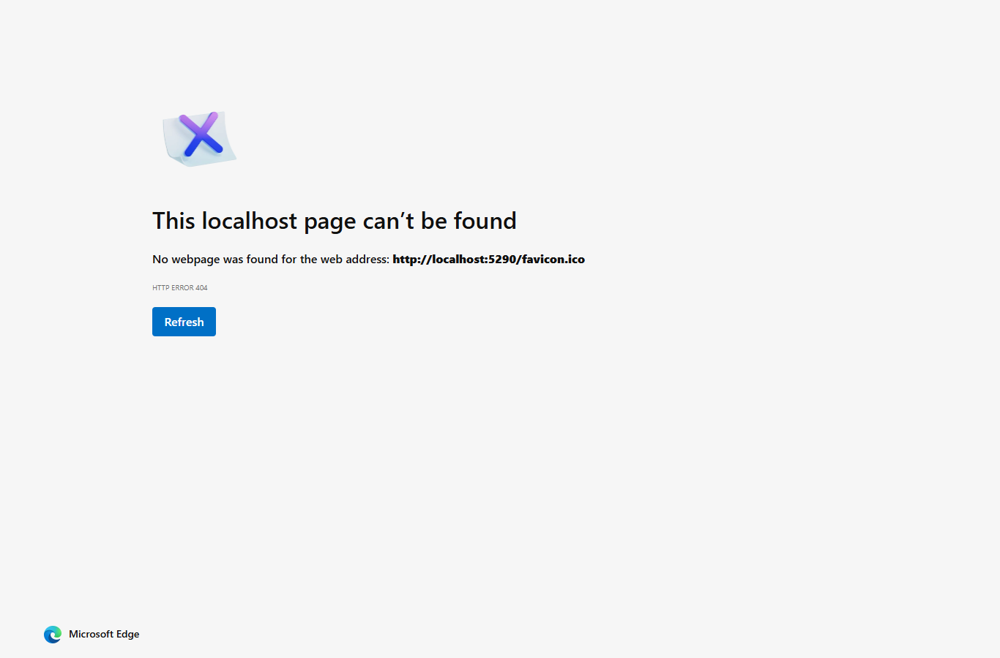 |
| **Step 1, previous build** — the same request is prerendered as a full application page | 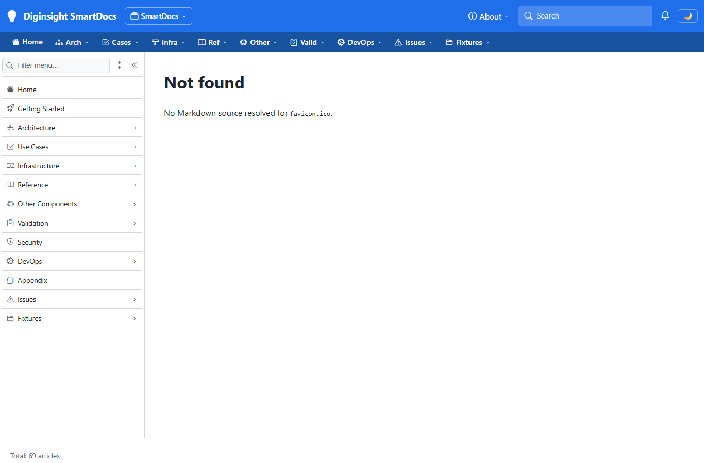 |
| **Step 2** — an article whose name ends in `.js` still renders | 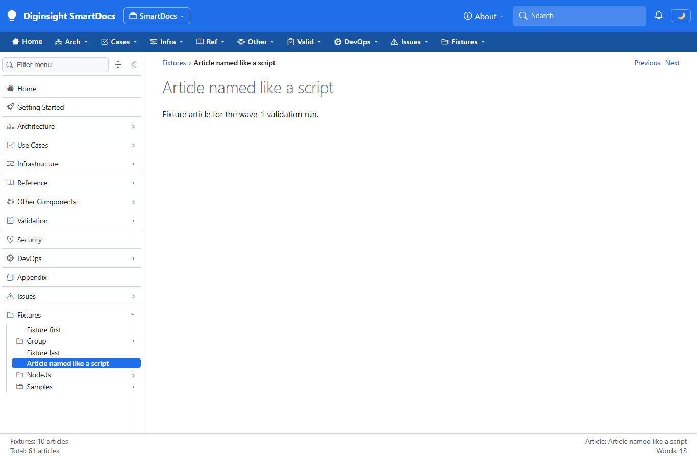 |
| **Step 3** — the last article of a nested section, with Previous and Next both active | 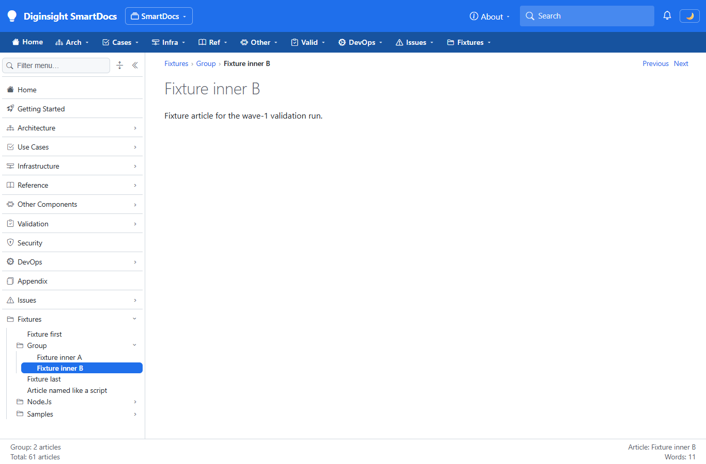 |
| **Step 4, previous build** — the first article of the root-mounted space links back into the second space | 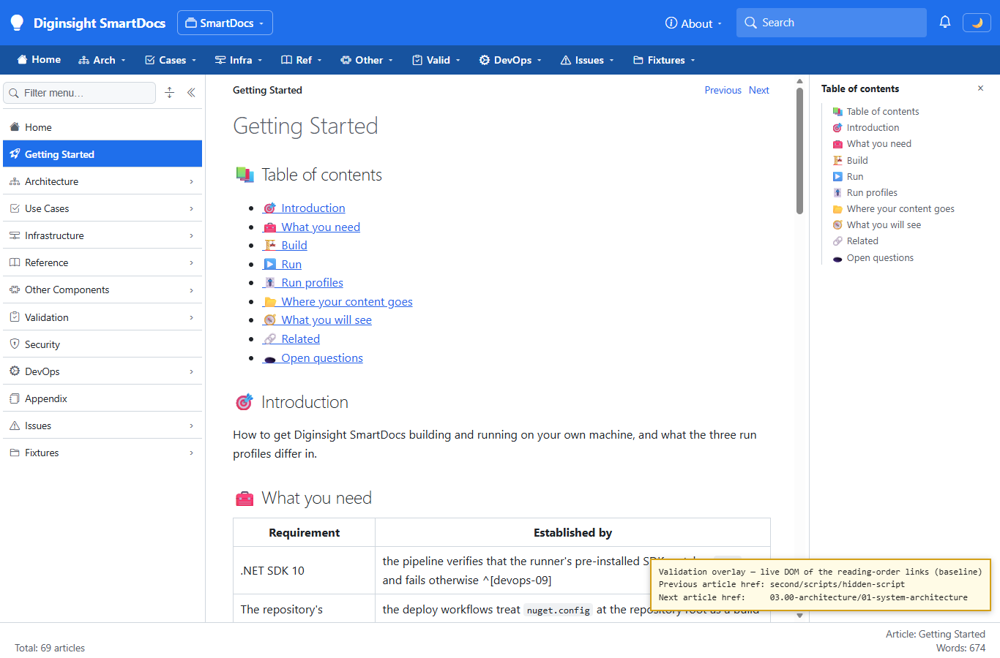 |
| **Step 4, wave 1** — the same article has no Previous link | 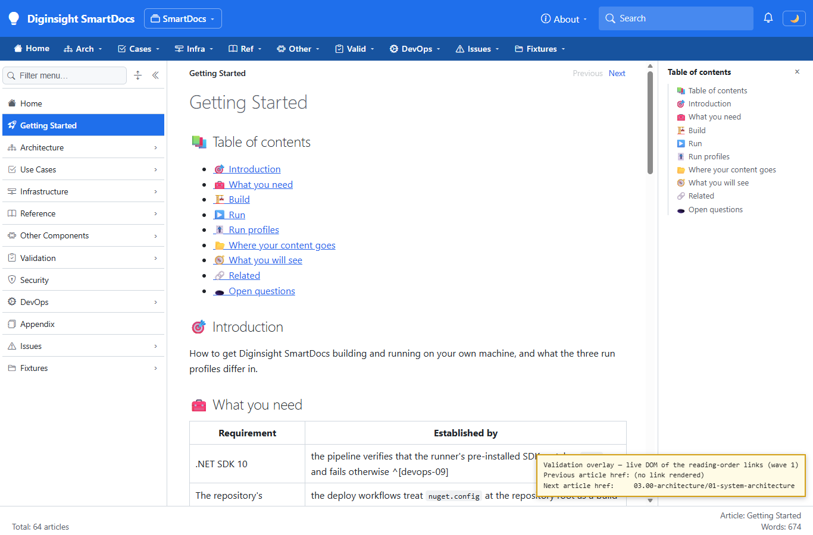 |
| **Step 6, previous build** — asset folders, a section of build output, and an empty section in the menu | 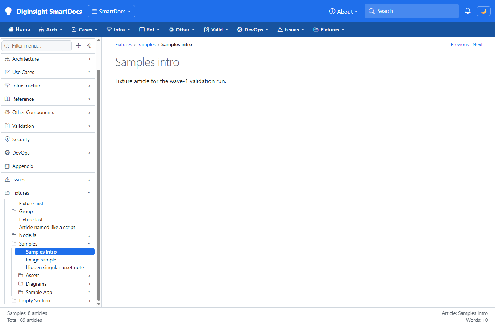 |
| **Step 6, wave 1** — only navigable articles remain |  |
| **Step 7, previous build** — infrastructure folders of the second space in its menu | 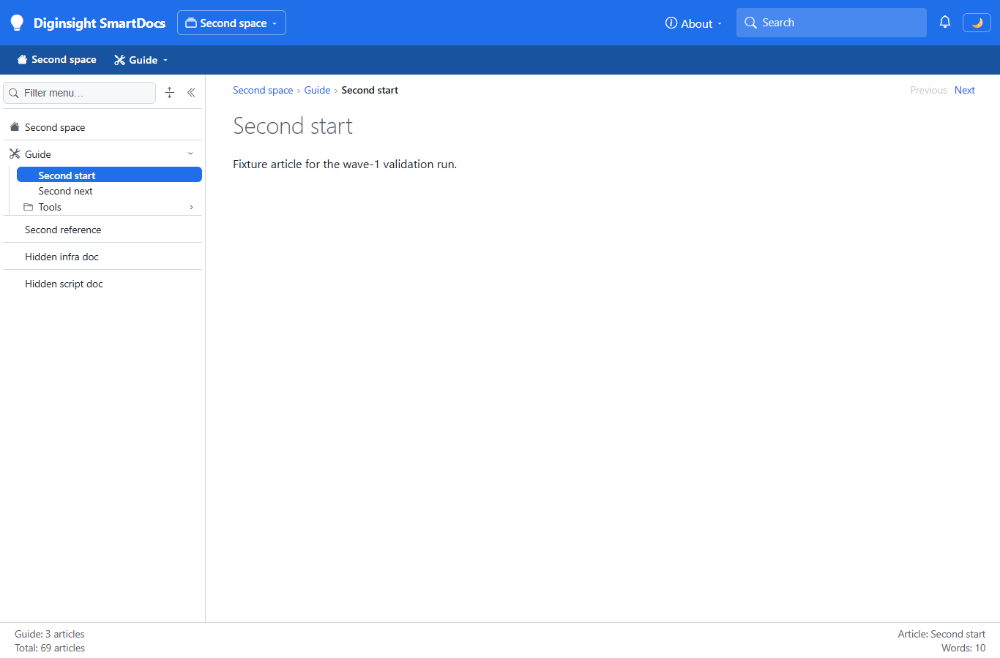 |
| **Step 7, wave 1** — the second space shows its content only | 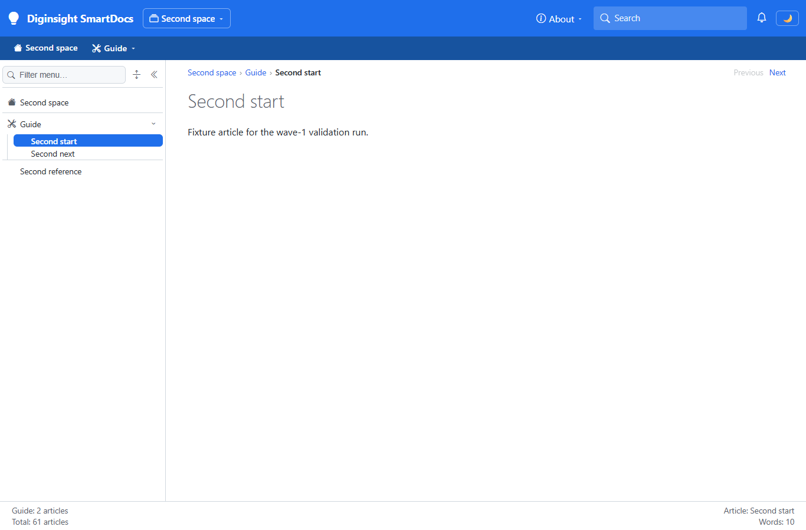 |
| **Step 8, wave 1** — a reload revalidates every response and reuses the image | 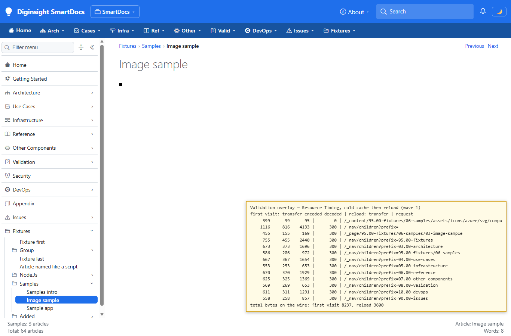 |
| **Step 8, previous build** — a reload downloads everything again, uncompressed | 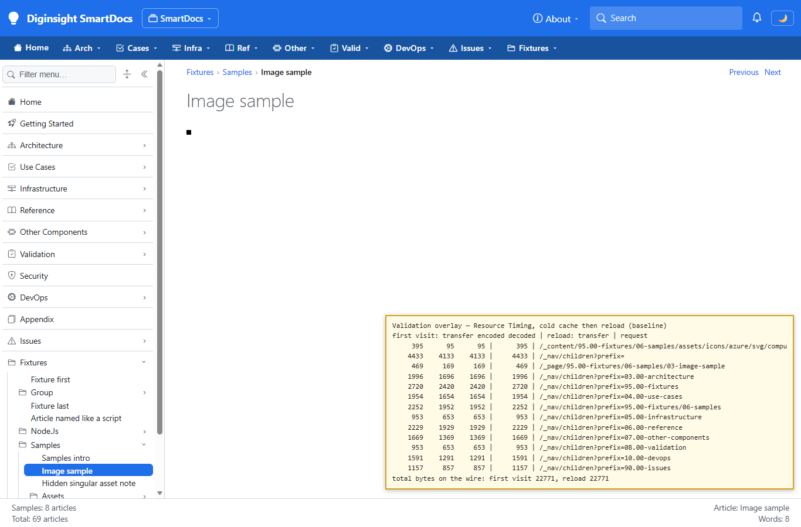 |
| **Step 9, wave 1** — after the publish and a whole-site invalidation, the new section is listed and counted |  |
| **Step 9, previous build** — the new section is listed, but the counts didn't move |  |
| **Step 10, wave 1** — after the deletion, the counts dropped live; the open sidebar still lists the deleted section until a reload | 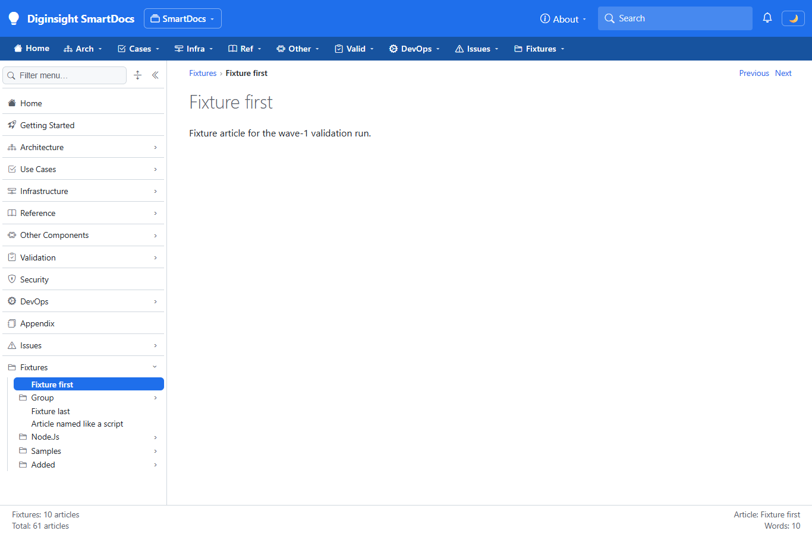 |
| **Step 11, wave 1, first paint** — last-known counts from the snapshot and the prerendered lower bound | 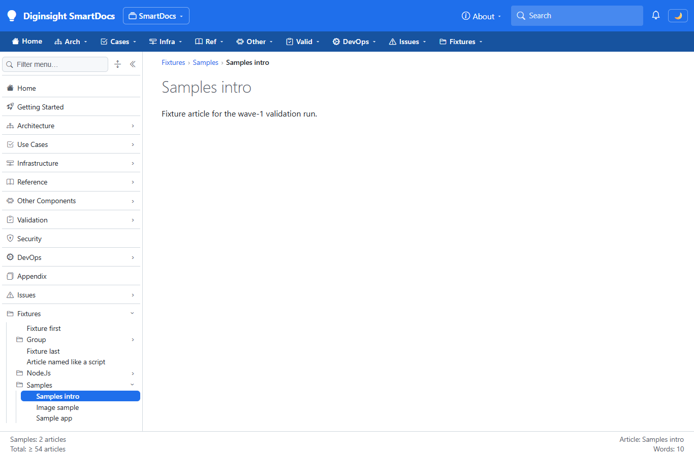 |
| **Step 11, wave 1, settled** — the crawl reached the changed folder |  |
| **Step 11, previous build, first paint** | 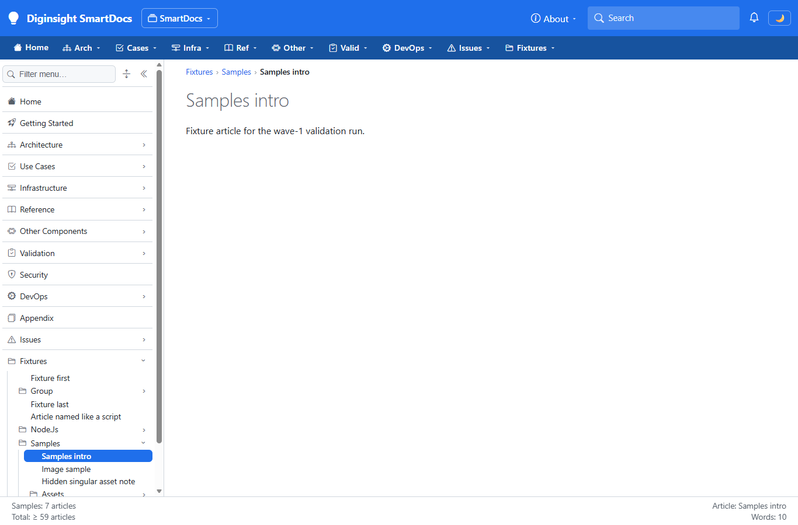 |
| **Step 11, previous build, settled** | 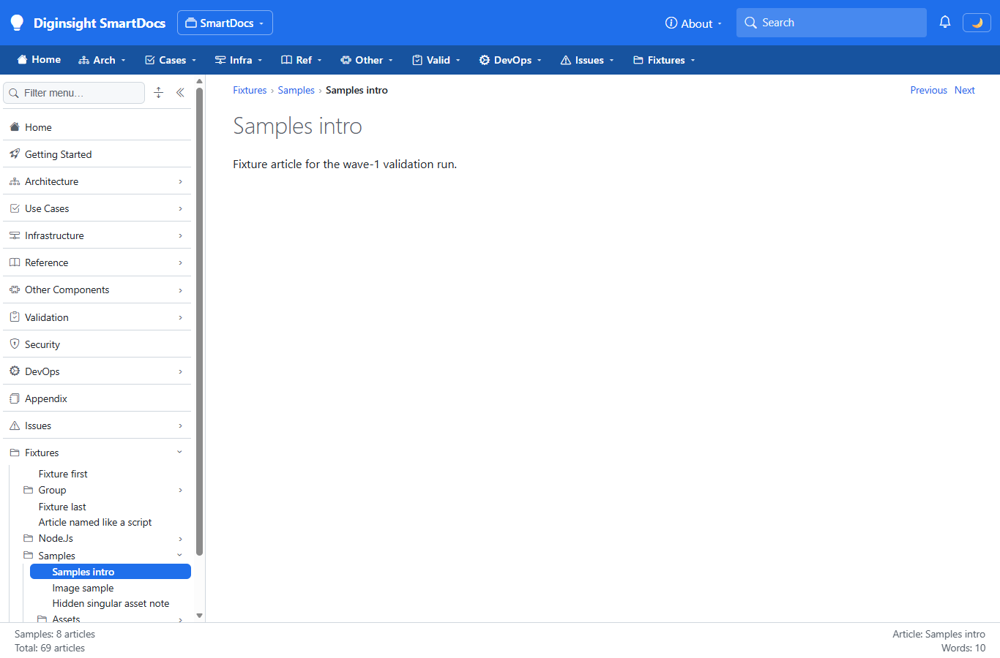 |

Steps 5, 12 and 13 produce no screen of their own: step 5 is a sweep whose per-page values the run compared and stored, and steps 12 and 13 are read from the console. Their output:

```text
Step 5 — client-router sweep, wave 1
articles: 61, passed: 61, failed: 0, slowest Previous/Next after navigation: 801 ms

Step 11 — wave-1 console after the restart (excerpt)
INFO  Nav metrics seeded from snapshot: 26 folders
INFO  Now listening on: http://localhost:5290
DBUG  FolderMetricsIndex.DiscoverAsync(root:"second") START
DBUG  Drain folded 2 folders, 0 changed
DBUG  Drain folded 1 folders, 0 changed
DBUG  FolderMetricsIndex.DiscoverAsync(root:"03.00-architecture") START
DBUG  Drain folded 1 folders, 0 changed
  … one small drain after each root section …
DBUG  FolderMetricsIndex.DiscoverAsync(root:"95.00-fixtures") START
DBUG  Pushed 3 nav metadata deltas
DBUG  Drain folded 5 folders, 2 changed
DBUG  Pushed 1 nav metadata deltas
DBUG  Drain folded 1 folders, 1 changed

Step 11 — previous-build console after the restart (excerpt)
INFO  Nav metrics seeded from snapshot: 33 folders
INFO  Now listening on: http://localhost:5291
10:39:46.079  FolderMetricsIndex.DiscoverAsync(root:"second") START
10:39:59.250  Pushed 3 nav metadata deltas
10:39:59.264  Drain folded 33 folders, 3 changed
10:40:00.225  FolderMetricsIndex.DiscoverAsync(root:"03.00-architecture") START

Step 13 — disk reads logged over the wave-1 restart
header reads from disk: 90 for 82 distinct keys
level builds: 58 for 26 distinct levels
```

## 📝 Notes

- **Timings compare two builds, not environments.** Both hosts ran side by side on one shared development machine, reading local files, in a Release build with this application's categories logged at `Debug` to a console. Each figure is a comparison between the two builds under the same load; none is a deployed figure.
- **How Resource Timing reads.** Edge reports a response's transfer size as its encoded body plus a flat 300 bytes for headers. A revalidated response therefore shows 300 — headers only — and a response served from the browser's cache shows 0. Resource Timing reports a revalidated response with status `200`, because the browser hands the page its stored copy, so the transfer size is the evidence of the `304`.
- **The step-11 total at first paint is a lower bound in both builds.** Until the browser hydrates, the footer sums the space's root sections — "≥ 54" in wave 1, "≥ 59" in the previous build — because the server's site total is read only in the browser. Wave 1 doesn't change that; the analysis assigns it to `C10-persist-prerender-state`.
- **An open sidebar keeps a deleted section until reload.** Image 15 shows "Added" after its deletion, with the counts already correct. Pushes carry counts, not membership, in both builds; the analysis assigns membership pushes to `C29-folder-records`.
- **Counts settle about 8 s after a whole-site invalidation.** The invalidation drops every cached level, and each folder's refold waits for its level to be rebuilt — a median of 258 ms per level build, 423 ms at p90, over the 72 builds the two invalidations logged with `Debug` console logging. The previous build never settles at all. The analysis replaces whole-site invalidations with change sets in `C25-change-driven-freshness`.
- **Two snapshots, two content views.** Each host kept its own snapshot. The previous build's counts include the articles under asset folders and build output, which is why its totals exceed wave 1's for the same files.

This run did **not** cover:

- a Blob content source — so not the single-round-trip blob read of `C20` — nor Redis, a cache companion, or more than one instance;
- a deployed instance: no figure here substitutes for `M1-deployed-baseline`;
- SmartCache's size accounting, priorities, and evictions under the new cap — not observable in a browser — which rest on reading the store path;
- HTTPS, where compression is also enabled, and viewports narrower than 1366 pixels;
- folders larger than the fixtures — a level of more than 20,000 size units was never built.
