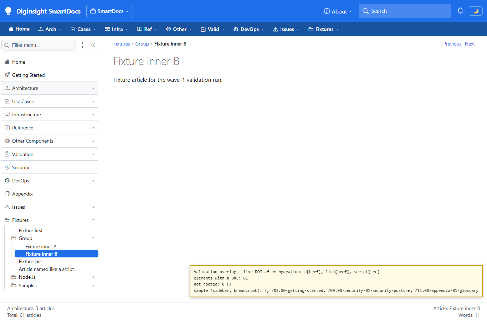
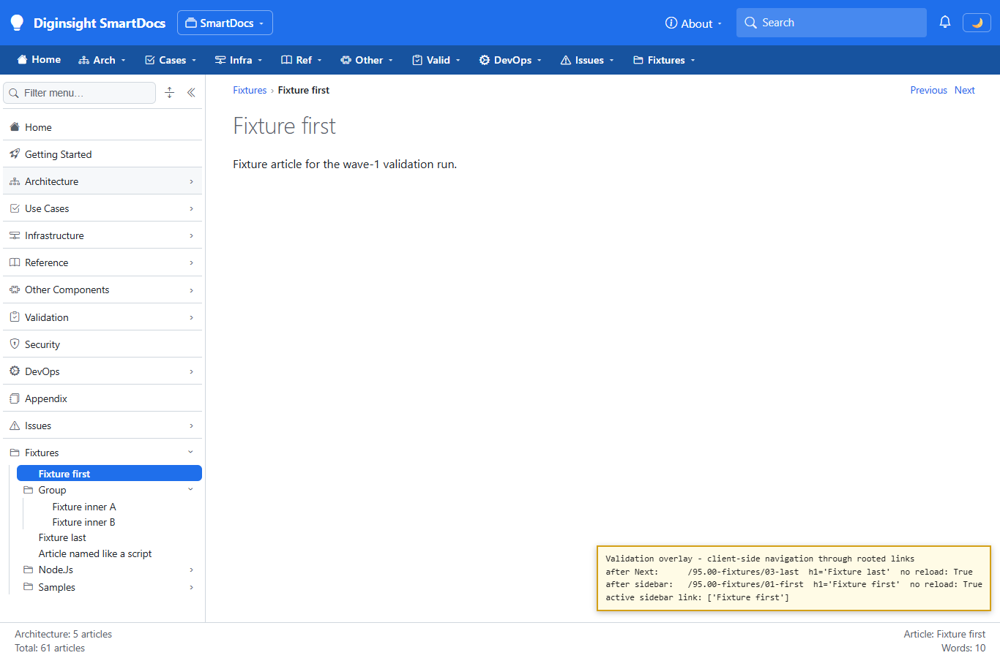
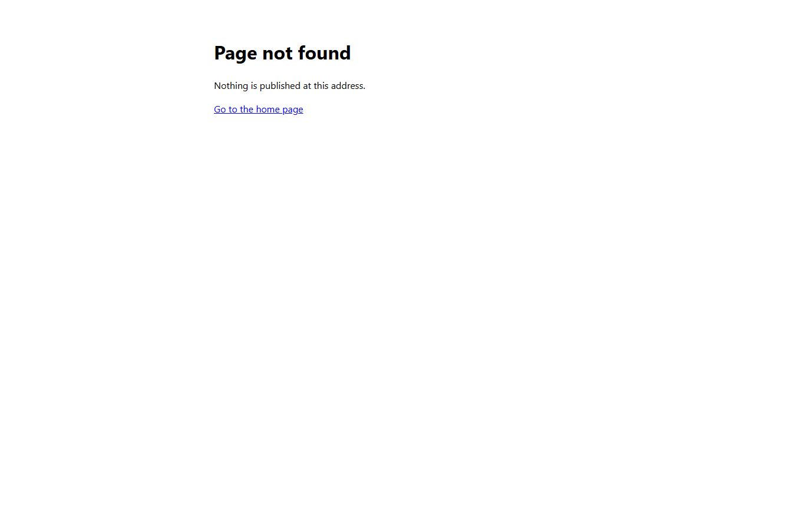
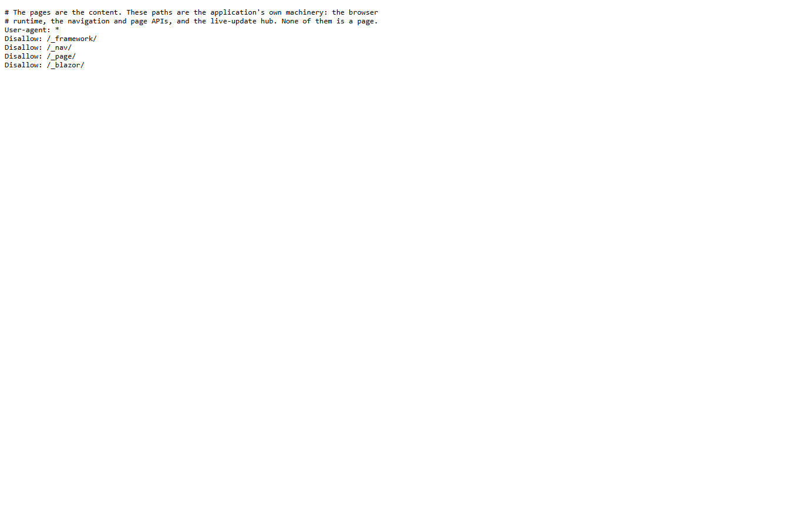
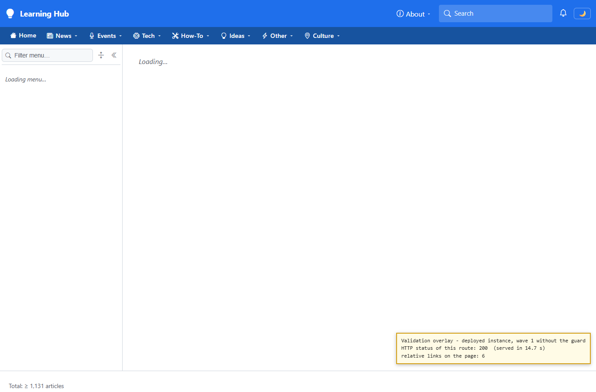

# Validation sequence — page route guard and rooted links

## 📚 Table of contents

- [🎯 What this proves](#-what-this-proves)
- [🧾 Environment](#-environment)
- [🔬 Sequence and results](#-sequence-and-results)
- [📷 Evidence](#-evidence)
- [📝 Notes](#-notes)

## 🎯 What this proves

`M1` found the deployed Learning Hub busy on almost every CPU-second of its single core, for crawler requests to routes that don't exist ([`N20`](../01-startup-and-navigation-optimization.analysis.md#n20-crawler-trap--unknown-routes-answer-200-and-breed-more)). [`C32`](../01-startup-and-navigation-optimization.analysis.md#c32-end-the-crawler-trap--what-changed) ends that in three parts:

- a guard that answers a route naming nothing in the content with a 404 before prerendering;
- in-app links that are rooted, so no page can invent a nested route;
- a `robots.txt` that keeps crawlers off the application's own endpoints.

A passing run shows every real route still rendering, every invented route ending in a cheap 404, every link rooted, and client navigation unchanged.

## 🧾 Environment

| Item | Value |
|---|---|
| URL | `http://localhost:5290/` for this change; the deployed Learning Hub, running wave 1 without this change, for the comparison in step 7 |
| Build | `dotnet build src/Diginsight.SmartDocs.slnx` in Debug and Release → both succeeded, 0 warnings, 0 errors; the host rebuilt again on `dotnet run -c Release` |
| Run | A visible console: `dotnet run -c Release --no-launch-profile`, `ASPNETCORE_ENVIRONMENT=Development`, this application's categories logged at `Debug` to the console |
| Content | The same copy of this repository's `src/docs` plus the `95.00-fixtures` section and the second space at `/second` that [the wave-1 run](20261002.01-validation-sequence.md) used |
| Browser | Microsoft Edge, visible window driven by Playwright, viewport 1366×900 |
| Date | 2026-10-02 |

## 🔬 Sequence and results

| # | Precondition | Action | Expected | Observed | Result |
|---|---|---|---|---|---|
| 1 | Host warm | Request eleven real routes: the site root, a section, an article, a folder, a nested article, an article and a folder whose names end in `.js`, an article by its `.md` file name, an article in a different letter case, the second space's mount point, and an article in it | Each one renders, as before | `200` for all eleven, 12,244–28,775 bytes of prerendered HTML in 779–1,674 ms | PASS |
| 2 | Host warm | Request five invented routes: three shaped like the crawler's (`/95.00-fixtures/01-first/03.00-architecture/js`, `/95.00-fixtures/02-group/_framework/03.00-architecture/95.00-fixtures`, `/second/01-guide/js`) and two missing pages | A `404` before prerendering, with nothing to follow but the home page | `404` for all five, a 455-byte page whose only link is `/`, in 46–109 ms | PASS |
| 3 | Host warm | Request `/favicon.ico` and `/95.00-fixtures/missing-image.png` | A `404` with no body, as in wave 1 | `404`, 0 bytes, in 38 and 99 ms | PASS |
| 4 | Host warm | Request `/robots.txt`, `/_nav/children?prefix=`, `/_content/95.00-fixtures/01-first.md`, `/_page/95.00-fixtures/01-first`, and `/_page/missing-page` | `robots.txt` served; the APIs unaffected by the guard | `200 text/plain` with four `Disallow` rules; the APIs `200`, `200`, `200`, and `204`, as before | PASS |
| 5 | Article `/95.00-fixtures/02-group/02-inner-b` open and hydrated | Read every `a[href]`, `link[href]`, and `script[src]` in the live DOM; then the prerendered HTML of the article and of the site root | Every URL rooted | Live DOM: 61 URLs, none relative. Prerendered HTML: 61 and 75 URLs, none relative | PASS |
| 6 | As step 5 | Click **Next**, then **Fixture first** in the sidebar | Client-side navigation as before, with the right sidebar entry active | `/95.00-fixtures/03-last` with heading "Fixture last", then `/95.00-fixtures/01-first` with heading "Fixture first"; a marker set on `window` before the clicks survived both; active sidebar entry: "Fixture first" | PASS |
| 7 | — | Open the invented route of step 2 in the browser on this host, follow its link, and open the same route on the deployed Learning Hub | This host: a 404 page that leads home. Deployed: the soft 404 `N20` describes | This host: status `404`, title "Page not found", one link, which loads `/`. Deployed: status `200` after 14.7 s, the full application shell with 6 relative URLs, still "Loading…" when captured | PASS |

## 📷 Evidence

The yellow boxes in images 20, 21, and 24 are overlays the run injected to show live DOM values; they aren't part of the application.

| Step | Screenshot |
|---|---|
| **Step 5** — after hydration, no URL on the page is relative |  |
| **Step 6** — client navigation through the rooted links, with the sidebar highlighting the article on screen |  |
| **Step 7** — an invented route ends in a self-contained 404 page |  |
| **Step 4** — `robots.txt` as served |  |
| **Step 7, deployed wave 1** — the same route answered with the application shell and status 200 |  |

Steps 1 to 4 have no screen of their own. The table rows carry their values, read from the responses.

## 📝 Notes

- **Prerender times are this host's, not a deployment's.** Every request ran on a development machine with `Debug` console logging; the comparison that matters is within the run — a 404 costs about a twentieth of a prerender.
- **The deployed comparison ran on an instance under load.** The deployed Learning Hub was serving the crawler at the time, so its 14.7 s includes queueing behind other requests; the status and the relative links are what step 7 compares.
- **The guard is as lenient as the page loader.** A route passes when every segment but the last is a folder and the last is a folder, an article, or a Markdown file, compared without regard to case; it never refuses a route the page loader could render.

This run did **not** cover:

- a Blob content source, where names are case-sensitive and the page loader, unlike the guard, may still miss a route that differs in case;
- the deployed instance after this change, which the analysis records once it's deployed;
- a space whose route base spans more than one segment — none is configured.
