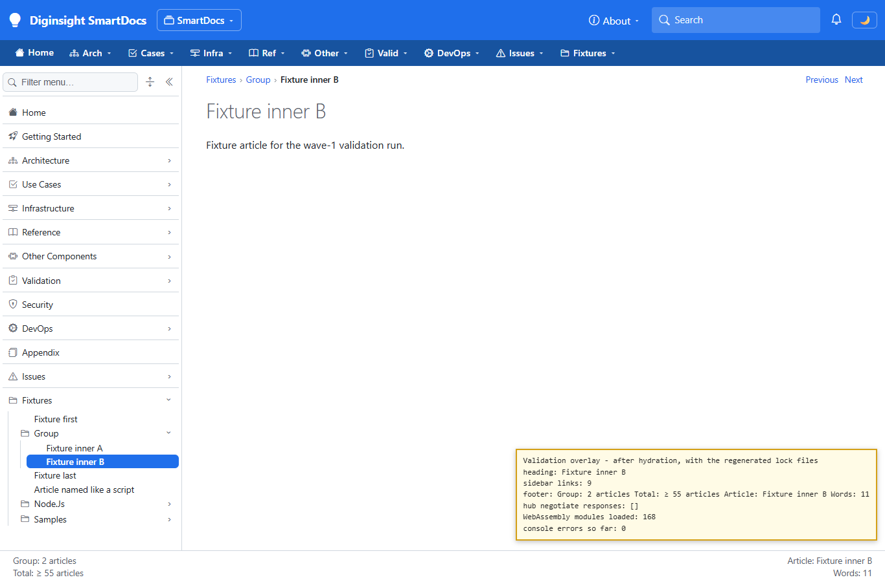
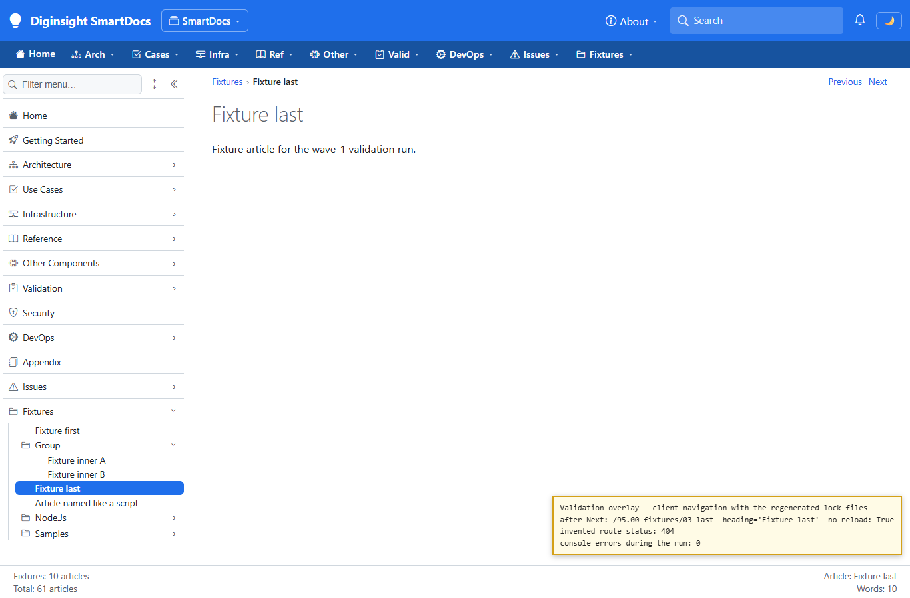

# Validation sequence — locked restore for deploys

## 📚 Table of contents

- [🎯 What this proves](#-what-this-proves)
- [🧾 Environment](#-environment)
- [🔬 Sequence and results](#-sequence-and-results)
- [📷 Evidence](#-evidence)
- [📝 Notes](#-notes)

## 🎯 What this proves

The deploy workflow restored without locked mode, and the lock files recorded no runtime target, so every runtime-specific publish re-resolved the floating versions and shipped a package graph no developer had built ([`SIG-6`](../02-signals.md)). Turning locked mode on alone would have failed every deploy, because the lock files lacked the targets the publish restores. The change declares the deploy runtimes on the host and on the shared library it publishes, regenerates their lock files, and restores in locked mode on the publish. A passing run shows the deploy's exact publish succeeding without touching a lock file, drift failing it, and the application running on the regenerated versions.

## 🧾 Environment

| Item | Value |
|---|---|
| CI reproduction | An export of the working-tree changes, built in the session workspace — never in the working tree — with an empty package folder of its own, as the deploy's runner has |
| Command | The workflow's publish, verbatim: `dotnet publish src/Diginsight.SmartDocs.Web/Diginsight.SmartDocs.Web.csproj -c Release -r <rid> --self-contained true -p:RestoreLockedMode=true` |
| Build | `dotnet build src/Diginsight.SmartDocs.slnx` in Debug and Release → both succeeded, 0 warnings, 0 errors |
| Smoke run | A visible console, `dotnet run -c Release --no-launch-profile`, on the same validation content as [the wave-1 run](20261002.01-validation-sequence.md) |
| Browser | Microsoft Edge, visible window driven by Playwright, viewport 1366×900 |
| Date | 2026-10-02 |

## 🔬 Sequence and results

| # | Precondition | Action | Expected | Observed | Result |
|---|---|---|---|---|---|
| 1 | Runtime identifiers declared; lock files regenerated by an ordinary restore | Compare the regenerated lock files with the committed ones | Runtime targets added; the client's lock file unchanged | Host and shared library: targets `net10.0`, `net10.0/win-x64`, `net10.0/win-x86`. Host: 10 versions moved and one transitive package added, among them Azure.Storage.Blobs 12.30.0, Diginsight.Components 1.0.0.115, log4net 3.5.0, and Apache.Arrow 22.1.0. Shared library: 19 ASP.NET Core and extension packages from 10.0.11 to 10.0.12. Client: unchanged | PASS |
| 2 | As step 1 | Build Debug and Release, then restore again | Clean builds; lock files stable | Both builds 0 warnings, 0 errors; the lock files byte-identical after the builds and a second restore | PASS |
| 3 | Export with an empty package folder | Run the deploy's locked publish for `win-x64`, then for `win-x86` | Both publish; no lock file changes | Executable produced in 145 s and 30 s; 0 errors; every lock file byte-identical afterwards | PASS |
| 4 | Export; one package reference added without regenerating the lock files | Run the locked publish | The restore fails on the drift | `error NU1004: The package references have changed for net10.0 … The packages lock file is inconsistent with the project dependencies so restore can't be run in locked mode` | PASS |
| 5 | Export; the lock files as committed before this change | Run the locked publish | The restore fails: those lock files carry no runtime target | `error NU1004: The project's runtime identifiers have changed from. Project's runtime identifiers: win-x64;win-x86, lock file's runtime identifiers .` | PASS |
| 6 | Smoke host started on the regenerated versions | Open `/95.00-fixtures/02-group/02-inner-b`, wait for hydration, click **Next**, request an invented route | The application behaves as before | Heading "Fixture inner B", 9 sidebar links, 168 WebAssembly modules loaded; **Next** reached `/95.00-fixtures/03-last` without a reload; the invented route answered `404`; no console error | PASS |
| 7 | As step 6 | Reload the article and record the live-update hub's traffic for up to 15 s | The hub connects | `POST /_nav/hub/negotiate`, then a WebSocket on `/_nav/hub`; the footer total reached "61 articles" | PASS |

## 📷 Evidence

The yellow boxes are overlays the run injected to show live DOM values; they aren't part of the application.

| Step | Screenshot |
|---|---|
| **Step 6** — the article after hydration, on the regenerated package versions |  |
| **Step 6** — client navigation and the invented route |  |

Steps 1 to 5 run no browser; their output, quoted in the table, comes from the restore and publish commands.

## 📝 Notes

- **The new versions aren't new to production.** Every deploy before this change re-resolved the floating references at publish time, so the deployed apps were already running the versions the regenerated lock files now name — step 3 reproduces that publish exactly. What changes is that development builds now run them too, and that a later release of any floating dependency stops reaching a deploy unannounced.
- **Step 6's first hub check saw no negotiation**, because it ended 2.5 s after the page loaded and the client connects the hub only after it reads the first total. Step 7 waited, and saw it.
- **Updating a dependency now takes a regenerated lock file.** A pull that moves a floating version must restore with `--force-evaluate` and commit the result; until then, deploys fail with `NU1004` rather than ship the change silently.

This run did **not** cover:

- the deploy runner itself, which the next deploy exercises — its result is recorded in the analysis;
- a `win-x86` deploy to a 32-bit worker; step 3 only publishes for it.
