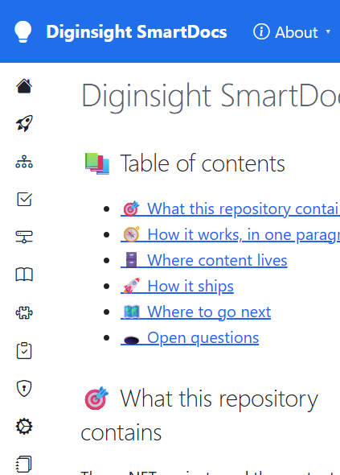

# Validation sequence — C4 startup warm-up queue

## 📚 Table of contents

- [🎯 What this proves](#-what-this-proves)
- [🧾 Environment](#-environment)
- [🔬 Sequence and results](#-sequence-and-results)
- [📷 Evidence](#-evidence)
- [📝 Notes](#-notes)

## 🎯 What this proves

`C4-start-after-listen` moves navigation startup work into one hosted queue. The worker waits for `ApplicationStarted`, then for the first response or a two-second grace. It checks a foreground gate before every folder-level discovery or warm item. Navigation requests enqueue three levels of look-ahead instead of starting an unmanaged `Task.Run`.

A passing run shows that the host serves a complete page while startup work continues, queued look-ahead doesn't change navigation output, and folder totals still converge.

## 🧾 Environment

| Item | Value |
|---|---|
| URL | `http://localhost:5290/` |
| Build | `dotnet build src/Diginsight.SmartDocs.slnx -c Debug --artifacts-path <session-artifacts>` → succeeded, 0 warnings, 0 errors |
| Run | `dotnet run` in a visible VS Code task terminal, rebuilt into an isolated artifacts directory |
| Browser | Visible headed browser, viewport 529×737 |
| Date | 2026-10-02 |

## 🔬 Sequence and results

| # | Precondition | Action | Expected | Observed | Result |
|---|---|---|---|---|---|
| 1 | The developer's existing app holds the default Debug output files | Build the changed solution into an isolated artifacts directory | The change compiles without stopping or changing the existing process | Build succeeded with 0 warnings and 0 errors; the existing process remained running | PASS |
| 2 | The visible terminal shows folder-level startup warm-up activity | Open the site root and read the live DOM | A complete page is served before the startup worker finishes | Page title and H1: `Diginsight SmartDocs`; footer: `Total: 48 articles`, `Article: Diginsight SmartDocs`, `Words: 550`; response start at 2,469 ms; the worker completed later in the visible terminal | PASS |
| 3 | The browser is hydrated and navigation requests enqueue look-ahead work | Open `/03.00-architecture/02-host-application`, then read the heading and footer | Navigation remains correct while queued warm work uses the same worker | H1: `The host — Diginsight.SmartDocs.Web`; footer first showed `Architecture: 5 articles`, `Total: ≥ 45 articles`, and `Words: 779`, then changed to `Total: 48 articles` without a reload | PASS |

## 📷 Evidence

| Step | Screenshot |
|---|---|
| **Step 2** — the home page is complete while startup warming continues |  |
| **Step 3** — navigation remains correct and the aggregate has converged |  |

Step 1 is console-only evidence because it produces no rendered page. The build ended with:

```text
Build succeeded.
    0 Warning(s)
    0 Error(s)
```

## 📝 Notes

- The first implementation checked the foreground gate once per root branch. Its first page reached response start after 5,826 ms, so the run rejected that implementation. The accepted implementation checks before every folder level.
- The Debug profile emits detailed activity logs. The observed times diagnose this run; they aren't deployment targets.
- The run validates one local file-system space. It doesn't cover Blob latency, multiple instances, a publish-time whole-site invalidation, or deployed startup.
- The run doesn't validate later wave-2 changes: folder records, stale-while-revalidate behavior, lazy top-bar loading, or delayed hub connection.
