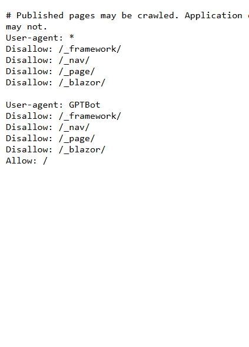
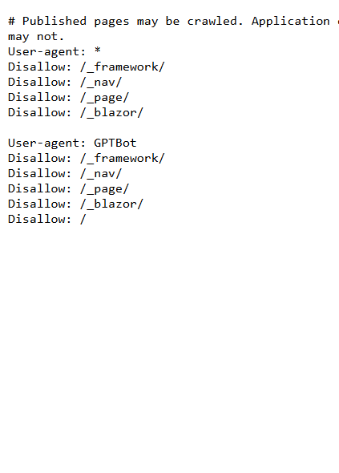

# Validation sequence — per-space GPTBot policy

## 📚 Table of contents

- [🎯 What this proves](#-what-this-proves)
- [🧾 Environment](#-environment)
- [🔬 Sequence and results](#-sequence-and-results)
- [📷 Evidence](#-evidence)
- [📝 Notes](#-notes)

## 🎯 What this proves

The static `robots.txt` couldn't express a decision per content space. The application now generates it from `SpaceOptions.AllowGptBot`, which defaults to `false`. The Learning Hub opts in; a space that doesn't opt in remains denied. Every policy keeps crawlers away from the framework, navigation, page API, and live-update paths.

## 🧾 Environment

| Item | Value |
|---|---|
| URL | `http://localhost:5290/robots.txt` |
| Build | `dotnet build src/Diginsight.SmartDocs.slnx -c Debug --artifacts-path <session-artifacts>` → succeeded, 0 warnings, 0 errors |
| Run | Two visible VS Code task-terminal runs: the local Learning Hub overlay, then the default SmartDocs overlay |
| Browser | Visible headed browser, viewport 529×737 |
| Date | 2026-10-02 |

## 🔬 Sequence and results

| # | Precondition | Action | Expected | Observed | Result |
|---|---|---|---|---|---|
| 1 | Local Learning Hub space has `AllowGptBot: true` | Open `/robots.txt` and read the live text | GPTBot may crawl published content, but not application endpoints | Status `200`; GPTBot group repeats the four endpoint exclusions and ends with `Allow: /` | PASS |
| 2 | Default SmartDocs space omits `AllowGptBot` | Restart visibly with the default overlay, reload `/robots.txt`, and read the live text | The default is deny, proving one space's choice doesn't open another | Status `200`; GPTBot group repeats the four endpoint exclusions and ends with `Disallow: /` | PASS |

## 📷 Evidence

| Step | Screenshot |
|---|---|
| **Step 1** — Learning Hub opts GPTBot into public content |  |
| **Step 2** — a space without the option remains denied |  |

## 📝 Notes

- The deployed Learning Hub overlay is in the internal peer because it carries private infrastructure identifiers. It was updated before this public record.
- This run doesn't deploy or modify the deployed instance.
- The generated file uses a five-minute browser cache. A configuration deployment can therefore take up to five minutes to reach a browser that already fetched it.
