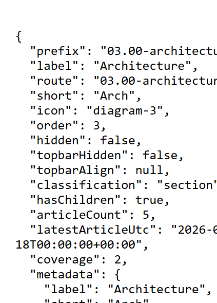

# Validation sequence — C29 folder records

## 📚 Table of contents

- [🎯 What this proves](#-what-this-proves)
- [🧾 Environment](#-environment)
- [🔬 Sequence and results](#-sequence-and-results)
- [📷 Evidence](#-evidence)
- [📝 Notes](#-notes)

## 🎯 What this proves

`C29-folder-records` makes one SmartCache `folder` entry authoritative for authored folder metadata, classification, recursive article count, newest article, and coverage. Navigation levels sent to the browser reference folder prefixes and carry the referenced records beside the level. The browser holds one record map and materializes its menu view from it. Hub updates replace records in that map, so aggregate changes don't flush every cached level.

## 🧾 Environment

| Item | Value |
|---|---|
| URL | `http://localhost:5290/` |
| Build | `dotnet build src/Diginsight.SmartDocs.slnx -c Debug --artifacts-path <session-artifacts>` → succeeded, 0 warnings, 0 errors |
| Run | Rebuilt app in a visible VS Code task terminal; local content-mutation endpoint enabled |
| Browser | Visible headed browser, viewport 529×737 |
| Date | 2026-10-02 |

## 🔬 Sequence and results

| # | Precondition | Action | Expected | Observed | Result |
|---|---|---|---|---|---|
| 1 | Host warm | Open `/_nav/children?prefix=` and read its live response | Folder children are references, and complete records are returned beside them | Section entries contain `folderPrefix` and no copied leaf; `folders` contains eight records with labels, short labels, icons, order, classification, aggregates, coverage, and every authored metadata key | PASS |
| 2 | Host warm | Open `/_nav/folder?prefix=03.00-architecture` | One authoritative folder record | Status `200`; prefix `03.00-architecture`, label `Architecture`, short `Arch`, icon `diagram-3`, order `3`, classification `section`, article count `5`, complete coverage, and the four authored metadata keys | PASS |
| 3 | Architecture article open and hydrated | Add one temporary article through the local test endpoint | Hub pushes changed folder records; the visible counts update without reload | Response counts: Architecture `6`, site root `49`; visible footer changed to `Architecture: 6 articles` and `Total: 49 articles` | PASS |
| 4 | Step 3 complete | Delete the temporary article | Records return to baseline, and temporary content is removed | Response counts: Architecture `5`, site root `48`; visible footer returned to `Architecture: 5 articles` and `Total: 48 articles`; the probe folder no longer exists | PASS |

## 📷 Evidence

The first image uses a formatting overlay injected by the run so the live JSON record is readable; it isn't part of the application.

| Step | Screenshot |
|---|---|
| **Step 2** — one complete folder record |  |
| **Step 3** — pushed records update the visible folder and site totals |  |

## 📝 Notes

- The temporary article was deleted in step 4, and its folder was verified absent afterward.
- Server prerender still consumes the in-process `NavChild` representation. `C10-persist-prerender-state` removes the duplicate client bootstrap rather than widening C29 into prerender state work.
- This run covers one instance. Cross-instance delivery remains part of `C23` and `C28`.
