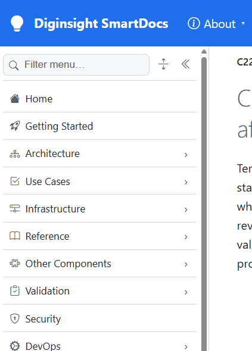
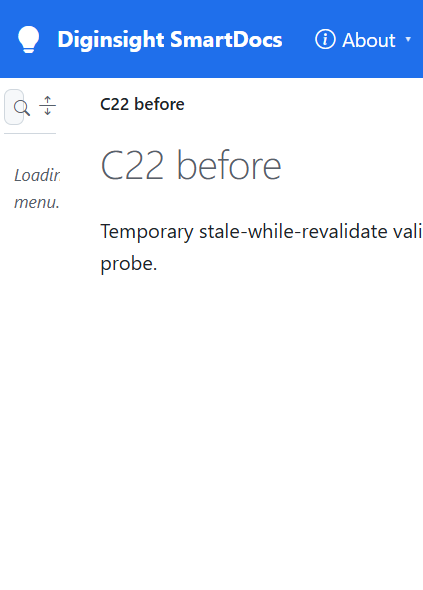

# Validation sequence — C22 background revalidation

## 📚 Table of contents

- [🎯 What this proves](#-what-this-proves)
- [🧾 Environment](#-environment)
- [🔬 Sequence and results](#-sequence-and-results)
- [📷 Evidence](#-evidence)
- [📝 Notes](#-notes)

## 🎯 What this proves

`C22-revalidate-in-background` keeps the last page, folder record, and navigation level available after its freshness interval. An expired read returns that value and queues one deduplicated refresh. One hosted worker performs refreshes, stores successful results, and logs failures without replacing a usable stale value.

## 🧾 Environment

| Item | Value |
|---|---|
| URL | `http://localhost:5290/` |
| Build | `dotnet build src/Diginsight.SmartDocs.slnx -c Debug --artifacts-path <session-artifacts>` → succeeded, 0 warnings, 0 errors |
| Run | Rebuilt app in a visible VS Code task terminal; content, structure, and level tolerances set to one second |
| Browser | Visible headed browser, viewport 529×737 |
| Date | 2026-10-02 |

## 🔬 Sequence and results

| # | Precondition | Action | Expected | Observed | Result |
|---|---|---|---|---|---|
| 1 | Temporary two-page section says `C22 before` | Read its `/_page`, `/_nav/folder`, and root `/_nav/children` values | All three caches hold the same source version | Page `before`; folder label `C22 before`; level record label `C22 before` | PASS |
| 2 | Source changed directly to `C22 after`, without invalidation; wait 1.5 seconds | Read the same three values | Return stale values immediately and queue refreshes | Page `before`; folder label `C22 before`; level record label `C22 before` | PASS |
| 3 | Step 2 queued refreshes | Poll once per second | All three converge to the changed source without a reader rebuilding them | On attempt 3: page `after`; folder label `C22 after`; level record label `C22 after` | PASS |
| 4 | Cache says `C22 after`; source changed back to `C22 before` without invalidation | Open the article visibly after the tolerance, then reload after background convergence | First render uses stale content; later render uses refreshed content | First visible H1 and title: `C22 after`; after convergence and reload: H1 and title `C22 before` | PASS |

## 📷 Evidence

| Step | Screenshot |
|---|---|
| **Step 4, stale response** — the expired cached page remains immediately usable |  |
| **Step 4, refreshed response** — the same route reflects the source after background convergence |  |

## 📝 Notes

- The first implementation refreshed page content but not folder records: the `folder` SmartCache operation had no structural `MaxAge`. The run rejected it; the accepted implementation applies the same structural tolerance to the record.
- Explicit invalidation still evicts matching stale entries. Stale-while-revalidate covers tolerance expiry when an invalidation notification is absent.
- The temporary section and all three files were deleted after the run.
- This run covers one process. Cross-instance invalidation remains part of `C23`.
