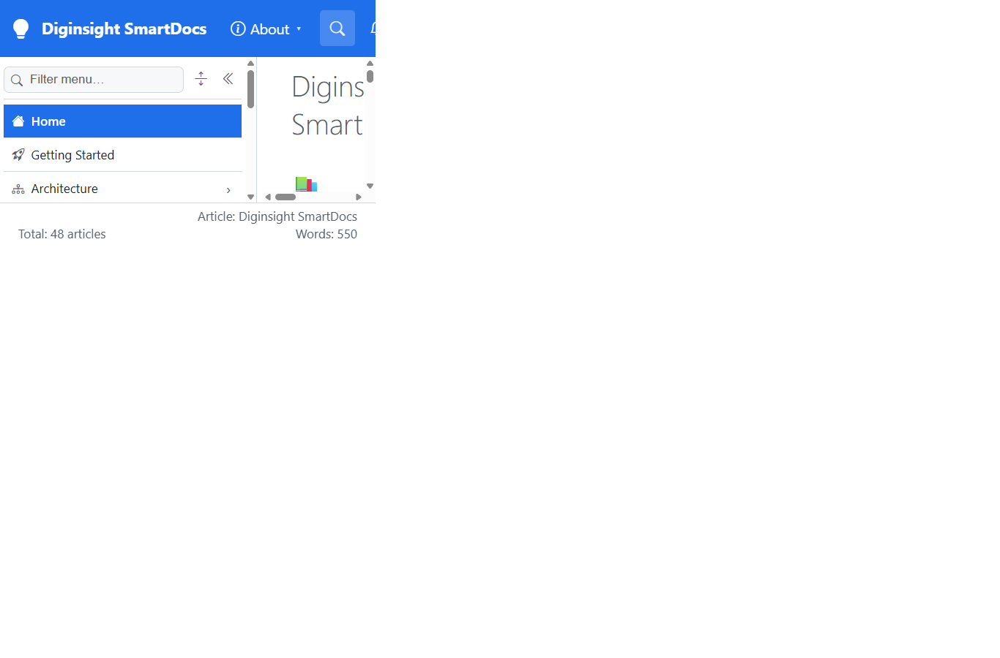

# Validation sequence — C11 lazy top bar

## 📚 Table of contents

- [🎯 What this proves](#-what-this-proves)
- [🧾 Environment](#-environment)
- [🔬 Sequence and results](#-sequence-and-results)
- [📷 Evidence](#-evidence)
- [📝 Notes](#-notes)

## 🎯 What this proves

`C11-lazy-topbar` leaves top-level buttons available immediately but doesn't fetch any dropdown level during prerender or initial hydration. First hover or click runs one shared, deduplicated load and displays that section's links.

## 🧾 Environment

| Item | Value |
|---|---|
| URL | `http://localhost:5290/` |
| Build | `dotnet build src/Diginsight.SmartDocs.slnx -c Debug --artifacts-path <session-artifacts>` → succeeded, 0 warnings, 0 errors |
| Run | Rebuilt app in a visible VS Code task terminal |
| Browser | Visible headed browser, viewport 1366×900 |
| Date | 2026-10-02 |

## 🔬 Sequence and results

| # | Precondition | Action | Expected | Observed | Result |
|---|---|---|---|---|---|
| 1 | Fresh page load; don't open a top-bar section | Wait five seconds after hydration and inspect resource timing | Only the root navigation level was fetched | One navigation request: `/_nav/children?prefix=` | PASS |
| 2 | Step 1 complete | Hover **Arch** | Fetch Architecture once and show its dropdown | A second request appeared for `prefix=03.00-architecture`; the dropdown showed five links from System architecture through Caching and invalidation | PASS |

## 📷 Evidence

| Step | Screenshot |
|---|---|
| **Step 2** — the first hover has loaded and opened only the Architecture dropdown |  |

## 📝 Notes

- Hover and click share the same in-flight task, so crossing the button while clicking can't issue duplicate requests.
- This run covers a pointer hover. The click path calls the same loader and remains keyboard accessible.
