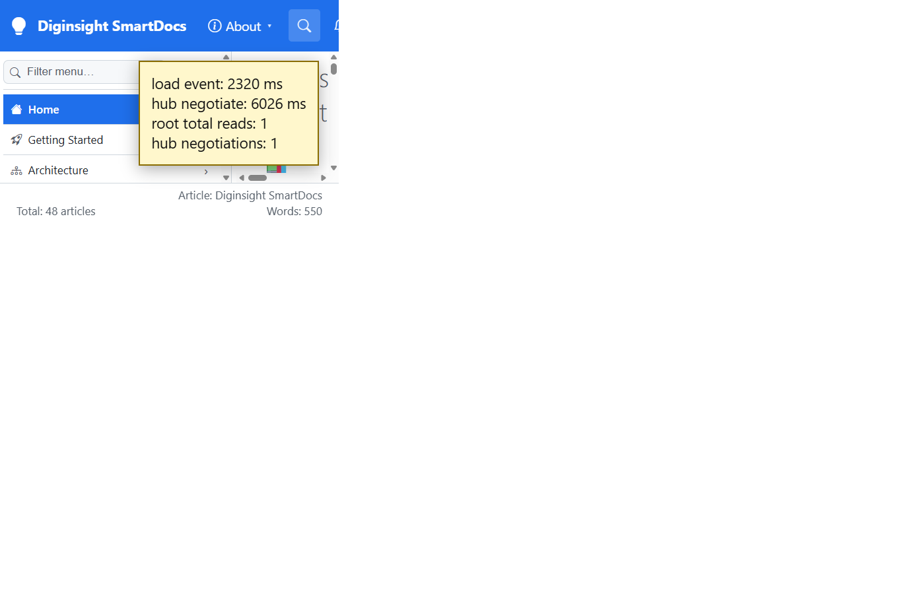

# Validation sequence — C12 hub after idle

## 📚 Table of contents

- [🎯 What this proves](#-what-this-proves)
- [🧾 Environment](#-environment)
- [🔬 Sequence and results](#-sequence-and-results)
- [📷 Evidence](#-evidence)
- [📝 Notes](#-notes)

## 🎯 What this proves

`C12-hub-after-idle` renders and hydrates before it starts SignalR. The browser waits for `requestIdleCallback` with a bounded fallback, then connects once. The previous `ConvergeTotalAsync` loop is gone; the initial total is read once, and hub records keep it current.

## 🧾 Environment

| Item | Value |
|---|---|
| URL | `http://localhost:5290/` |
| Build | `dotnet build src/Diginsight.SmartDocs.slnx -c Debug --artifacts-path <session-artifacts>` → succeeded, 0 warnings, 0 errors |
| Run | Rebuilt app in a visible VS Code task terminal |
| Browser | Visible headed browser, viewport 1366×900 |
| Date | 2026-10-02 |

## 🔬 Sequence and results

| # | Precondition | Action | Expected | Observed | Result |
|---|---|---|---|---|---|
| 1 | Fresh page load | Compare navigation `loadEventEnd` with the SignalR negotiate resource start | Hub negotiation starts after load, during idle work | Load event at 2,320 ms; hub negotiate at 6,026 ms | PASS |
| 2 | Hub connected | Wait 12 seconds and count root-folder and negotiate requests | No five-second convergence polling and no duplicate connection | One `/_nav/folder?prefix=` request and one `/_nav/hub/negotiate` request; footer `Total: 48 articles` | PASS |

## 📷 Evidence

The yellow box is a validation overlay injected from the live performance entries; it isn't part of the application.

| Step | Screenshot |
|---|---|
| **Steps 1–2** — hub startup follows load, with one total read and one negotiation |  |

## 📝 Notes

- Browsers without `requestIdleCallback` use a zero-delay timer after first render.
- The idle callback has a two-second timeout, so continuous main-thread work can't prevent the connection indefinitely.
- Reconnection behavior is unchanged and still refreshes the root record after a drop.
