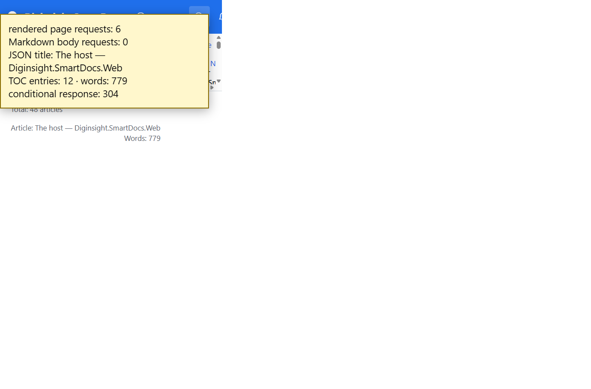

# Validation sequence — C21 cached rendered pages

## 📚 Table of contents

- [🎯 What this proves](#-what-this-proves)
- [🧾 Environment](#-environment)
- [🔬 Sequence and results](#-sequence-and-results)
- [📷 Evidence](#-evidence)
- [📝 Notes](#-notes)

## 🎯 What this proves

`C21-cache-rendered-pages` gives each route a SmartCache `page` entry. The server resolves Markdown, runs Markdig once per version, and returns the rendered page as JSON with an entity tag. The browser consumes the rendered result and no longer includes or runs Markdig for navigation.

## 🧾 Environment

| Item | Value |
|---|---|
| URL | `http://localhost:5290/03.00-architecture/02-host-application` |
| Build | `dotnet build src/Diginsight.SmartDocs.slnx -c Debug --artifacts-path <session-artifacts>` → succeeded, 0 warnings, 0 errors |
| Run | Rebuilt app in a visible VS Code task terminal |
| Browser | Visible headed browser, viewport 1366×900 |
| Date | 2026-10-02 |

## 🔬 Sequence and results

| # | Precondition | Action | Expected | Observed | Result |
|---|---|---|---|---|---|
| 1 | Article loaded and hydrated | Inspect browser resource timing | One rendered-page request, no Markdown body request | One `/_page/03.00-architecture/02-host-application`; zero Markdown `/_content` requests | PASS |
| 2 | Page cache warm | Fetch the page API and read JSON and headers | Rendered HTML, title, TOC, and word count with a validator | `200 application/json`; title `The host — Diginsight.SmartDocs.Web`; 12 TOC entries; 779 words; strong ETag | PASS |
| 3 | Step 2 ETag held | Repeat with `If-None-Match` | No body transfer | Status `304` | PASS |

## 📷 Evidence

The yellow box is a validation overlay from live resource and response values; it isn't part of the application.

| Step | Screenshot |
|---|---|
| **Steps 1–3** — rendered-page JSON replaces Markdown download and supports `304` |  |

## 📝 Notes

- Prerender and API rendering share `RenderedPageProvider`; the API doesn't render a second representation.
- `/_content` remains for images, downloads, and compatibility fallback.
- Initial hydration is covered by C10's separate validation.
