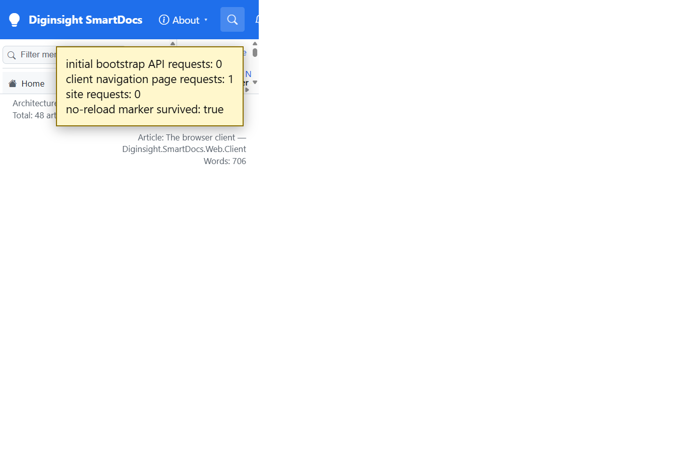

# Validation sequence — C10 persisted navigation bootstrap

## 📚 Table of contents

- [🎯 What this proves](#-what-this-proves)
- [🧾 Environment](#-environment)
- [🔬 Sequence and results](#-sequence-and-results)
- [📷 Evidence](#-evidence)
- [📝 Notes](#-notes)

## 🎯 What this proves

`C10-persist-prerender-state` carries the rendered page, site shell, loaded levels, and folder records from server prerender into WebAssembly. `[PersistentState]` marks the component and service state. Because this hosted page didn't emit the framework service payload, the host also injects the same public bootstrap record after prerender; WASM restores it before `RunAsync`.

## 🧾 Environment

| Item | Value |
|---|---|
| URL | `http://localhost:5290/03.00-architecture/02-host-application` |
| Build | `dotnet build src/Diginsight.SmartDocs.slnx -c Debug --artifacts-path <session-artifacts>` → succeeded, 0 warnings, 0 errors |
| Run | Rebuilt app in a visible VS Code task terminal |
| Browser | Visible headed browser, viewport 1366×900 |
| Date | 2026-10-02 |

## 🔬 Sequence and results

| # | Precondition | Action | Expected | Observed | Result |
|---|---|---|---|---|---|
| 1 | Full page request, then hydration | Inspect resources after seven seconds | No bootstrap API repeat | Zero `_site`, `/_page`, `/_nav/children`, and `/_nav/folder` requests; H1 `The host — Diginsight.SmartDocs.Web` | PASS |
| 2 | Step 1 hydrated; set an in-memory marker | Click the next architecture article | Client navigation uses C21 and doesn't reload the document | H1 `The browser client — Diginsight.SmartDocs.Web.Client`; one `/_page` request; zero `_site` requests; marker still `true` | PASS |

## 📷 Evidence

The yellow box is a validation overlay from live resource timing and the in-memory marker; it isn't part of the application.

| Step | Screenshot |
|---|---|
| **Steps 1–2** — hydration performs no bootstrap fetch, then client navigation requests one rendered page |  |

## 📝 Notes

- The standard .NET 10 persistent-service transport didn't emit state in this page's two-root hosted shape. The checked host fallback serializes only public site and rendered-content data after prerender; it carries no storage identity or secret.
- The bootstrap script uses `application/json` and is consumed before `RunAsync`.
- Client navigation after hydration uses normal APIs, so content freshness and validators remain effective.
