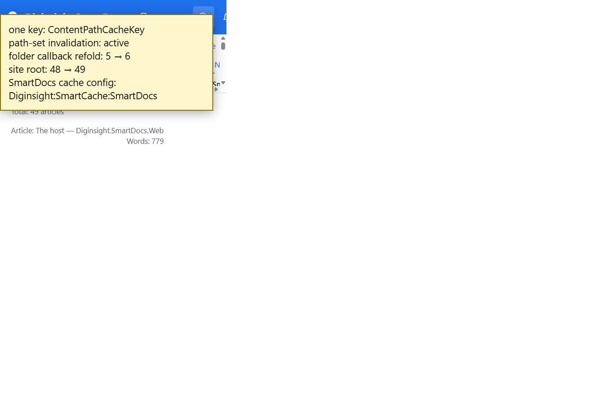

# Validation sequence — C23 unified SmartCache model

## 📚 Table of contents

- [🎯 What this proves](#-what-this-proves)
- [🧾 Environment](#-environment)
- [🔬 Sequence and results](#-sequence-and-results)
- [📷 Evidence](#-evidence)
- [📝 Notes](#-notes)

## 🎯 What this proves

`C23-one-smartcache-model` uses `ContentPathCacheKey` for content, children, parsed headers, levels, indexes, folder records, and rendered pages. One path-set invalidation rule addresses all kinds. Folder keys attach a local refold callback for distributed invalidations. Cached envelopes report their own sizes, and application freshness sits under `Diginsight:SmartCache:SmartDocs`.

## 🧾 Environment

| Item | Value |
|---|---|
| URL | `http://localhost:5290/03.00-architecture/02-host-application` |
| Build | `dotnet build src/Diginsight.SmartDocs.slnx -c Debug --artifacts-path <session-artifacts>` → succeeded, 0 warnings, 0 errors |
| Run | Rebuilt app in a visible VS Code task terminal; local content-mutation endpoint enabled |
| Browser | Visible headed browser, viewport 1366×900 |
| Date | 2026-10-02 |

## 🔬 Sequence and results

| # | Precondition | Action | Expected | Observed | Result |
|---|---|---|---|---|---|
| 1 | Build complete | Inspect cache composition and configuration | One key type, one application cache section, self-sizing envelopes, no unbound enabled flag | `ContentPathCacheKey` covers seven kinds; freshness is under `Diginsight:SmartCache:SmartDocs`; envelopes for content, listings, heads, metadata, levels, indexes, folders, and pages implement heuristic sizing; `Diginsight:SmartCache:Enabled` removed | PASS |
| 2 | Architecture article open, baseline 5 and 48 | Publish one temporary article | Path-set invalidation invokes the folder refold path and updates visible records | Mutation response: Architecture `6`, site root `49`; footer changed to `Architecture: 6 articles`, `Total: 49 articles` | PASS |
| 3 | Step 2 complete | Delete the temporary article | Same model returns to baseline and leaves no probe | Architecture `5`, site root `48`; probe folder absent | PASS |

## 📷 Evidence

The yellow box is a validation overlay summarizing the inspected model and live values; it isn't part of the application.

| Step | Screenshot |
|---|---|
| **Steps 1–2** — the unified invalidation model has refolded the folder and root records |  |

## 📝 Notes

- This run uses one process. The callback is attached to the cache key, so a companion-delivered invalidation executes the same refold on each instance.
- The temporary article was deleted and verified absent.
- C24 replaces the in-memory aggregate projection with persisted per-folder summaries; C23 makes its records use the same cache model.
